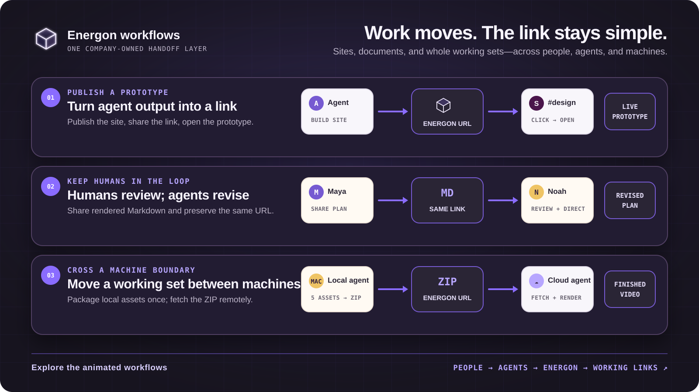

# Energon

<div align="center">
  
</div>

<div align="center">

[](https://github.com/tmchow/energon/actions/workflows/ci.yml)
[](./LICENSE)

</div>

<p align="center">
  <a href="https://getenergon.com">Website</a> ·
  <a href="https://docs.getenergon.com">Documentation</a>
</p>

**Agent-native publishing for documents, prototypes, and working files.**

Built for agents to publish, read, reference, and revise ordinary files without operating a human editor. Ready for people to open, explore, and upload directly. Markdown renders as a document; a ready-to-serve HTML folder becomes a working site. Permitted updates keep the same URL across sessions and agent tools. Energon runs in your own Cloudflare account.

**No repo to create. No deployment pipeline to configure. No new link for every update.** Once yours is running, publish prepared files directly. Build your prototype before uploading if it needs a build step; Energon serves the output. Updates keep the address until expiry or deletion. Make an independent copy when you want to try another direction.

<div align="center">
  <a href="./docs/SCENARIOS.md">
    
  </a>
</div>

<p align="center"><em>Prototype publishing, human review, and cross-machine agent handoff. <a href="./docs/SCENARIOS.md">Explore the animated workflows →</a></em></p>

> Energon is self-hosted software, not a hosted service or a curl installer. Start with [Deploy your own Energon](#deploy-your-own-energon), or give [this prompt](#give-this-to-an-agent) to an agent.

## TL;DR

**The problem:** Sharing a document, a working prototype, and an agent's working files often requires different tools. Updates become new attachments, and work left in a local folder or chat session is hard to retrieve from another session or machine.

**The solution:** One publishing workflow, with a browser hub for people and a token-authenticated HTTP API for agents. The same artifact is a rendered view for people and accessible files for agents. They can return to its stable address to view, reference, or revise it. Energon stores bytes in your R2 bucket, metadata in D1, and serves published work from a separate content hostname.

### Start from your browser or your agent

- **From your browser:** open the hub, choose one file or a prepared site folder, review the password, expiration, and write settings, then publish. Open the result or copy its link for a person or agent. A ZIP selected in the hub is unpacked as a site; use the API to store an archive as one downloadable file.
- **From your agent:** [connect to your Energon](#connect-an-agent-to-an-existing-host), then ask it to publish a brief or prototype, read a link as reference, or update an existing artifact. Updating requires the object's write policy to allow it; reading and referencing do not imply permission to edit.

For example: publish a prototype, open it, ask your agent for a change, and refresh the same link. Later, give that link to another session as reference. An authenticated user or agent can make a separate copy to explore an alternative. There is no built-in editor, merge model, or revision history; a stable link shows the current contents.

### Why Energon?

| Need | What Energon does | Example |
| --- | --- | --- |
| View the actual work | Renders Markdown and serves prepared HTML sites with their assets | Open a brief as a page or interact with a prototype |
| Publish without an agent | Provides a signed-in browser hub for files and site folders | Upload a PDF and send its link to a teammate |
| Publish from different agents | Ships an [Agent Plugin](https://agent-plugins.org/) bound to this Energon for Cursor, Claude Code, Codex, Copilot, Grok, and other compatible clients | “Publish the onboarding flow prototype to Energon and post the link to `#design` in Slack” |
| Keep related files together | Publishes a named site with nested paths | `/ada/s/onboarding-flow/` |
| Hand off one artifact | Publishes a loose file with a short, stable ID | `/ada/f/x7k2q9/brief.md` |
| Revise without moving the link | Replaces one site path or loose file in place | `PUT /v1/files/x7k2q9` |
| Reference work in another session | Lets an agent retrieve current contents without joining the original conversation | “Read this brief as reference; don't change it” |
| Explore an alternative | Copies a file or site to an independent identity owned by the authenticated caller | Try a second prototype without replacing the first |
| Control who may overwrite | Stores `owner` or `org` write policy per site or file | Lock a final brief to its creator |
| Share with other people | Serves content without an Access session, optionally behind a share password | Send the same preview URL to a client or collaborator |
| Keep files on infrastructure you control | Runs as a Cloudflare Worker backed by your D1 and R2 | No public paste-service account |

## What the agent does underneath

The installed skill turns the natural-language request above into the same portable HTTP workflow from any supported agent. Once a host exists and the token is available, use the environment variable named by `GET /v1/help`. These examples use `YOURCO_ENERGON_TOKEN`, generated by `skill:init --name yourco`:

```bash
export ENERGON_ORIGIN=https://energon.your.co

# Inspect this Energon's live routes, limits, retention, and token env name.
curl -sS "$ENERGON_ORIGIN/v1/help"

# Confirm the token and its expiry.
curl -sS "$ENERGON_ORIGIN/v1/whoami" \
  -H "Authorization: Bearer $YOURCO_ENERGON_TOKEN"

# Reserve a stable site URL. Never assume overwrite permission.
curl -sS "$ENERGON_ORIGIN/v1/sites" \
  -H "Authorization: Bearer $YOURCO_ENERGON_TOKEN" \
  -H "Content-Type: application/json" \
  -d '{"slug":"onboarding-flow","overwrite":false,"ttl":"7d"}'

# Publish the homepage.
curl -sS "$ENERGON_ORIGIN/v1/sites/onboarding-flow/files/index.html" \
  -X PUT \
  -H "Authorization: Bearer $YOURCO_ENERGON_TOKEN" \
  -H "Content-Type: text/html; charset=utf-8" \
  --data-binary @index.html

# Or upload an entire site from a ZIP after creating its slug.
curl -sS "$ENERGON_ORIGIN/v1/sites/onboarding-flow/import" \
  -H "Authorization: Bearer $YOURCO_ENERGON_TOKEN" \
  -H "Content-Type: application/zip" \
  --data-binary @onboarding-flow.zip

# Inspect the site without downloading every file.
curl -sS "$ENERGON_ORIGIN/v1/sites/onboarding-flow" \
  -H "Authorization: Bearer $YOURCO_ENERGON_TOKEN"
```

The create and write responses return both `url` for humans and `api_url` for agents. ZIP import requires an existing slug; if every archive entry is inside one wrapping directory, Energon strips that directory so `index.html` lands at the site root. A site serves `index.html` first, then `index.md`; without either, its root shows a file list.

## How it works

```text
                        operator's Cloudflare account

 agent / curl
      │  Bearer token
      ▼
┌──────────────────────── hub hostname ────────────────────────┐
│ Cloudflare Access ── humans: hub, account, setup, tokens     │
│ Energon Worker     ── agents: /v1 API                        │
└──────────────┬─────────────────────────────┬──────────────────┘
               │ metadata                    │ bytes
               ▼                             ▼
          ┌─────────┐                   ┌─────────┐
          │   D1    │                   │   R2    │
          │ catalog │                   │ objects │
          └─────────┘                   └────┬────┘
                                           │ public or passworded
                                           ▼
                              ┌─────────────────────────┐
                              │ separate content host   │
                              │ /{handle}/s/...         │
                              │ /{handle}/f/...         │
                              └────────────┬────────────┘
                                           ▼
                                        browser
```

The hostname split matters: active content never inherits the hub's Access session. Public responses can be cached at the edge; writes and deletes purge the affected cache entries.

## Design principles

1. **One publishing primitive across agent harnesses.** The deployed Energon renders its own plugin name, origin, token environment variable, and operating instructions. Personal and organization Energons can use separate names without colliding.
2. **Stable addresses, explicit mutation.** A site owns a human-chosen slug. A loose file gets a short ID. Updates use `PUT`; they do not mint a new URL. Writes are last-write-wins on the affected path.
3. **Humans control credentials and destructive choices.** Humans mint tokens through Access. Agents must not invent tokens, guess ownership of an existing slug, or silently opt into overwrite.
4. **Open links are deliberate.** Published URLs are public by default so recipients do not need to sign in. Share passwords gate sensitive links; token-authenticated `/v1` reads bypass those passwords.
5. **The running Energon is the source of truth.** `GET /v1/help` describes its identity, routes, limits, retention policy, and token policy. `GET /v1/openapi.json` is the HTTP contract for every `/v1` route. Installed skills tell agents to consult them instead of assuming upstream defaults.

## When to use Energon

| Capability | Energon | Object storage alone | Static-site platform | Shared document editor |
| --- | --- | --- | --- | --- |
| Agent-oriented HTTP workflow | Built in | Build it yourself | Usually build/deploy oriented | Usually UI oriented |
| One file and multi-file sites | Both | Objects, no site behavior | Sites | Documents |
| Stable replace-in-place URL | Yes | Depends on your URL layer | Usually | Yes |
| Operator-owned infrastructure | Your Cloudflare account | Usually | Usually | Vendor hosted |
| External link without signing in | Yes, optional password | Depends on policy | Usually | Depends on sharing policy |
| Comments, suggestions, and merge history | No | No | Git-based at best | Yes |

Use Energon for prototypes, rendered Markdown, agent-to-agent handoffs, screenshots, PDFs, and small sites that need a durable link. Use a document editor for collaborative review, a full application platform for builds and server-side runtimes, and direct object storage when you only need a storage API.

## Installation

There are three distinct installation paths. They are not interchangeable.

### Deploy your own Energon

Fork [`tmchow/energon`](https://github.com/tmchow/energon) into your account or organization, then follow [INSTALL.md](./INSTALL.md). The short version is:

```bash
git clone https://github.com/your-org/energon.git
cd energon
npm install
npx wrangler r2 bucket create energon
npx wrangler d1 create energon
npm run skill:init -- --name yourco --origin https://energon.your.co
```

Then configure a distinct hub hostname and content hostname, Cloudflare Access, D1, R2, and deployment credentials. Workers Paid is required for the supported upload limits. Do not reuse another Energon's D1 database ID or R2 bucket.

### Connect an agent to an existing host

Open the deployed host's `/setup`, or read `GET {origin}/v1/help`. Both provide the actual marketplace, plugin, and token environment variable for that Energon.

```text
# Claude Code
/plugin marketplace add your-org/energon
/plugin install yourco-energon@yourco-energon --scope user

# Cursor
agent plugin marketplace add https://github.com/your-org/energon.git
agent plugin install yourco-energon@yourco-energon

# Codex / ChatGPT
codex plugin marketplace add your-org/energon
codex plugin add yourco-energon@yourco-energon

# Grok
grok plugin marketplace add your-org/energon
grok plugin install yourco-energon@yourco-energon --trust

# GitHub Copilot
copilot plugin marketplace add your-org/energon
copilot plugin install yourco-energon@yourco-energon
```

An agent follows `{origin}/auth.md`. If the token environment variable named by `/v1/help` is set, it uses that. Otherwise it connects with a code: it shows the human a link and an eight-digit code, the human signs in, enters the code, picks a lifetime, and approves, and the agent receives the token directly and saves it as that variable. For CI, scheduled jobs, and hosted sandboxes, a human creates the token at `{origin}/tokens` and stores it in the environment's secret store. The secret is shown once and cannot be recovered later.

### Run the source locally

```bash
git clone https://github.com/tmchow/energon.git
cd energon
npm install
npx wrangler d1 migrations apply energon --local
cp .dev.vars.example .dev.vars
npm run dev
```

Open <http://127.0.0.1:8787>. Localhost skips Cloudflare Access and defaults to `dev@example.com`; set `DEV_ACCESS_EMAIL` in `.dev.vars` to change the identity.

## Give this to an agent

### Stand up Energon

```text
Read INSTALL.md in this repository and stand up an Energon host for me or my organization.

Follow INSTALL.md exactly. Ask me for our hub hostname, content hostname, who may mint tokens, and whether coworkers' tokens should overwrite each other's files (WRITE_POLICY=org) or only the creator (owner).

Do not invent a token. Do not reuse another Energon's D1 database_id or R2 bucket. After skill:init, commit the generated plugin and catalogs so teammates install from this fork.
```

### Connect an agent to a host that exists

```text
Read INSTALL.md in this repository, section "Connect an agent", and install Energon for this machine.

Ask me for our Energon origin (https://...) if it is not already in the environment or INSTALL.md. Install the skill from this Energon's repo at user (global) scope. Then read {origin}/auth.md: if the token env named by GET {origin}/v1/help is set, use it; otherwise connect with a code, show me the link and code, and after I approve, save the token as that env where this environment keeps secrets. If I already use another Energon, this skill has a different name. Install it too, or pin it in this repo. Do not invent a token.
```

The deployed host's `/setup` page has the same prompt filled with its own values.

## API reference

All authenticated routes use this Energon's token environment variable (`YOURCO_ENERGON_TOKEN` in these examples):

```bash
-H "Authorization: Bearer $YOURCO_ENERGON_TOKEN"
```

Errors are JSON with `error`, `message`, and `hub`. The live schema (paths, request and response bodies, status codes, error codes) is `GET {origin}/v1/openapi.json`, an OpenAPI 3.1 document committed at `openapi/v1.json`. `GET {origin}/v1/help` is this Energon's identity: origins, token env, retention presets, token policy, limits.

### Sites

| Method and path | Purpose |
| --- | --- |
| `POST /v1/sites` | Create or explicitly claim a slug; can duplicate another site |
| `GET /v1/sites` | List sites you created or last wrote, with search and pagination |
| `GET /v1/sites/{slug}` | List a site's files |
| `PATCH /v1/sites/{slug}` | Change password, TTL, or write policy |
| `DELETE /v1/sites/{slug}` | Delete the site and all its objects |
| `PUT /v1/sites/{slug}/files/{path}` | Create or replace one path with the raw request body |
| `GET /v1/sites/{slug}/files/{path}` | Read one path as raw bytes with a token |
| `DELETE /v1/sites/{slug}/files/{path}` | Delete one path |
| `POST /v1/sites/{slug}/import` | Import an `application/zip` archive |
| `GET /v1/sites/{slug}/export` | Export the site as a zip |

```bash
# Create a password-protected site using this Energon's default write policy.
curl -sS "$ENERGON_ORIGIN/v1/sites" \
  -H "Authorization: Bearer $YOURCO_ENERGON_TOKEN" \
  -H "Content-Type: application/json" \
  -d '{"slug":"private-draft","overwrite":false,"password":"correct horse battery staple"}'

# Replace one path without changing the site's expiry.
curl -sS "$ENERGON_ORIGIN/v1/sites/private-draft/files/notes.md" \
  -X PUT \
  -H "Authorization: Bearer $YOURCO_ENERGON_TOKEN" \
  -H "Content-Type: text/markdown; charset=utf-8" \
  --data-binary @notes.md
```

### Loose files

| Method and path | Purpose |
| --- | --- |
| `POST /v1/files` | Upload one file or duplicate an existing file into a new ID |
| `GET /v1/files` | List loose files you created or last wrote, with search and pagination |
| `GET /v1/files/{id}` | Read raw bytes; `?download=1` sets attachment disposition |
| `PUT /v1/files/{id}` | Replace bytes while preserving the ID and public URL |
| `PATCH /v1/files/{id}` | Change password, TTL, or write policy |
| `DELETE /v1/files/{id}` | Delete the object and catalog row |

```bash
# Create a loose file. The JSON response contains its id and stable url.
curl -sS "$ENERGON_ORIGIN/v1/files" \
  -H "Authorization: Bearer $YOURCO_ENERGON_TOKEN" \
  -F "file=@brief.pdf" \
  -F "ttl=30d"

# Replace it later. Do not POST again.
curl -sS "$ENERGON_ORIGIN/v1/files/{id}" \
  -X PUT \
  -H "Authorization: Bearer $YOURCO_ENERGON_TOKEN" \
  -H "X-Filename: brief.pdf" \
  --data-binary @brief.pdf
```

### Identity

| Method and path | Purpose | Authentication |
| --- | --- | --- |
| `GET /auth.md` | Authentication setup, credential boundaries, and recovery | None |
| `GET /v1/help` | Identity, SOP, routes, limits, retention, and token policy | None |
| `GET /v1/health` | Return `{ "ok": true }` | None |
| `GET /v1/openapi.json` | OpenAPI 3.1 contract for every `/v1` route, with `servers` set to this Energon | None |
| `POST /v1/connections` | Start a code-based connection for human approval | None |
| `POST /v1/connections/{id}/token` | Poll for one-time credential delivery | Request poll token |
| `GET /v1/whoami` | Return token owner, label, and expiry | Token |

For headers, response shapes, filters, duplication, ZIP behavior, and error handling, query the deployed `/v1/openapi.json` or see the rendered plugin's `references/api.md`.

## Configuration

The committed [wrangler.toml](./wrangler.toml) is a complete example with placeholder origins and database ID. A typical fork changes these values:

```toml
[vars]
PUBLIC_ORIGIN = "https://energon.your.co"                  # Hub and /v1
CONTENT_ORIGIN = "https://content.energon.your.co"         # Published bytes; must be separate
TOKEN_ENV = "YOURCO_ENERGON_TOKEN"                         # Must match the rendered skill
SKILL_NAME = "yourco-energon"
MARKETPLACE_NAME = "yourco-energon"
MARKETPLACE_REPO = "your-org/energon"
TOKEN_PREFIX = "ee_live_"

ALLOW_UNLIMITED_RETENTION = "true"
DEFAULT_TTL = "never"
MAX_TTL = "never"
WRITE_POLICY = "org"                                      # owner or org

ALLOW_UNLIMITED_TOKENS = "true"                           # Affects future mints only
ALLOWED_EMAIL_DOMAINS = "your.co,your.com"
FOOTER_TEXT = ""
```

Code defaults are stricter when retention and write-policy variables are absent: seven-day default retention, a 30-day maximum, and creator-only writes. `PUT` never extends content TTL; `PATCH { "ttl": "7d" }` resets it from the current time. Token expiry is a separate clock.

See [docs/DEPLOY.md](./docs/DEPLOY.md) for every variable, custom-domain and Access rules, cache behavior, cron costs, migration policy, and fork hygiene.

## Repository commands

| Command | What it does |
| --- | --- |
| `npm run dev` | Start the local Worker on port 8787 |
| `npm run db:local` | Apply D1 migrations to local state |
| `npm run db:remote` | Apply migrations remotely; reserved for an authorized production operation |
| `npm run types` | Generate Wrangler binding types |
| `npm run typecheck` | Type-check Worker and tests |
| `npm run lint` | Run oxlint |
| `npm run lint:fix` | Apply safe lint fixes |
| `npm run test:unit` | Run fast Node tests without Miniflare |
| `npm run test:worker` | Boot the Worker and run integration/API tests |
| `npm run test:watch` | Run Vitest in watch mode |
| `npm test` | Run unit and Worker suites |
| `npm run skill:init -- --name yourco --origin https://energon.your.co` | Render a fork's plugin and catalogs for this Energon |
| `npm run skill:render` | Validate templates upstream; regenerate the plugin on initialized forks |
| `npm run skill:render -- --check` | Validate templates; fail if initialized output has drifted |
| `npm run vendor:mermaid` | Refresh the locally served Mermaid browser asset |
| `npm run deploy` | Deploy with Wrangler; only for a human-authorized production flow |

While editing, use the focused test map in [AGENTS.md](./AGENTS.md). CI generates Wrangler types, type-checks, lints, and runs both suites.

## Troubleshooting

### `401 unauthorized` or `401 token_expired`

Stop retrying. A human must sign in at `{origin}/tokens` and mint a new token. Tokens are shown once, cannot be revealed later, and expired tokens cannot be extended. Confirm the correct environment variable with:

```bash
curl -sS "$ENERGON_ORIGIN/v1/help"
```

### `409 site_exists`

The slug is already claimed. Read the returned URL and last writer, then choose a new slug or ask the human before retrying with `"overwrite": true`. Claiming a slug does not wipe its existing paths.

### `404 site_not_found` on `PUT`

Create the site with `POST /v1/sites` first. Energon never creates a missing site implicitly. Likewise, replacing a loose file requires an existing ID.

### `413 too_large` or `413 storage_cap`

The default limit is 25 MB per file and per ZIP upload, with at most 200 files in an imported archive and a 20 GB platform safety cap. Split the artifact, use a different delivery system, or delete old content after the human confirms.

### `410 expired`

The content passed its `expires_at` and is gone or awaiting purge. Publish it again under a new object; retrying the expired URL will not restore it.

### Local D1 or type errors after a fresh clone

```bash
npx wrangler d1 migrations apply energon --local
npm run types
npm run typecheck
```

Do not delete `.wrangler/state`; it is the local database.

### The hub works but published URLs fail in production

Verify that `PUBLIC_ORIGIN` and `CONTENT_ORIGIN` are different custom hostnames and that both route to the Worker. Cloudflare Access belongs on the hub, not the content hostname. Production content publication fails closed when the separate origin is missing.

## Limitations

- **No hosted public Energon:** [getenergon.com](https://getenergon.com) explains the project but does not host files or provide an Energon account. This repository is source for an Energon you run. It ships templates and placeholder configuration, with no generated plugin. Run `npm run skill:init` with a unique name and real HTTPS origin before distributing a plugin.
- **Cloudflare-specific:** the supported deployment uses Workers, D1, R2, Access, custom domains, and a Workers Paid plan.
- **Public by default:** anyone with a published link can open it unless a share password is set. A share password protects public reads, not token-authenticated `/v1` reads.
- **Not collaborative editing:** there are no comments, suggestions, merges, or version history. Writes are last-write-wins per path.
- **No recycle bin:** deletes are destructive; expired content is purged.
- **Bounded artifacts:** defaults cap one file or ZIP at 25 MB, one ZIP at 200 files, and total stored content at 20 GB.
- **Scoped catalog:** `GET /v1/sites` and `GET /v1/files` return only objects the token owner created or last wrote, not an org-wide inventory.

## FAQ

### Is published content private?

Not by default. Public links intentionally skip Cloudflare Access so an external recipient can open the same URL. Set a share password for link-level protection. Keep the hub and API on a different hostname from published content.

### Should I publish a site or a loose file?

Use a site for several related files, a prototype, or a document with assets. Use a loose file for one screenshot, PDF, Markdown file, or archive that should remain an archive.

### Can two coworkers update the same URL?

Yes when its write policy is `org`. With `owner`, only the creator can mutate it. The creator can change that policy later. Concurrent edits do not merge; the last successful write to a path wins.

### Can I use more than one Energon host?

Yes. Each fork renders a distinct plugin name and token environment variable. Install each at user scope, or pin the intended personal or organization plugin in a repository.

### Can an agent mint or recover a token?

An agent can start a connection, but a signed-in human must enter its code and approve before a token is delivered. Humans can also create tokens at `/tokens` for environments where no agent can ask. The secret is delivered or displayed once. It cannot be recovered or renewed, and an expired token must be replaced.

### Why separate hub and content hostnames?

Published HTML can be active content. Serving it from a separate hostname prevents it from sharing the hub's Access session and authenticated UI origin.

### Where did the idea come from?

[Claude Artifacts](https://support.claude.com/en/articles/9487310-what-are-artifacts-and-how-do-i-use-them) made the “create something, get a link” workflow feel obvious, but keeps the artifact inside Claude products. [ht-ml.app](https://ht-ml.app) carries that idea onto a public HTML host. [Proof](https://www.proofeditor.ai) makes Markdown collaboration simple. [Shopify Quick](https://shopify.engineering/quick) showed how good it feels when a folder becomes a link on your own infrastructure. Energon is the combination this project wanted: mixed file types, different agent harnesses, operator-owned infrastructure, shared writes, and externally shareable links.

## About contributions

> *About Contributions:* Please don't take this the wrong way, but I do not accept outside contributions for any of my projects. I simply don't have the mental bandwidth to review anything, and it's my name on the thing, so I'm responsible for any problems it causes; thus, the risk-reward is highly asymmetric from my perspective. I'd also have to worry about other "stakeholders," which seems unwise for tools I mostly make for myself for free. Feel free to submit issues, and even PRs if you want to illustrate a proposed fix, but know I won't merge them directly. Instead, I'll have Claude or Codex review submissions via `gh` and independently decide whether and how to address them. Bug reports in particular are welcome. Sorry if this offends, but I want to avoid wasted time and hurt feelings. I understand this isn't in sync with the prevailing open-source ethos that seeks community contributions, but it's the only way I can move at this velocity and keep my sanity.

For Energon specifically, [issues are welcome](https://github.com/tmchow/energon/issues/new/choose), but do not open a pull request against `tmchow/energon` unless the owner asked for it. A workflow closes pull requests from forks. Keep your fork's changes on your fork. See [CONTRIBUTING.md](./CONTRIBUTING.md).

Report vulnerabilities privately; do not put secrets or customer content in a public issue. Follow [SECURITY.md](./SECURITY.md) for the current reporting channel.

## License

[MIT](./LICENSE)
