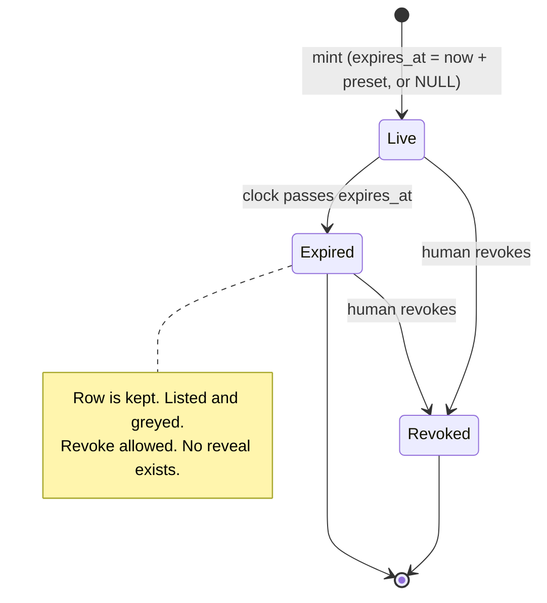
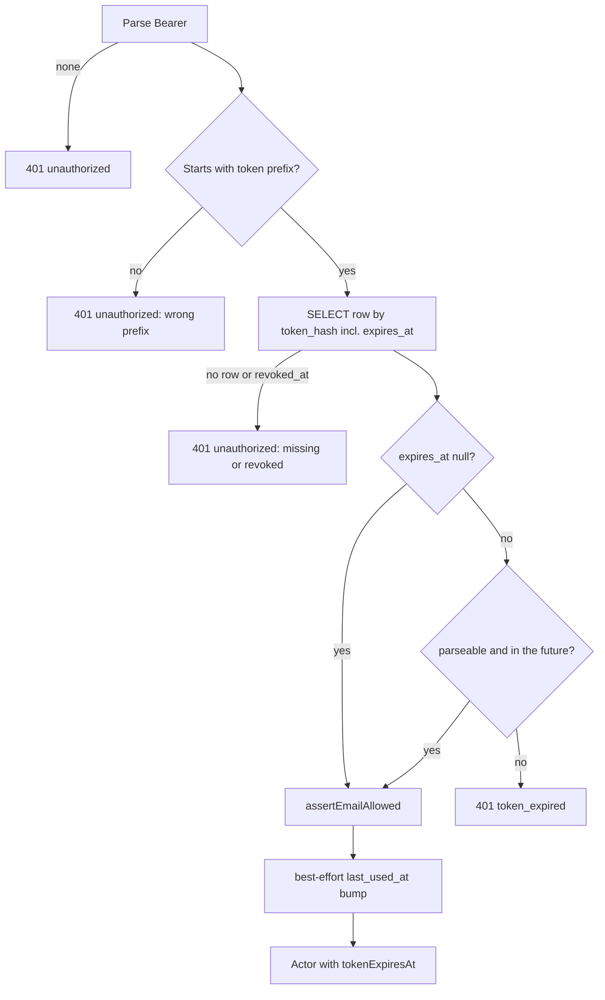

# API Token Expiration - Plan

## Goal Capsule

- **Objective:** An API Token minted on this instance stops working after a lifetime the human chose at mint time, so a leaked or forgotten token is not trusted forever. Operators can forbid never-expiring tokens on their instance.
- **Means:** A nullable `expires_at` on the `tokens` row, a lifetime picker on the tokens page, an expiry check in bearer auth, and one instance flag that controls whether "Never" is offered (KTD1, KTD2, KTD4).
- **Authority:** Product Contract Requirements win on behavior. Key Technical Decisions win on mechanism within their cited Rs. Units override neither.
- **Execution profile:** Seven dependency-ordered units. Each lands as one commit. Schema first, then policy, mint, auth, page, docs, and the verification skill last.
- **Stop conditions:** Stop and ask if a session-settled decision (Key Decisions below) turns out to be infeasible. Stop if the legacy `ensureSchema` path cannot add the column additively.
- **Tail ownership:** The implementer runs the Verification Contract and hands off a branch. Shipping (push, PR) is not part of this plan.

---

## Product Contract

### Summary

Every API Token gets a lifetime chosen from a fixed preset list at mint time, defaulting to 90 days. Bearer auth rejects an expired token with a distinct, terminal 401. "Never" remains a choice unless the instance config disables it. Expired tokens stay in the tokens list, greyed and labeled, and can still be revoked.

### Problem Frame

Today a token minted at `/tokens` is valid until a human revokes it. Agents hold these tokens in env vars and CI secrets that are rarely rotated, so a leaked token is trusted indefinitely. The instance already bounds how long *content* lives (retention policy in `src/policy.ts`) but has no equivalent bound on the credential that writes that content. Industry practice has converged on mandatory or default-on expiry for personal access tokens, with an admin policy to forbid non-expiring tokens. `STRATEGY.md` places expiry in the "Ownership and trust" track: a company-owned host has to be safe to hand a token to every teammate.

### Key Decisions

- **Existing tokens are grandfathered as never-expiring.** (session-settled: user-approved — chosen over back-dating a default lifetime from `created_at`: retroactive expiry silently breaks running agents, the failure GitLab reversed in 2024.) Governs R4.
- **Preset lifetimes are 1d, 7d, 30d, 60d, 90d, 180d, 365d, plus Never when allowed. Default is 90d.** (session-settled: user-directed — chosen over a free-form duration field: the user asked for the common PAT preset shape; 90d over 30d because rotation is manual and there is no renew action.) Governs R1, R2.
- **Disabling Never later does not affect already-minted never-expiring tokens.** (session-settled: user-approved — chosen over rejecting them on the next request: a config flip must not take down every agent at once; revoke is the explicit tool for that.) Governs R7.
- **No extend or renew action.** (session-settled: user-approved — chosen over a renew endpoint or UI button: replacement by minting keeps the secret rotating; renewing keeps the same secret alive.) Governs R11.
- **Expired token rows are kept, not purged.** Chosen over a sweep like content expiry: the row is the audit trail that explains why an integration stopped. Tokens are hash-only since migration 0011, so a kept row holds no recoverable secret. Governs R11.

### Requirements

**Minting**

- R1. `POST /account/tokens` accepts an optional `ttl` field whose value is one of the token preset ids (`1d`, `7d`, `30d`, `60d`, `90d`, `180d`, `365d`, `never`), compared case-insensitively.
- R2. A missing or empty `ttl` uses the instance default, `90d`. Any other value not in the preset list returns 400 with error code `bad_ttl` and a message listing the allowed ids.
- R3. A minted token stores `expires_at` as ISO-8601 UTC text computed from mint time plus the preset, or `NULL` for `never`. The 201 response includes `expires_at`.
- R4. Rows that predate this feature have `expires_at = NULL` and authenticate as never-expiring.

**Instance policy**

- R5. A new instance var `ALLOW_UNLIMITED_TOKENS` controls whether `never` is offered. Unset means allowed. Once set, only `1`, `true`, or `yes` (case-insensitive) means allowed; any other value forbids `never`.
- R6. When `never` is not allowed, the preset list omits it, the tokens page does not show it, and `ttl: never` at mint returns 400 `bad_ttl`. The default lifetime stays `90d`.
- R7. Token policy is independent of content retention policy. `ALLOW_UNLIMITED_RETENTION`, `DEFAULT_TTL`, `MAX_TTL`, and `TTL_PRESETS` have no effect on tokens.

**Authentication**

- R8. `requireToken` rejects a token whose `expires_at` is at or before now with status 401, error code `token_expired`, and a message that names the expiry date, states the token cannot be extended, tells the agent to have the human mint a new one at `{origin}/tokens` and export it as the token env, and says not to retry or invent a token. The check runs after the missing/revoked check and before the `last_used_at` update, so an expired token never bumps `last_used_at`.
- R9. A stored `expires_at` that is non-null but empty or unparseable is treated as expired (fail closed). This rule applies wherever expiry is evaluated: auth and listing.
- R10. `GET /v1/whoami` adds `expires_at` (ISO string or `null`).

**Tokens page and account API**

- R11. `listTokens` and `/account/data` return `expires_at` and a derived `expired` boolean per token. The tokens page shows an Expires column with the absolute date and a relative "in N days", "Never", or "Expired" label. Expired rows stay visible, greyed, and keep the Revoke action. There is no renew or extend action, and no reveal (tokens are shown once at mint).
- R13. The mint form has a lifetime select populated from the instance's token presets with the default preselected.

**Agent-facing surfaces**

- R14. `GET /v1/help` gains a top-level `tokens` object with `presets` (id, seconds, label), `default`, `allow_never`, and `tokens_url`, plus one SOP line describing token lifetime and what to do on `token_expired`. `GET /llms.txt` gains an equivalent line.
- R15. The skill templates, rendered plugin, `INSTALL.md`, `docs/DEPLOY.md`, `wrangler.example.toml`, `wrangler.toml`, and `.dev.vars.example` describe the new var and the expiry behavior, including that the var affects only future mints.

**Verification skill**

- R16. The local verification skill under `.cursor/skills/verify-energon/` can mint a token with a chosen lifetime, and its feature map names the lifetime control, the `expires_at` fields, and the `token_expired` outcome, so a verify drive of the tokens feature covers expiry.

### Success Criteria

- An agent given the rendered skill and an expired token makes exactly one request, then tells the human to mint a new token at `{origin}/tokens`, with no retry and no invented token.
- A deployment that does not set the new var behaves the same as before for existing tokens and offers Never on the tokens page.

### Scope Boundaries

- Minting stays human-only behind Cloudflare Access. No agent-callable mint, extend, or renew.
- No purge or sweep of expired token rows.
- No change to content retention presets or behavior.
- Content retention vocabulary on the hub and in help stays as is; only the tokens surfaces change.

#### Deferred to Follow-Up Work

- An expiry-warning response header on authenticated `/v1` responses when a token expires within 7 days. Cheap, but it is a new agent contract and deserves its own copy and tests.
- A "expires soon" nudge on the hub or tokens page for humans.
- Aligning every existing 401 message and the `hub` field in error bodies on `/tokens` instead of `/account`. Only the new expired message must name `/tokens`.
- Replacing remaining "key" wording on the tokens page and in the help SOP with "token" per `CONCEPTS.md`.
- An operator cap on token lifetime (a token analogue of `MAX_TTL`). This plan ships only the Never flag.
- An operator-facing inventory of never-expiring tokens; until then the deploy guide carries the query.

### Acceptance Examples

- AE1. **Covers R1, R3.** Given a signed-in human, when they mint with label `ci` and `ttl: 7d`, then the response is 201 with `expires_at` about seven days from now and the token authenticates on `/v1/whoami`.
- AE2. **Covers R2.** Given a mint request with no `ttl`, then `expires_at` is about 90 days from now.
- AE3. **Covers R2.** Given `ttl: 3h`, then the response is 400 `bad_ttl` and the message lists `1d, 7d, 30d, 60d, 90d, 180d, 365d, never`.
- AE4. **Covers R6.** Given `ALLOW_UNLIMITED_TOKENS=false` and `ttl: never`, then the response is 400 `bad_ttl` and the message does not list `never`.
- AE5. **Covers R8.** Given a token whose `expires_at` is one minute in the past, when an agent calls `PUT /v1/sites/x/files/a.txt`, then the response is 401 with `error: token_expired`, the message contains `/tokens` and the expiry date, and the row's `last_used_at` is unchanged.
- AE6. **Covers R4.** Given a row inserted with `expires_at = NULL` and `created_at` two years ago, when it is used, then the request succeeds and `whoami` returns `expires_at: null`.
- AE8. **Covers R11.** Given one live, one expired, and one revoked token, when the owner opens `/tokens`, then the live and expired rows render, the expired row is greyed with "Expired" and offers only Revoke, and the revoked row is hidden as today.
- AE9. **Covers R16.** Given a verify-energon run, when the agent runs the mint-token helper with lifetime `1d`, then it prints a token whose `whoami` shows `expires_at` about one day out.

---

## Planning Contract

### Key Technical Decisions

- KTD1. **Nullable `expires_at TEXT` on `tokens`, added in three places.** A migration `migrations/0013_token_expires_at.sql` (0011 and 0012 already exist upstream), the `CREATE TABLE` in `src/schema.sql`, and both `TABLE_STATEMENTS` and the `ensureColumns` list in `src/db.ts` (appended after `token_secret`, `token_hint`, `user_id`). `ensureColumns` only adds nullable `TEXT`, which matches the ISO-text convention on `sites.expires_at` and gives R4 for free. No index: lookups are by `token_hash`, `user_id`, and `user_email`. Cites R3, R4.
- KTD2. **A token-specific lifetime resolver, not `resolveExpiresAt`.** `resolveExpiresAt` applies content `maxSeconds` (30d when unlimited retention is off), treats empty and `none` as never, and accepts arbitrary durations. A new `tokenPolicy(env)` and `resolveTokenExpiresAt(policy, ttl)` in `src/policy.ts` own a fixed `TOKEN_TTL_CATALOG`, reuse `parseDuration` and `formatTtlLabel` for seconds and labels, and reuse the `TtlPreset` shape so the page can copy `fillTtlSelect`. Cites R1, R2, R6, R7.
- KTD3. **Unset-means-allowed wrapper over the existing `flag()` parser.** `flag()` returns false when unset, which would remove Never from every existing deployment. The token policy treats an undefined var as allowed and otherwise delegates to `flag()`, so a set value follows the same strict truthy rule as `ALLOW_UNLIMITED_RETENTION` and a typo fails closed. Cites R5.
- KTD4. **Distinct `token_expired` error code with terminal prose.** The repo already distinguishes missing, wrong-prefix, and revoked in 401 prose because the audience is agents that need to relay an instruction. OAuth guidance to collapse all failures into one generic error is a probing defense that does not apply here: the expired branch fires only after a hash match on a 32-character random secret, so the caller already holds the token. Cites R8.
- KTD5. **One token-specific expiry predicate, failing closed.** `isExpired` in `src/expire.ts` returns false for an unparseable value, which is right for content and wrong for a credential. Add `tokenExpired(expiresAt, now)` next to the token policy in `src/policy.ts`: null is live; empty or unparseable is expired; parsed time at or before now is expired. `requireToken` and `listTokens` both call it, and the page reads the derived `expired` flag without recomputing. Cites R9, R11.
- KTD6. **Token policy exposed under its own `tokens` key in help, not inside `retention`.** Keeps the agent from conflating content presets with token presets. Cites R14.
- KTD7. **The worker suite runs on the committed wrangler vars; the disallow branch is unit-tested.** `vitest.config.ts` points the workers pool at `wrangler.toml`, so its `[vars]` block is the worker suite's environment (existing API tests already assert retention values that come only from there). U6 sets `ALLOW_UNLIMITED_TOKENS = "true"` in `wrangler.toml` beside `ALLOW_UNLIMITED_RETENTION`, which keeps the worker suite on the allowed path. The `ALLOW_UNLIMITED_TOKENS=false` branch is covered in `test/unit/policy.spec.ts` against the resolver and in `test/unit/auth.spec.ts` through the mint path with a mocked env. Cites R5, R6.
- KTD8. **Mint is the only writer of `expires_at`, and it writes `Date.toISOString()`.** The resolver computes the value server-side from a validated preset, so user input never reaches the column. Comparison is `Date.parse` in TypeScript, never SQL text comparison, so an operator-edited value with a timezone offset still parses correctly. Cites R3, R9.

### High-Level Technical Design

Token lifecycle after this change. Revoke and expiry are independent; a row can be both.

Bearer auth decision order in `requireToken`. The expired branch sits between the row check and the usage bump.

### System-Wide Impact

- **Auth boundary.** `requireToken` gains a second terminal 401 code. Every consumer that treats `error: unauthorized` as "re-mint" must also treat `token_expired` that way: the skill template, `llms.txt`, and the help SOP (U6). Missing and revoked stay merged under `unauthorized`.
- **Cross-user boundary is unchanged.** `listTokens` scopes by `user_id` (falling back to `user_email` for legacy rows) and `revokeToken` checks ownership the same way before anything else, returning one 404 for a foreign id. Expiry adds no new ownership path. The `expired_at` in the 401 body reaches only the bearer of that token.
- **Unauthenticated `/account/data`.** The route returns empty lists with no actor; `expires_at` and `expired` ride the same actor-scoped listing, so no new exposure. U3 must not touch that branch.
- **Account mutations already reject cross-origin and form bodies** (`bad_origin`, `bad_content_type`). The mint route keeps that guard; `ttl` rides the same JSON body.
- **Error body keys.** `ApiError` spreads `extra` at top level beside `error`, `message`, and `hub`. The expired error uses `expired_at` and `tokens_url`; neither collides.
- **Derived state can flip between reads.** `expired` is computed at read time, so a listing can change with no write. Page copy says "Expired", never "was expired at revoke" or similar persisted phrasing.
- **Rollback.** Old code selects and inserts explicit columns, so a reverted Worker ignores `expires_at` and needs no down-migration. That is also the hazard: under old code every finite-lifetime token, including already-expired ones, authenticates again, and tokens minted during the revert window carry NULL for good. Once any token has a non-null `expires_at`, the rollback floor is the first build that ships U4; U6 records that floor in the deploy guide. Rolling back below it requires revoking every finite-lifetime token first.

### Risks & Dependencies

- **Double-apply of the column.** If the Worker deploys before an operator runs the D1 migration, `ensureColumns` adds the column at first request and `wrangler d1 migrations apply` then fails with `duplicate column name`, leaving `d1_migrations` behind and blocking later migrations. Mitigation: the migration file holds exactly one `ALTER TABLE` so there is no partial state, and U6 adds an operator note to `docs/DEPLOY.md` on ordering and manual stamping. The reverse order is safe because `ensureColumns` checks `PRAGMA table_info`.
- **DDL drift across three copies.** Nothing reads `src/schema.sql` at runtime, so a contributor can forget it and no test fails. Mitigation: U1 adds a drift test comparing column sets in `src/schema.sql` and `TABLE_STATEMENTS` and asserting the migration contains the single expected `ALTER`.
- **Fail-closed rule could bite valid mints.** If the resolver ever wrote a non-ISO value, every new token would be dead on arrival. Mitigation: U2 tests that every preset's resolved value round-trips `Date.parse`.
- **Rollback below the expiry-aware build revives expired tokens.** A routine revert after a bad deploy silently reopens every expired credential. Mitigation: the deploy guide names the first expiry-aware build as the rollback floor and the revoke-first procedure for going below it (U6); the schema unit (U1) lands one deploy ahead of the auth unit (U4) so the floor is a single build, not a range.
- **Verification skill drift.** `AGENTS.md` requires the verify-energon feature map to change in the same PR as any hub control or `/v1` route it names. Mitigation: U7 is in scope, and the picker's stable id is fixed in U5 so U7 can cite it.

### Assumptions

- The hub bootstrap already serializes retention policy JSON for its select; the tokens page bootstrap does not carry policy today, and U3 adds the token projection using the same pattern. The hub picker reads `default_ttl` and `allow_unlimited`; the token projection uses `default` and `allow_never`, so the copied picker code maps those names.
- `formatTtlLabel` already maps every token preset id to a human label, so no new label table is needed.

### Sources and Research

- Repo: `src/auth.ts` (`requireToken`, `mintToken`, `listTokens`, `revokeToken`, `unauthorized`, `helpBody`), `src/policy.ts` (`parseDuration`, `formatTtlLabel`, `TtlPreset`, `flag`), `src/expire.ts` (`isExpired`), `src/db.ts` (`TABLE_STATEMENTS`, `ensureColumns`), `src/tokens.html`, `src/hub.client.js` (`fillTtlSelect`), `test/helpers.ts` (`mint`, `assertDomBindings`), `.cursor/skills/verify-energon/` (SKILL.md Drive section, `features/mint-token.md`, `bin/mint-token`), `STRATEGY.md` (Ownership and trust track), `AGENTS.md` (schema in three representations; verify map changes in the same PR).
- Learnings: `docs/solutions/database-issues/legacy-schema-upgrade-ordering.md` (tables, then legacy columns, then indexes), `docs/solutions/runtime-errors/custom-token-prefix-authentication.md` (test a token property through mint, auth, list, and help together; the worker fixture omitting an env var hid the last bug).
- External: GitHub fine-grained PATs default to 30 days with an org policy to forbid non-expiring tokens; GitLab made expiry mandatory at up to 365 days and reversed its retroactive expiry of existing tokens after breakage; npm granular tokens default to 7 days with a 90-day cap. These shaped the preset list, the 90-day default, and the grandfathering decision.

---

## Implementation Units

### U1. Add `expires_at` to the tokens schema

- **Goal:** Every database shape (fresh, migrated, legacy-upgraded) has a nullable `expires_at` on `tokens`.
- **Requirements:** R3, R4. KTD1.
- **Dependencies:** none.
- **Files:** `migrations/0013_token_expires_at.sql` (create), `migrations/0004_token_secret.sql`, `migrations/0009_expires_at.sql`, `migrations/0010_write_policy.sql` (header comments only), `src/schema.sql`, `src/db.ts`, `src/types.ts`, `test/unit/db.spec.ts`.
- **Approach:**
  1. Write the migration with the same non-idempotency header comment as `migrations/0011_identity_tokens_gate.sql` and a NULL-means-never note, and point the recovery sentence at the migration-ordering runbook in `docs/DEPLOY.md` (U6). Update the "see README" sentence in the legacy headers (0004, 0009, 0010) to point at the same runbook.
  2. Add the column to the `tokens` DDL in `src/schema.sql` and in `TABLE_STATEMENTS`.
  3. Append `expires_at` to the `ensureColumns(db, "tokens", ["token_secret", "token_hint", "user_id"])` list, before the token backfill statements that follow it.
  4. Add `expires_at?: string | null` to `TokenRow`.
- **Patterns to follow:** `migrations/0009_expires_at.sql`; the `token_secret` column path through `src/db.ts`.
- **Test scenarios:**
  - Legacy fixture with the migration-0005 tokens columns: after `ensureSchema`, `tokens` has `expires_at`.
  - Fresh database via `ensureSchema`: `tokens` has `expires_at` from the table statement alone.
  - Fixture whose `tokens` already has `expires_at`: `ensureSchema` issues no `ALTER TABLE tokens` (record executed SQL in the `SchemaDb` mock).
  - Drift test: the column-name set for each table in `src/schema.sql` equals the set in `TABLE_STATEMENTS`, and `migrations/0013_token_expires_at.sql` contains exactly one `ALTER TABLE tokens ADD COLUMN expires_at TEXT`.
- **Verification:** `npm run test:unit -- test/unit/db.spec.ts` passes and `npm run typecheck` is clean.

### U2. Token lifetime policy and resolver

- **Goal:** One place computes the token preset list, the default, whether Never is allowed, and a mint-time `expires_at` from a `ttl` value.
- **Requirements:** R1, R2, R5, R6, R7, R9. KTD2, KTD3, KTD5, KTD7, KTD8.
- **Dependencies:** U1 (both units edit `src/types.ts`).
- **Files:** `src/policy.ts`, `src/types.ts`, `test/unit/policy.spec.ts`.
- **Approach:**
  1. Add `ALLOW_UNLIMITED_TOKENS?: string` to `Env`.
  2. Add `TOKEN_TTL_CATALOG` with the seven duration ids and a `TOKEN_DEFAULT_TTL` of `90d`.
  3. Add the unset-means-allowed wrapper next to `flag()` (KTD3).
  4. Add `tokenPolicy(env)` returning presets (with Never appended when allowed), default id, and `allowUnlimited`; and a public projection for help and page bootstrap.
  5. Add `resolveTokenExpiresAt(policy, ttl, now)`: undefined or empty string means default; lowercase and match against the preset ids; `never` returns null when allowed; anything else throws 400 `bad_ttl` with the allowed ids in the message and `extra`. The non-null result is always `Date.toISOString()`.
  6. Add `tokenExpired(expiresAt, now)` per KTD5.
- **Patterns to follow:** `instancePolicy` and `resolveExpiresAt` for shape and error style; `parseWritePolicyEnv` for a small env parser with a test.
- **Test scenarios:**
  - Unset var: presets end with `never`, `allowUnlimited` is true.
  - `ALLOW_UNLIMITED_TOKENS=true`, `1`, `YES`: presets end with `never`, `allowUnlimited` is true.
  - `ALLOW_UNLIMITED_TOKENS=false`, `0`, `no`, `maybe`, `off`, `disabled`, `""`: presets omit `never`, `allowUnlimited` is false.
  - `ttl` undefined and `ttl: ""`: `expires_at` is now plus 90 days.
  - `ttl: "7D"`: resolves the same as `7d`.
  - `ttl: "3h"`, `ttl: 86400` (number), `ttl: "none"`: throw `bad_ttl`.
  - `ttl: "never"` allowed: null. Not allowed: throws `bad_ttl` and the message omits `never`.
  - Content vars do not change token presets or default: test each of `MAX_TTL=1d`, `ALLOW_UNLIMITED_RETENTION=false`, `DEFAULT_TTL=7d`, and `TTL_PRESETS=1h,7d` separately and assert the token catalog and the 90-day default are unchanged.
  - Every preset's resolved `expires_at` round-trips `Date.parse` and is `tokenExpired` false at mint time.
  - `tokenExpired`: null is live; `""` and `"not-a-date"` are expired; a value one minute past with a `+02:00` offset is expired; the same value one hour ahead is live; a value equal to `now` is expired.
- **Verification:** `npm run test:unit -- test/unit/policy.spec.ts` passes.

### U3. Mint and list carry expiry

- **Goal:** The account API stores a lifetime at mint and reports expiry in listings.
- **Requirements:** R1, R2, R3, R11, R13 (bootstrap side). KTD5.
- **Dependencies:** U1, U2.
- **Files:** `src/auth.ts`, `src/index.ts`, `test/helpers.ts`, `test/api.spec.ts`, `test/routes.spec.ts`, `test/unit/auth.spec.ts`.
- **Approach:**
  1. `POST /account/tokens` reads `body.ttl` and passes it through to `mintToken`; the 201 body (still sent with `secretJson`) includes `expires_at`.
  2. `mintToken(env, email, label, userId?, ttl?)` resolves `ttl` with U2's resolver against `tokenPolicy(env)` and includes `expires_at` in the INSERT column list. Resolving inside `mintToken` means the unit test and the route exercise the same code path.
  3. `listTokens` selects `expires_at` in both of its queries (by `user_id` and by legacy `user_email`) and returns `expires_at` plus `expired` computed with `tokenExpired` (KTD5).
  4. `serveTokens` bootstrap adds the token policy projection so the page can build the select.
  5. `test/helpers.ts` `mint(label, email, extra, ttl?)` gains a fourth optional `ttl` argument merged into the JSON body; the existing `extra` headers argument keeps its position so current callers are untouched.
- **Patterns to follow:** The `bad_label` 400 path in `mintToken`; the `hint`/`recoverable` derivation in `listTokens`; the mock D1 `prepare` branching on `INSERT INTO tokens` and `FROM users` in `test/unit/auth.spec.ts`.
- **Test scenarios:**
  - Covers AE1. Mint with `ttl: 7d`: 201, `expires_at` within a minute of now plus seven days, token authenticates on `/v1/whoami`.
  - Covers AE2. Mint with no `ttl`: `expires_at` about 90 days out.
  - Covers AE3. Mint with `ttl: 3h`: 400 `bad_ttl`, message lists the preset ids.
  - Mint with `ttl: never` on the default worker env: 201 with `expires_at: null`.
  - Covers AE4. Unit test in `test/unit/auth.spec.ts` with a mocked env of `ALLOW_UNLIMITED_TOKENS: "false"`: `mintToken` with `ttl: never` throws 400 `bad_ttl` and the message omits `never`; `tokenPolicy` on that env omits `never` from presets so the page bootstrap and help projection omit it; a row with `expires_at: null` still authenticates through `requireToken` on that env.
  - `/account/data` lists a token with `expires_at` and `expired: false`; after setting `expires_at` to the past directly in D1, the same list shows `expired: true`.
  - A row with `expires_at: "not-a-date"` lists as `expired: true`.
  - Revoke on an expired token: 200 and the row shows `revoked: true`. Revoke by a different account on an expired token id: 404, the same body as for a foreign live id.
  - The mint 201 body and `/account/data` still never contain the raw token; the existing "shown once and cannot be recovered" test stays green.
  - Unit: `mintToken` INSERT binds `expires_at` in the right position (the mock in `test/unit/auth.spec.ts` reads the hash at index 4 today; update the index map when the column list grows).
- **Verification:** `npx vitest run test/api.spec.ts` and `npx vitest run test/routes.spec.ts` pass; existing token tests still pass with the extended `mint` helper.

### U4. Reject expired tokens in bearer auth and expose expiry on whoami

- **Goal:** An expired token gets a terminal 401 that an agent can act on, and a live token can learn its own expiry.
- **Requirements:** R8, R9, R10. KTD4, KTD5.
- **Dependencies:** U1, U2, U3 (U3 and U4 both edit `src/auth.ts` and its tests).
- **Files:** `src/auth.ts`, `src/types.ts`, `src/index.ts`, `test/unit/auth.spec.ts`, `test/api.spec.ts`.
- **Approach:**
  1. Add `expires_at` to the `requireToken` SELECT column list.
  2. After the missing/revoked branch, throw a new `ApiError(401, "token_expired", ...)` when `tokenExpired` is true. Put `expired_at` and `tokens_url` in `extra`. The message follows R8 and names `{origin}/tokens` and the token env.
  3. Add `tokenExpiresAt?: string | null` to `Actor` (beside `userId` and `idpSub`), set it in the returned actor, and add `expires_at` to the `/v1/whoami` response.
  4. Update the exact-equality `toEqual` on the `requireToken` result in `test/unit/auth.spec.ts`, which already lists `userId` and `idpSub` as undefined.
- **Execution note:** Start with the failing worker test for the expired 401 body so the message wording is pinned before the branch is written.
- **Patterns to follow:** The revoked branch in `requireToken`; the "revoked token cannot PUT" test in `test/api.spec.ts`; `expiredError` in `src/expire.ts` for tone.
- **Test scenarios:**
  - Covers AE5. Token with `expires_at` one minute in the past: `PUT /v1/sites/x/files/a.txt` returns 401, `error` is `token_expired`, and the message contains every clause R8 names: `/tokens`, `ENERGON_TOKEN`, the expiry date, "mint", "cannot be extended", "do not retry", and "do not invent"; `last_used_at` is still null afterwards.
  - Covers AE6. Row with `expires_at: null` and an old `created_at`: request succeeds and `whoami` returns `expires_at: null`.
  - Token with `expires_at` one hour in the future: request succeeds and `whoami` returns that ISO string.
  - Token that is both revoked and expired: 401 `unauthorized` (revoked wins).
  - Row with `expires_at: "not-a-date"`: 401 `token_expired`.
  - The expired 401 body contains `error`, `message`, `hub`, `expired_at`, and `tokens_url`, and none of `token_hash`, `token_hint`, `user_email`, or `user_id`.
  - Unit: mock D1 returns an expired row; `requireToken` throws `{ status: 401, code: "token_expired" }` and never issues the `UPDATE`.
- **Verification:** `npm run test:unit -- test/unit/auth.spec.ts` and `npx vitest run test/api.spec.ts` pass.

### U5. Tokens page lifetime picker and expiry column

- **Goal:** Humans choose a lifetime when minting and can see which tokens are live, expiring, or expired.
- **Requirements:** R11, R13. KTD5.
- **Dependencies:** U3.
- **Files:** `src/tokens.html`, `src/chrome.css`, `test/pages.spec.ts`.
- **Approach:**
  1. Add a `<select name="ttl" id="mint-ttl">` with `aria-label="Token lifetime"` to the mint form, filled from the bootstrap token policy the way `fillTtlSelect` fills the hub's select (mapping `default` and `allow_never` where the hub reads `default_ttl` and `allow_unlimited`), default preselected, and a one-line note when Never is not allowed. The id and label are stable handles the verify-energon map cites (U7).
  2. Send `ttl` in the mint POST body.
  3. Add an Expires column: absolute date including year, plus "in N days" (round up, "in less than a day" under 24 hours), "Never" for null, "Expired" for expired rows.
  4. Keep expired rows visible with a muted row style and their Revoke action. Revoked rows stay hidden as today. There is no reveal control to hide.
  5. Reuse `.field` styling for the select.
- **Patterns to follow:** `src/hub.html` `stage-ttl` select and `src/hub.client.js` `fillTtlSelect`; `render()` in `src/tokens.html`.
- **Test scenarios:**
  - Page contains `id="mint-ttl"`, an "Expires" column header, the "Expired" label string, and the muted-row class; `assertDomBindings` passes for every new `$("id")`; the existing "shown once" and no-reveal assertions stay green.
  - Bootstrap JSON on `/tokens` includes token presets and the default id.
  - Covers AE8 (manual, via verify-energon). With a live, an expired, and a revoked token in the run's persist database, `/tokens` shows two rows, the expired one greyed with "Expired" and only a Revoke control. The page's render logic is an inline script with no DOM test harness in the repo, so this stays a manual check.
- **Verification:** `npx vitest run test/pages.spec.ts` passes; the manual check above passes and the picker defaults to 3 months.

### U6. Agent-facing help, skill, and instance config docs

- **Goal:** Agents and operators can discover token lifetime rules and the new instance var without reading code.
- **Requirements:** R14, R15. KTD6.
- **Dependencies:** U2, U3, U4 (U6 edits `src/auth.ts` after both).
- **Files:** `src/auth.ts` (`helpBody`), `src/llms.ts`, `templates/skill/SKILL.md.tmpl`, `templates/skill/references/api.md.tmpl`, `plugins/energon/skills/energon/SKILL.md`, `plugins/energon/skills/energon/references/api.md`, `wrangler.example.toml`, `wrangler.toml`, `.dev.vars.example`, `docs/DEPLOY.md`, `INSTALL.md`, `CONCEPTS.md`, `test/api.spec.ts`, `test/unit/skill-render.spec.ts`.
- **Approach:**
  1. `helpBody` adds a `tokens` object from U2's projection and one SOP line: tokens expire after the lifetime chosen at mint, `token_expired` means stop and ask the human to mint a new one at `/tokens`, tokens cannot be extended. Update the `whoami` route description to include `expires_at`.
  2. `llms.ts` adds the same line in its bullet style.
  3. Skill template: Scenario G becomes "No token, expired token, or 401" with the stop-and-ask rule; the api reference adds a `token_expired` row and the new `whoami` shape. Re-render `plugins/energon` with `npm run skill:render`.
  4. Config docs: add `ALLOW_UNLIMITED_TOKENS = "true"` to `wrangler.toml` and to the company block of `wrangler.example.toml`, `"false"` to its stricter block, and a commented line to `.dev.vars.example`. Add the var to the tables in `docs/DEPLOY.md` and `INSTALL.md` and to the "Ask the human for" list in `INSTALL.md`. Every one of those rows states that the flag only removes Never from future mints: tokens minted before this feature and Never tokens minted before the flip keep authenticating until revoked on `/tokens`. `AGENTS.md` needs no change: its hard stop already says humans mint at `/tokens`, and it is a contributor document, not agent SOP.
  5. Operator note in `docs/DEPLOY.md`: apply D1 migrations before deploying a Worker whose `ensureColumns` list grew. If the Worker went first, confirm the column with `PRAGMA table_info(tokens)` and record the migration in `d1_migrations` by hand as a human operator. This is the runbook the migration headers (U1) point at. In the same note, state the rollback floor: once any token has a non-null `expires_at`, do not roll back below the first build that enforces expiry without revoking every finite-lifetime token first (the query is `expires_at IS NOT NULL AND revoked_at IS NULL`).
  6. Confirm the Token Expiry entry in the Authentication section of `CONCEPTS.md` still matches the shipped behavior; it was written alongside this plan.
- **Patterns to follow:** The `retention` key and SOP lines in `helpBody`; the retention bullet in `src/llms.ts`; existing var-table rows in `docs/DEPLOY.md`.
- **Test scenarios:**
  - `/v1/help` body has `tokens.presets` ending in `never` on the default env, `tokens.default` of `90d`, `tokens.allow_never` true, and `tokens.tokens_url` ending in `/tokens`.
  - `/v1/help` SOP array contains a line mentioning `token_expired` and `/tokens`.
  - `/llms.txt` mentions token expiry.
  - Rendered `plugins/energon/skills/energon/SKILL.md` contains `token_expired` (guards against forgetting to re-render; the render check in `test/unit/skill-render.spec.ts` fails on drift).
  - `docs/DEPLOY.md` contains the migration-ordering note (checked by reading, not by test).
- **Verification:** `npm run test:unit` (includes the render drift check) and `npx vitest run test/api.spec.ts` pass.

### U7. Teach the verification skill about token lifetimes

- **Goal:** A verify-energon drive of the tokens feature covers lifetime choice, the expiry fields, and the expired-token 401, and the helper can mint with a chosen lifetime.
- **Requirements:** R16. AE9.
- **Dependencies:** U4, U5, U6 (the map cites handles and copy those units fix).
- **Files:** `.cursor/skills/verify-energon/SKILL.md`, `.cursor/skills/verify-energon/features/README.md`, `.cursor/skills/verify-energon/features/mint-token.md`, `.cursor/skills/verify-energon/bin/mint-token`.
- **Approach:**
  1. `bin/mint-token [label] [ttl]`: an optional second argument is sent as `ttl` in the JSON body; omitted means the instance default. Keep the `Origin` header and the `ee_live_` check. Print the token as today; also append `TOKEN_EXPIRES_AT` from the 201 body to `state.env`.
  2. `features/mint-token.md`: extend the intro to say a token carries a lifetime chosen at mint. Add sub-features `token-lifetime` (the `#mint-ttl` select, default "3 months", Never present only when the instance allows it), `token-expires` (`whoami` and `/account/data` carry `expires_at`; the Tokens page shows an Expires column), and `token-expired` (an expired token gets 401 `token_expired` whose message names `/tokens`, "cannot be extended", and "do not retry"). Add user entry points for the select and for `POST /account/tokens` with `ttl`. Add driving steps: hub mint with the select, HTTP mint with `bin/mint-token verify-run 1d`, whoami showing `expires_at` about one day out, and an expired-token step that backdates `expires_at` on this run's persist database with `npx wrangler d1 execute energon --local --persist-to "$PERSIST" --command "UPDATE tokens SET expires_at = '2000-01-01T00:00:00.000Z' WHERE label = 'verify-expired'"` (fixture setup on the run's own database, never production) and then proves the 401 on `/v1/whoami` and the greyed row on `/tokens`. Add gotchas: there is no seconds preset, so expiry proof needs the backdate step; the backdate is setup, not proof; `token_expired` is distinct from `unauthorized`.
  3. `features/README.md`: update the Mint a token line to say it also covers lifetime, expiry fields, and the expired 401.
  4. `SKILL.md` Drive section: the Tokens browser line adds "choose a lifetime in `#mint-ttl` (`aria-label="Token lifetime"`)"; the Helpers table row for `bin/mint-token` documents the optional `ttl` argument and `TOKEN_EXPIRES_AT`.
- **Patterns to follow:** The existing four-section feature entry contract in `features/README.md`; the `Origin` header and `json_get` usage in `bin/mint-token`.
- **Test scenarios:**
  - Test expectation: none automated -- the skill is markdown and shell with no test harness. Drive the updated recipe once on a verify-energon run: `bin/mint-token verify-run 1d` prints a token, `whoami` returns `expires_at` about one day out (covers AE9), the backdate step yields 401 `token_expired`, and `/tokens` shows the greyed row.
- **Verification:** The recipe drives end to end on a fresh `bin/launch` and the evidence directory holds the whoami JSON, the 401 body, and the `/tokens` screenshot.

---

## Verification Contract

| Scope | Command | Proves |
|---|---|---|
| U1 | `npm run test:unit -- test/unit/db.spec.ts` | Legacy and fresh schema paths both have `expires_at` |
| U2 | `npm run test:unit -- test/unit/policy.spec.ts` | Preset list, default, flag polarity, `bad_ttl` cases, independence from retention vars |
| U3, U4 | `npx vitest run test/api.spec.ts` | Mint, list, expired 401, whoami, revoked-wins ordering, secret never recoverable |
| U3 | `npx vitest run test/routes.spec.ts` | `/account/data` shape; cross-origin and form-body rejection still hold on mint |
| U4 | `npm run test:unit -- test/unit/auth.spec.ts` | Expired branch never bumps `last_used_at`; disallow-never through the mint path |
| U5 | `npx vitest run test/pages.spec.ts` | DOM bindings and page contracts |
| U6 | `npm run test:unit` | Help and llms content, rendered skill not drifted |
| U7 | Drive `features/mint-token.md` on a `bin/launch` run | Lifetime mint, `expires_at` on whoami, backdated token gets `token_expired` |
| Before commit | `npx wrangler types && npm run typecheck && npm run lint && npm test` | Whole suite, both tsconfigs, oxlint |
| Acceptance (manual, once) | On a verify-energon run, mint with `bin/mint-token verify-expired 1d`, backdate it per U7, give an agent session the rendered skill and that token, ask it to publish a file | The agent makes exactly one authenticated request, relays the mint instruction naming `/tokens`, and neither retries nor invents a token. Record the transcript in the PR. |

Quality gate: CI runs `wrangler types`, `typecheck`, `lint`, `test:unit`, and `test:worker` on every PR; pre-commit runs `oxlint`. No `wrangler deploy`, `db:remote`, or `d1 execute` against production from an agent; `d1 execute` is allowed only against a verify-energon persist directory.

---

## Definition of Done

- All seven units landed, dependency order respected, each as its own commit.
- The verify-energon feature map and helper name the `#mint-ttl` control, the `expires_at` fields, the `token_expired` code, and the `ttl` argument, in the same PR as the hub and `/v1` changes they describe.
- All Verification Contract commands pass locally, and the manual acceptance run with an expired token is recorded with its request count and the agent's handoff message.
- A token minted with no `ttl` on the default env shows "3 months" on `/tokens` and `expires_at` on `whoami`.
- A pre-existing row with `expires_at = NULL` still authenticates.
- `plugins/energon` is re-rendered and committed alongside the template change.
- No leftover experimental code, unused helpers, or commented-out branches from abandoned approaches.
- `CONCEPTS.md` describes token expiry in the Authentication section.
