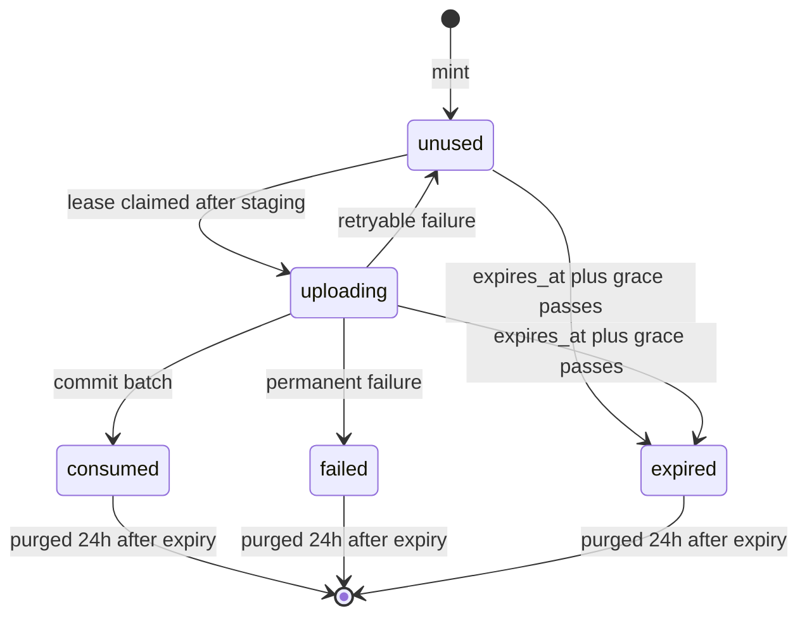

# Upload grants - Plan

## Goal Capsule

- **Objective:** Someone holding an API Token can let any other machine upload one file to this Energon for a few minutes, without giving that machine a token and without the bytes passing through the token holder.
- **Means:** A new single-use credential (Upload Grant) minted on `/v1`, redeemed by a tokenless `PUT` on the content origin that runs through the existing account mutators as the minting account (KTD1, KTD2).
- **Authority:** This plan's Product Contract, then `STRATEGY.md` boundaries (links open by default, no revision history, not per-user ACL, no dependence on a specific agent product), then `AGENTS.md` change rules.
- **Stop conditions:**
  - Stop if a grant secret would appear in any URL.
  - Stop if a grant upload can publish without consuming the grant in the same D1 batch as the catalog commit (KTD4).
  - Stop if a grant can be used as an API Token, or an API Token as a grant.
  - Stop if grant uploads bypass platform quota reservation, write claims, or cache purge.
  - Stop before merging if the XML content-isolation prerequisite (Risks & Dependencies) has not landed.
- **Execution profile:** Worker + D1 + R2 code, schema migration, `/v1` contract, runtime docs, skill templates, verify map. One PR, one concern.
- **Who finishes:** The implementer lands the PR against `tmchow/energon` using the PR template, including a verify-energon drive of the new feature file.

---

## Product Contract

### Summary

Add Upload Grants. A token holder mints a grant for exactly one target: a new loose file, an existing loose file, or one path in an existing site. The grant can carry a size cap and an expected SHA-256. The response holds an upload URL and a secret. Any machine sends the raw bytes to that URL once, with the secret in a header, before the grant expires. A successful upload publishes immediately and uses up the grant. The token holder can read the grant's state and the resulting URL.

### Problem Frame

An orchestrator (for example, a fleet gateway on one machine holding the account's token) wants agents on other machines to publish files they have locally. Today it has three options, each with a cost:

- Route the bytes through itself, which defeats the point of a direct upload.
- Give every machine its own API Token. Each token can list, replace, delete, and change passwords on everything the account owns.
- Use the Write Password door. It never expires, cannot be revoked per delegation, grants read plus full path control on a site, and requires a placeholder object to exist first.

The broader pattern is "server mints, client uploads directly": CI runners, sandboxes, MCP gateways, and orchestrators all need a narrow, short-lived permission to put one file somewhere. Energon has no credential of that shape.

### Requirements

**Minting**

- R1. A token holder can mint a grant whose target is exactly one of: a new loose file (filename required), an existing loose file (by id), or one path in an existing site (site id plus path).
- R2. Minting fails unless the minting account can currently write the target under its write policy.
- R3. A new-file grant may carry the file's TTL and write policy, validated at mint the same way `POST /v1/files` validates them.
- R4. A grant may carry a maximum size, capped at this Energon's per-file limit, and an expected SHA-256.
- R5. A grant expires after a short, operator-independent lifetime chosen at mint from a fixed catalog (KTD7), never later than the minting token's own expiry.
- R6. The mint response returns the grant id, the upload URL, the HTTP method, the header that carries the secret, the secret itself (shown once), the expiry, and the target. For existing-file and site-path targets it also returns the public URL the upload will change.

**Uploading**

- R7. Any client can redeem a grant with a raw-body `PUT` to the upload URL with the secret in a header. No API Token, Access session, or `/connect` is involved.
- R8. A successful upload publishes immediately: new-file targets create the file owned by the minting account, existing-file targets replace bytes at the same URL, and site-path targets add or replace that one path.
- R9. A grant publishes at most once. After success, every later redeem attempt fails and reports the resulting public URL, until the grant record is swept 24 hours after expiry.
- R10. An upload that fails for a retryable reason leaves the grant redeemable until it expires. An upload that fails for a permanent reason ends the grant with a recorded reason (KTD5).
- R11. An upload whose bytes exceed the grant's maximum or do not match its expected SHA-256 publishes nothing.
- R12. A grant stops working when its minting token is revoked or expires, or when the minting account's email stops being allowed on this Energon.
- R13. Responses to the uploading client never contain hub URLs, `api_url`, or any secret; on success they carry the public URL.

**Status and discovery**

- R14. Any token of the minting account can read a grant's state (unused, uploading, consumed, failed, expired), its last failure reason, and the resulting public URL once consumed.
- R15. A tokenless agent that reaches the content origin can learn how to redeem a grant from the content-origin `/llms.txt` and from error bodies.

### Key Decisions

- **Grants are their own credential with their own expiry and single-use lifecycle.** (session-settled: user-approved — chosen over adding expiry to the existing Write Password: a write password is per object, shared by every holder, and grants read plus delete on sites.) Governs R5, R9, R12.
- **A successful upload publishes immediately; there is no separate commit step.** (session-settled: user-approved — chosen over an upload-then-commit flow where bytes stay unpublished until the token holder approves: keeps unpublished staging out of Energon.) Governs R8.
- **One grant covers one file path; a site folder needs one grant per path.** (session-settled: user-approved — chosen over a time-boxed multi-path site grant: tighter and simpler, at the cost of many grants for large folders.) Governs R1.
- **A grant can create a new loose file.** (session-settled: user-approved — chosen over requiring an empty placeholder first.) Governs R1, R8.

### Scope Boundaries

- Conditional writes (`If-Match` or expected-version checks) are not part of this plan.
- Revision history, immutable revision URLs, private-by-default links, and team ACLs stay out per `STRATEGY.md`.
- R2 native presigned URLs are not used; every byte goes through the Worker (KTD2).
- No hub UI: grants are not listed, minted, or revoked from the hub.
- Grant-created files cannot carry share or write passwords at mint; the token holder can `PATCH` them afterward.
- Considered and not built:
  - A revoke endpoint for unused grants. Lifetime is at most one hour and revoking the minting token kills every grant it minted (R12). Revisit if operators report leaked grants they could not stop.
  - Rate limiting wrong grant secrets through `gate_attempts`. Grant secrets are high-entropy random strings, not human phrases. Revisit if logs show guessing.
  - A per-account cap on outstanding grants. The minter can already upload directly with its token, so grants add no new write capacity. Revisit if grant rows grow large enough to matter.
  - An attempt counter. Expiry already bounds retries.
  - A per-grant limit on concurrent staging. Several requests carrying the same secret can each stage a body before one wins the lease. Only a secret holder can do this, each body is capped by the grant's size limit, and staged objects are deleted on failure and swept hourly. Revisit if Worker logs show repeated parallel staging against one grant.
  - A "via upload grant" marker in the hub catalog. The writer is the real minting account.

#### Deferred to Follow-Up Work

- Public documentation in `energon-docs` (HTTP API reference and a "let another machine upload" guide).
- Conditional writes, as a separate plan with its `STRATEGY.md` change.

---

## Planning Contract

### Key Technical Decisions

- KTD1. **The upload calls the existing account mutators as the minting account.** The grant stores the minting token id and email (user id nullable, as legacy tokens have none). A helper factored out of `requireToken` in `src/auth.ts` rebuilds the `Actor` from a token id: it applies the same revoked, `tokenExpired`, and `assertEmailAllowed` checks and the legacy `getUser(email)` fallback, and fails closed when the token row or user is gone. Mint and both upload checks use it, so later changes to token checks reach grants automatically. The rebuilt `Actor` has `via: "grant"` and no admin scope. The upload calls `createLooseFile`, `putLooseFile` (no rename), or `putSiteFile` in `src/files.ts` and `src/sites.ts`. It never calls the request parsers `postLooseFromRequest` or `putLooseFromRequest`, which honor rename, password, TTL, and write-policy headers. This reuses write claims, platform quota reservation and release, R2 snapshot rollback, cache purge, and the `OWNER_WRITE_SQL` permission re-check. The guest-write plan's ban on these helpers (`docs/plans/2026-09-05-001-feat-guest-write-password-plan.md`, stop conditions and R12) exists because a guest is not an account and must not get a fake `Actor`; a grant acts for a real account that delegated, so the ban does not apply. `last_written_by` becomes the minter's email.
- KTD2. **The upload URL lives on the content origin at `/_grants/{grant_id}`.** Handles come from `handleFromEmail`, which replaces `_` with `-`, so no handle can start with `_` and no `RESERVED_HANDLES` change is needed. This keeps tokenless writes off the hub origin, matching the guest-write decision, and needs no change to the Access bypass set in `scripts/setup-access.mjs`. A hub-origin request to this path gets a JSON 404 naming the content-origin URL, not a redirect: in production Access answers hub paths outside its bypass list, and clients drop `Authorization` on a cross-host redirect, which would surface as a misleading `grant_invalid`. Browser uploads are out of scope: `OPTIONS` returns 405 and grant responses carry no `access-control-allow-origin`. The content-host branch runs before `ensureSchema`, so the grant branch calls it itself. Local single-origin runs serve it directly. The route is not under `/v1`, so it stays out of `openapi/v1.json`, but its error codes join the OpenAPI error enum because the drift test scans all of `src/`.
- KTD3. **The secret travels in a header, never the URL.** Workers Logs record request URLs. The header is `Authorization: Bearer <secret>`. The secret is a high-entropy random string with a fixed `grant_` marker. What keeps grants and API Tokens apart is storage, not the marker: grant secrets are hashed with their own domain prefix (mirroring `hashWritePassword` in `src/gate.ts`) and looked up only in the grants table, while tokens are looked up by an unprefixed hash in `tokens`. The marker alone is not enough because operators set `TOKEN_PREFIX`. Compare with the constant-time `hashesEqual`. An unknown id and a wrong secret return the same 404 `grant_invalid`.
- KTD4. **Consuming the grant happens in the same D1 batch as the catalog commit.** Each of the three mutators takes an optional grant guard `{ grantId, leaseId }`. D1 batches do not abort when a statement changes zero rows, so every statement in the batch carries the full predicate set, and the consume `UPDATE` checks with `EXISTS` that this attempt's catalog write landed. This is the two-way pattern in `exchangeConnection` (`src/connections.ts`). Per mutator, as each commits today:
  - `createLooseFile` commits with one unchecked `INSERT ... .run()` (`src/files.ts`). With a guard it becomes a batch:
    - an `INSERT ... SELECT ... WHERE EXISTS` (grant row has this `lease_id` and state `uploading`);
    - a consume `UPDATE ... WHERE lease_id = ? AND EXISTS` (a `loose_files` row with the id this attempt minted).
    - A zero-change `INSERT` throws inside the existing `try`, so the existing catch deletes the R2 key and releases quota. Today's code has no lost-race path for a non-throwing `INSERT`; this adds one.
  - `putLooseFile` commits with one `UPDATE ... WHERE last_written_by = <claim token>` and finalizes the write claim separately. With a guard the commit becomes a batch:
    - the existing `UPDATE` plus the lease `EXISTS` and the target-unexpired check;
    - a consume `UPDATE` with `EXISTS` (the file row still carries this claim token).
    - Finalize stays where it is.
  - `putSiteFile` already batches, but its upsert is unconditional and its compensation runs outside the batch. With a guard:
    - the upsert becomes `INSERT ... SELECT ... WHERE <not purge-claimed, unexpired, OWNER_WRITE_SQL, lease is mine> ON CONFLICT DO UPDATE`;
    - the `sites` `UPDATE` adds the lease `EXISTS` and the target-unexpired check;
    - the consume `UPDATE` checks the same site predicates with `EXISTS`.
  - Every guarded statement requires the target to be unexpired (`expires_at IS NULL OR expires_at > ?` at the commit timestamp) and the grant to be within `expires_at` plus the claim grace (KTD5). Every guarded statement also requires the minting token row to be unrevoked and unexpired, so a revocation that lands after the last pre-commit check still blocks publication (R12); the email allow-list is environment configuration, so it stays a pre-commit check. A target or grant that expires mid-commit then changes no rows, so a grant never records `consumed` for content a purge is about to remove, and a late commit cannot land after the status read reports `expired`.
  - When a guarded commit fails, the mutator re-reads the grant row before its conflict handling. If the lease is no longer this attempt's, it throws `grant_busy` (409) rather than `putSiteFile`'s 403 `forbidden_write` or a generic lost-race code. If the lease is still this attempt's, it re-checks the minting token and maps a revoked or expired token to `grant_failed`.
  - Without a guard, every statement and batch stays exactly as today.
  - A separate finalize step after the mutator is rejected: a crash between commit and finalize would leave the grant redeemable after publication (double write, or for new files a second file).
- KTD5. **Grant state machine with a lease taken after staging and never reclaimed.** States: `unused`, `uploading` (with `lease_id`, `leased_at`), `consumed`, `failed` (with `last_error`). `expired` is derived at read time once `expires_at` plus the five-minute claim grace has passed, so it is terminal: nothing can publish under a grant the status read has called expired. Upload order:
  1. Look up the grant and verify the secret (KTD3).
  2. Judge expiry at request arrival; fail closed on an unparseable `expires_at`, like `tokenExpired` in `src/policy.ts`.
  3. Reject cheaply if the grant is `consumed`, `failed`, or `uploading`.
  4. Check the minting token and email (KTD1, R12).
  5. Stage the body with `withUpload` and verify size and SHA-256 (U2).
  6. Re-check the minting token, then claim the lease with a conditional `UPDATE` from `unused` to `uploading` with a new `lease_id`. The claim requires `expires_at` plus a five-minute grace to be in the future, so a request that arrived in time can finish staging, while a trickling client cannot hold a grant open until the sweep.
  7. Call the mutator with the guard (KTD4).

  Staging before the lease follows the existing rule that slow clients must not hold claims (`src/upload.ts`). A lease is never reclaimed. Under a lease the mutator snapshots and copies objects up to 100 MB, which can outlast the 60-second `STALE_CLAIM_MS`. A reclaimed lease would let the stalled attempt's R2 rollback overwrite the winner's committed bytes (`putSiteFile` takes no write claim). A worker that dies mid-upload leaves the grant `uploading` until it expires, and the token holder mints a new one. The grant transition runs only after the mutator has thrown and its own R2 restore, claim restore, and quota release have finished. It is never in a `finally` running beside the mutator, and never in `waitUntil`. A conditional `UPDATE ... WHERE lease_id = ?` then either releases to `unused` (retryable) or moves to `failed` (permanent):

  | Outcome | Grant transition | Client status |
  |---|---|---|
  | `file_busy`, `file_write_lost`, `site_write_lost`, `storage_cap`, transient 5xx before commit | release to `unused` | original status, retryable |
  | target deleted or expired, 403 write denied, `too_many_files`, minting token revoked or expired, email not allowed | `failed` with `last_error` | 410 `grant_failed` |
  | lease lost (`grant_busy`) | none; another attempt owns the row | 409 `grant_busy` |
  | `storage_rollback_failed` | stays `uploading` until the grant expires | 500 |
  | success | `consumed` (in the commit batch) | 201 or 200 with public URL |

  `putLooseFile` swallows its own R2 and claim restore errors today. With a guard present it surfaces them as `storage_rollback_failed`, so a failed restore cannot release the grant while R2 and the catalog disagree. Failures before the lease (bad secret, expired, already used, size or checksum) never change the row.
- KTD6. **No pre-minted file id; new-file URLs come from the upload response and the status read.** `createLooseFile` mints the id at upload. Pre-minting would need id reservation across `loose_files` and grants (file ids are six characters) and reintroduces an R2 key overwrite on retries. Because consumption is atomic (KTD4), a retry can never create a second file. The orchestrator learns the URL from `GET /v1/grants/{id}` (R14) or from the uploading client.
- KTD7. **Grant lifetime is a credential policy, separate from content retention and token expiry.** A fixed catalog of `5m`, `15m` (default), `30m`, `1h`, unaffected by `TTL_*` or `TOKEN_TTL_*` env vars, following `docs/solutions/architecture-patterns/separate-credential-expiry-from-content-expiry.md`. When the minting token expires sooner, the grant's expiry is clamped to the token's. A new-file grant stores the requested file TTL catalog id and write policy, and the upload re-resolves them so the file's `expires_at` counts from upload, and a policy change between mint and upload is honored.
- KTD8. **SHA-256 is verified after staging and before any claim or quota reservation.** Bodies held in memory are hashed with `crypto.subtle.digest`. Staged bodies (over 25 MB, which require `Content-Length`) pass the expected hash to the staging `bucket.put` so R2 rejects a mismatch without the Worker hashing 100 MB on its CPU budget. Both paths map a mismatch to 400 `checksum_mismatch`. Checking only on the final put is rejected: a mismatch would surface after the write claim and quota reservation. The expected value is lowercase hex at mint.
- KTD9. **Grant rows are swept, not kept.** A `purgeGrants` step in the `scheduled` handler deletes rows 24 hours past `expires_at`. It is scheduled like `purgeConnections` (`src/connections.ts`), but bounded: `DELETE ... WHERE id IN (SELECT id ... LIMIT n)` in a capped loop, since D1 has no `DELETE ... LIMIT`. Grants hold no R2 bytes, so the sweep is D1-only. Every grant transition (lease claim, commit `EXISTS`, consume, release, fail) requires the row to exist with this `lease_id`, so a row deleted mid-upload fails closed through the mutator's rollback. The status read returns 404 after a row is purged.
- KTD10. **Error codes.** `grant_invalid` (404), `grant_expired` (410), `grant_used` (410, body includes the public URL), `grant_failed` (410, body includes `last_error`), `grant_busy` (409, retryable), `checksum_mismatch` (400), and the existing `too_large` (413) with the grant's own limit in its message. Machine-facing bodies use a guest-style JSON shape with `cache-control: no-store` and no `hub` field, like `guestJson` in `src/guest-write.ts`; mutator `ApiError`s are rewritten into that shape with grant-context messages that never point at `/v1`.
- KTD11. **The uploading machine never chooses the content type.** The grant door passes no `Content-Type` hint to the mutators. `contentTypeFor` (`src/mime.ts`) falls back to the request hint for paths with no known extension, and `isolationCsp` (`src/http.ts`) sandboxes only HTML, XHTML, and SVG, so a hint such as `text/xml` would serve script-capable XML on the content origin, which every handle and its gate cookies share. Filenames and site paths are fixed at mint by the token holder, and the type follows them plus content sniffing. A replacement of an existing loose file keeps its stored type, as guest write does (`src/guest-write.ts`): `putLooseFile` always recomputes the type with `contentTypeFor`, so with a guard present it writes the existing row's stored `content_type` instead.

### High-Level Technical Design

Mint, upload, and status across the three parties:

```mermaid
sequenceDiagram
  participant O as Token holder
  participant H as Hub /v1
  participant M as Uploading machine
  participant C as Content origin /_grants
  participant DB as D1 + R2
  O->>H: POST /v1/grants (target, expires_in, max_bytes?, sha256?)
  H->>DB: check write permission, insert grant (secret hash)
  H-->>O: id, upload_url, header, secret (once), expires_at
  O-->>M: upload_url + secret (out of band)
  M->>C: PUT bytes, Authorization: Bearer secret
  C->>DB: verify secret, expiry, token; stage; verify size and sha256
  C->>DB: claim lease
  C->>DB: mutator commit + consume grant (one batch)
  C-->>M: 201/200 public url
  O->>H: GET /v1/grants/{id}
  H-->>O: consumed, url
```

Grant lifecycle:



### Assumptions

- Miniflare enforces the R2 `sha256` put option the same way remote R2 does. If it does not, the staged-path checksum test needs a remote check or a `DigestStream` fallback (see Risks).

### Risks & Dependencies

- **Prerequisite: XML content isolation.** A separate PR extends `isolationCsp` in `src/http.ts` to sandbox `application/xml`, `text/xml`, and `*+xml`, and lands before this plan's PR. Without it, a grant for a `.xml` path lets its holder publish script-capable XML on the shared content origin. The gap predates grants and affects token and write-password uploads too, so it is its own concern. (session-settled: user-directed — chosen over folding it into the grants PR or deferring it: grants hand the existing gap to a less-trusted uploader, and one concern per PR.)

- **Mutator signature changes touch the hottest write paths.** Adding the optional guard to `createLooseFile`, `putLooseFile`, and `putSiteFile` must leave token and hub behavior byte-for-byte unchanged when the guard is absent. The existing `test/api.spec.ts`, `test/files.spec.ts`, and `test/site-integrity.spec.ts` suites are the regression net.
- **Quota drift on new failure paths.** Every failure after `assertStorageRoom` must release its reservation (`docs/solutions/database-issues/platform-quota-drift-blocks-publishing.md`). The token re-check and lease claim run before the mutators reserve, so they need no release. One existing leak is inherited: when `putSiteFile`'s `restoreR2State` throws `storage_rollback_failed`, its reservation is never released. That case is rare, already affects token writes, and admins can repair it with `POST /v1/admin/quota/recompute`; this plan does not fix it.
- **R2 checksum rejection is not proven by the binding docs.** The Workers binding documents the `sha256` option but not its failure mode in detail. Confirm with a test that a mismatched staged put throws and stores nothing; if not, compute the digest in a `DigestStream` beside the existing head capture.
- **Workers request-body limits.** Free and Pro zones cap request bodies at 100 MB, matching `MAX_FILE_BYTES`. No change, but the content-origin `/llms.txt` should state the instance limit rather than a fixed number.

### System-Wide Impact

- **Auth boundary:** a third write door beside API Tokens and the Write Password. `CONCEPTS.md`, `STRATEGY.md`, `/auth.md`, `/v1/help`, and both `/llms.txt` bodies must describe it consistently.
- **Offboarding:** `docs/DEPLOY.md` says revoking a person's tokens stops their agents immediately. R12 keeps that true for grants; the line gains a clause saying so.
- **Content origin:** gains its first non-content write path. Content-host routing tests in `test/routes.spec.ts` must cover it.

---

## Implementation Units

### U1. Grant table, lifetime policy, and sweep

- **Goal:** Persist grants and expire them.
- **Requirements:** R5, R9, R10, R14; KTD5, KTD7, KTD9.
- **Dependencies:** none.
- **Files:**
  - `migrations/0022_upload_grants.sql` (new)
  - `src/db.ts`
  - `src/schema.sql`
  - `src/policy.ts`
  - `src/grants.ts` (new; sweep and shared row helpers)
  - `src/index.ts` (`scheduled`)
  - `test/unit/schema-drift.spec.ts`
  - `test/unit/policy.spec.ts`
  - `test/grants.spec.ts` (new)
- **Approach:**
  1. Table columns cover: id, secret hash, minting token id, minting email, minting user id (nullable), target kind, target file id or site id plus path, new-file filename, stored file TTL id and write policy, max bytes, expected SHA-256, state, lease id, leased at, last error, result file or site id, result public URL, created at, expires at. Indexes on `expires_at` and on minting user id.
  2. Add the table to `TABLE_STATEMENTS` and indexes to `INDEX_STATEMENTS` in `src/db.ts`, and the `CREATE` to `src/schema.sql`. A new table needs no `ensureColumns` entry.
  3. Add a grant lifetime catalog and resolver in `src/policy.ts` (KTD7), with a fail-closed expiry check.
  4. Add `purgeGrants` and call it from `scheduled` after `purgeConnections`.
- **Patterns to follow:** `migrations/0014_agent_connections.sql`; `tokenPolicy`, `resolveTokenExpiresAt`, and `tokenExpired` in `src/policy.ts`; `purgeConnections` in `src/connections.ts`.
- **Test scenarios:**
  - The schema-drift test passes with the new table in both `src/schema.sql` and `src/db.ts`.
  - A database at the `0021` shape gains the grants table on first `ensureSchema`.
  - Resolving lifetime with no input returns `15m`; `2h` is rejected with 400 `bad_ttl`; setting `TTL_DEFAULT` or `TOKEN_TTL_DEFAULT` does not change the grant default.
  - An unparseable `expires_at` counts as expired.
  - `purgeGrants` deletes a row 25 hours past expiry and keeps one 23 hours past expiry and one still live.
  - With more expired rows than one batch, repeated sweeps remove them all.
- **Verification:** Schema, policy, and sweep tests pass; a fresh local DB and an upgraded one both start.

### U2. Size and SHA-256 checks during staging

- **Goal:** Let a caller of `withUpload` require an exact SHA-256 and a tighter size cap before any claim.
- **Requirements:** R4, R11; KTD8.
- **Dependencies:** none.
- **Files:**
  - `src/upload.ts`
  - `test/unit/upload.spec.ts`
  - `test/grants.spec.ts`
- **Approach:**
  1. Add an optional expected SHA-256 to the upload reader. In-memory bodies are hashed with `crypto.subtle.digest`; staged bodies pass it to the staging `bucket.put`.
  2. Map either mismatch to a typed 400 `checksum_mismatch`, deleting any staged object.
  3. Existing callers pass nothing and behave as today.
- **Patterns to follow:** `readUpload`, `withUpload`, `capStream` in `src/upload.ts` and `src/http.ts`.
- **Test scenarios:**
  - A 10-byte in-memory body with its correct hex digest reads normally.
  - The same body with a wrong digest throws `checksum_mismatch` and nothing is staged.
  - A staged body over 25 MB with a wrong digest throws `checksum_mismatch` and the `tmp/uploads/` key is gone.
  - A call with no expected digest behaves exactly as before for empty, in-memory, and staged bodies.
- **Verification:** Unit and worker tests pass; existing upload tests are unchanged.

### U3. Grant guard on the account mutators

- **Goal:** Make grant consumption part of each mutator's catalog commit.
- **Requirements:** R8, R9; KTD1, KTD4.
- **Dependencies:** U1.
- **Files:**
  - `src/files.ts` (`createLooseFile`, `putLooseFile`)
  - `src/sites.ts` (`putSiteFile`)
  - `src/types.ts` (`Actor.via` gains `"grant"`)
  - `test/grants.spec.ts`
  - `test/d1-r2-claim-mutation.spec.ts`
- **Approach:**
  1. Each mutator accepts an optional guard and, when present, commits through the guarded batch KTD4 specifies for it; the consume `UPDATE` sets `consumed`, the result ids, and the public URL.
  2. Guard failure handling follows KTD4 (re-read the grant, `grant_busy` on a lost lease) and KTD5 (`putLooseFile` surfaces restore failures when guarded).
  3. With a guard present, `putLooseFile` keeps the stored `content_type` (KTD11).
  4. When absent, statements and batches are unchanged.
  5. Check every switch on `Actor.via` and treat `"grant"` like `"token"` for authorization.
- **Execution note:** Start with the race tests below, failing, before changing the mutators.
- **Patterns to follow:** the guarded batch in `exchangeConnection` (`src/connections.ts`) and its race test in `test/connections.spec.ts`; the coherent-outcome harness in `test/mutation-harness.ts`.
- **Test scenarios:**
  - `createLooseFile` with a valid guard creates the file and marks the grant consumed with the file's public URL, in one batch.
  - `createLooseFile` with a guard whose lease no longer matches returns 409 `grant_busy`, not 201; it creates no catalog row, its R2 key is gone, and `platform_quota.used` is unchanged.
  - `putLooseFile` with a lost lease returns 409 `grant_busy` and leaves the old bytes and catalog row intact.
  - `putLooseFile` with a guard whose R2 restore fails returns `storage_rollback_failed` and leaves the grant `uploading`.
  - `putSiteFile` with a valid guard on a new path creates the path and consumes the grant.
  - `putSiteFile` with a lost lease returns 409 `grant_busy`, not 403, and the `site_files` row and R2 bytes match their state before the attempt.
  - Deleting the grant row between lease and commit causes no publication, no quota drift, and no leftover R2 object.
  - A target that expires between lease and commit is not published and the grant is not consumed.
  - A guarded commit after the grant's `expires_at` plus grace publishes nothing, returns 410 `grant_expired`, and leaves `platform_quota.used` unchanged.
  - Revoking the minting token between the lease claim and the guarded commit publishes nothing, moves the grant to `failed`, and leaves `platform_quota.used` unchanged.
  - Two concurrent guarded commits for one grant produce exactly one publish, and the R2 bytes match the catalog row.
  - Without a guard, existing token publish, replace, and site-path tests pass unchanged.
- **Verification:** Mutation-harness and race tests show coherent outcomes; `test/api.spec.ts`, `test/files.spec.ts`, and `test/site-integrity.spec.ts` pass.

### U4. Mint and status endpoints

- **Goal:** Let a token holder mint a grant and read its state.
- **Requirements:** R1–R6, R14; KTD1, KTD3, KTD6, KTD7.
- **Dependencies:** U1.
- **Files:**
  - `src/grants.ts`
  - `src/auth.ts` (token-to-`Actor` helper)
  - `src/v1-routes.ts`
  - `src/route-table.ts`
  - `src/config.ts` (secret marker and header constants)
  - `test/grants.spec.ts`
- **Approach:**
  1. `POST /v1/grants` in the token table. Validate exactly one target. New file: `assertFilename`, TTL and write-policy validation as in `createLooseFile`. Existing file: it exists, is not expired or purge-claimed, and the minter can write it. Site path: `assertFilePath`, the site exists, the minter can write it.
  2. Resolve lifetime and clamp to the minting token's expiry (KTD7). Cap `max_bytes` at the instance per-file limit. Validate `sha256` as 64 hex characters.
  3. Factor the token-to-`Actor` helper out of `requireToken` (KTD1) and use it here. Generate id and secret, store the hash, minting token id, and email, store normalized filenames and paths, and return the R6 fields with `secretJson`. OpenAPI and help examples use an obviously fake secret.
  4. `GET /v1/grants/{id}` returns state, derived expiry, `last_error`, target, and result URL to any token of the minting account; other accounts get 404.
- **Patterns to follow:** `startConnection` and its secret handling in `src/connections.ts`; `secretJson` in `src/http.ts`; write-permission checks used by `PATCH /v1/files/{id}`.
- **Test scenarios:**
  - Minting a new-file grant returns an upload URL on the content origin under `/_grants/`, a secret starting with `grant_`, and no secret in the URL.
  - Minting for an `owner`-policy file owned by another account returns 403; for an `org`-policy file it succeeds.
  - Minting with two targets, or none, returns 400.
  - `expires_in: "1h"` with a token expiring in 10 minutes yields an expiry at the token's expiry.
  - `max_bytes` above the instance limit is capped; a malformed `sha256` returns 400.
  - The grant secret sent as a bearer token to `GET /v1/whoami` returns 401, including with `TOKEN_PREFIX` set to `grant_`; an API Token sent to a grant upload returns 404 `grant_invalid`.
  - Existing `requireToken` tests pass unchanged after the helper is factored out.
  - `GET /v1/grants/{id}` from a second token of the same account returns the state; from another account it returns 404.
  - No response body or catalog read ever includes the secret hash.
- **Verification:** Worker tests pass; mint and status appear in OpenAPI and `helpBody` (U6).

### U5. Upload door on the content origin

- **Goal:** Redeem a grant with a tokenless `PUT`.
- **Requirements:** R7–R13; KTD1, KTD2, KTD3, KTD5, KTD8, KTD10, KTD11.
- **Dependencies:** U1, U2, U3, U4.
- **Files:**
  - `src/grants.ts`
  - `src/index.ts`
  - `test/grants.spec.ts`
  - `test/routes.spec.ts`
- **Approach:**
  1. In `src/index.ts`, add a branch for `/_grants/{id}` before the content-host 404, and the hub-origin JSON 404 (KTD2). Call `ensureSchema` in that branch. Only `PUT` is allowed; other methods, including `OPTIONS`, return 405 with `Allow: PUT`.
  2. Follow the KTD5 order: precheck, token check, stage with the grant's size cap and expected digest, token re-check, lease claim, guarded mutator call. Both token checks use the KTD1 helper.
  3. Pass no content-type hint to the mutators (KTD11).
  4. Reject request headers that would change metadata (`X-Filename`, set-password, TTL, write policy, duplicate, multipart) with 400, as guest write does.
  5. Map outcomes per the KTD5 table and KTD10; success returns 201 for a new file or path and 200 for a replacement, with the public URL, id, size, and content type.
- **Patterns to follow:** `guestWrite` routing and `guestJson` responses in `src/guest-write.ts` and `src/index.ts`; `rejectForbiddenPutHeaders`.
- **Test scenarios:**
  - A new-file grant redeemed with correct bytes returns 201 and a public URL; `GET` of that URL returns the bytes; the file's creator is the minting account.
  - An existing-file grant replaces bytes at the same URL and returns 200.
  - A site-path grant creates the path (201); a second grant for the same path replaces it (200).
  - Redeeming a consumed grant returns 410 `grant_used` with the public URL.
  - A wrong secret and an unknown id both return 404 `grant_invalid` with identical bodies.
  - A redeem after expiry returns 410 `grant_expired`.
  - A body one byte over `max_bytes` returns 413 and the grant is still `unused`.
  - A checksum mismatch returns 400 `checksum_mismatch`, nothing is published, and a correct retry succeeds.
  - Revoking the minting token, then redeeming, returns 410 `grant_failed` and status shows the reason.
  - Deleting the target file before redeem returns 410 `grant_failed`.
  - Two concurrent redeems publish exactly once; the loser gets 409 `grant_busy` or 410 `grant_used`.
  - Platform quota after a failed redeem equals quota before it.
  - A `PUT` to `/_grants/{id}` on the hub origin returns a JSON 404 naming the content-origin URL.
  - `OPTIONS` on the upload URL returns 405, and no grant response carries `access-control-allow-origin`.
  - A site-path grant for an extensionless path, redeemed with `Content-Type: text/xml`, is not served as `text/xml`.
  - A stale `uploading` grant (worker died) cannot be redeemed again and reads as expired once `expires_at` plus the grace passes.
  - A redeem that arrives before expiry and finishes staging within the grace period publishes; a lease claim after the grace returns 410 `grant_expired`.
  - An existing-file grant on an extensionless file stored as `text/plain` keeps `text/plain` after redeem.
  - A lease-claim failure after staging leaves `platform_quota.used` unchanged and removes the `tmp/uploads/` object.
  - No redeem response contains `hub`, `api_url`, or `/v1`.
  - A metadata header such as `X-Filename` on redeem returns 400.
- **Verification:** Worker and route tests pass; quota and catalog stay coherent under the race tests.

### U6. Contracts and runtime docs

- **Goal:** Describe grants everywhere agents and operators read about writing.
- **Requirements:** R6, R13, R15.
- **Dependencies:** U4, U5.
- **Files:**
  - `openapi/v1.json`
  - `src/auth.ts` (`helpBody` routes and SOP)
  - `src/llms.ts`
  - `src/guest-write-protocol.ts` (content-origin `/llms.txt` gains a grant section)
  - `src/auth-doc.ts`
  - `templates/skill/SKILL.md.tmpl`
  - `templates/skill/references/api.md.tmpl`
  - `CONCEPTS.md`
  - `STRATEGY.md`
  - `docs/DEPLOY.md`
  - `test/golden/` (regenerated)
  - `test/unit/openapi-drift.spec.ts`
  - `test/unit/skill-render.spec.ts`
- **Approach:**
  1. Document `POST /v1/grants` and `GET /v1/grants/{id}` in OpenAPI and `helpBody`; add the KTD10 codes to the error enum.
  2. Add a grant section to the content `/llms.txt`: `PUT` raw bytes, `Authorization: Bearer`, one use, status codes, no `/v1`.
  3. Add an "another machine uploads" scenario to the skill template; assert the header and path constants appear in the rendered skill.
  4. Add an Upload Grant entry and relationship line to `CONCEPTS.md`.
  5. Extend the `STRATEGY.md` "Shared writes happen through …" boundary with single-use upload grants. Note that a grant is a capability, not an ACL, and that a grant can target any object the minter could write with its token, including another account's `org`-policy site.
  6. Add to the `docs/DEPLOY.md` offboarding line that revoking tokens also ends grants they minted.
  7. Keep agent product names out of shipped docs and skills.
- **Patterns to follow:** how the guest-write change touched these files (`docs/plans/2026-09-05-001-feat-guest-write-password-plan.md`, "Sourcing map").
- **Test scenarios:**
  - The openapi-drift test passes with the new routes and error codes.
  - Goldens for help, hub llms, content llms, and auth match the regenerated output and the content llms golden still contains no `/v1`, `/auth.md`, `/tokens`, or `/connect`.
  - The rendered skill contains the grant header and path constants and passes `skill:render --check`.
- **Verification:** Unit suite passes; goldens reviewed in the diff.

### U7. Verify-energon feature map

- **Goal:** Let a triage agent drive grants end to end on a local Energon.
- **Requirements:** R7–R12, R14.
- **Dependencies:** U5, U6.
- **Files:**
  - `.agents/skills/verify-energon/features/upload-grant.md` (new)
  - `.agents/skills/verify-energon/features/README.md`
  - `.agents/skills/verify-energon/features/discovery.md`
- **Approach:** Follow the four-section feature entry contract. Drive: mint a new-file grant with a token, redeem with `curl` and no token, open the public URL, redeem again for `grant_used`, read status, mint and redeem a site-path grant, show a checksum mismatch and a successful retry, and show a revoked-token failure.
- **Patterns to follow:** `.agents/skills/verify-energon/features/guest-write-password.md`.
- **Test scenarios:** Test expectation: none -- documentation for the verify skill; exercised by running it.
- **Verification:** A verify-energon run using this file succeeds on a fresh local launch and its evidence is named in the PR's Verify section.

---

## Verification Contract

| Change | Command |
|---|---|
| Schema, shared types, before commit | `npx wrangler types && npm run typecheck && npm run lint && npm test` |
| Upload helper | `npm run test:unit -- test/unit/upload.spec.ts` |
| Policy | `npm run test:unit -- test/unit/policy.spec.ts` |
| Schema drift | `npm run test:unit -- test/unit/schema-drift.spec.ts` |
| Grant mint, upload, status | `npx vitest run test/grants.spec.ts` |
| Mutator regressions | `npx vitest run test/api.spec.ts test/files.spec.ts test/site-integrity.spec.ts test/d1-r2-claim-mutation.spec.ts` |
| Content-origin routing | `npx vitest run test/routes.spec.ts` |
| OpenAPI and help | `npm run test:unit -- test/unit/openapi-drift.spec.ts test/unit/golden.spec.ts` |
| Skill templates | `npm run test:unit -- test/unit/skill-render.spec.ts` and `npm run skill:render -- --check` |
| User path | verify-energon skill with `features/upload-grant.md` |

## Definition of Done

- Every unit's test scenarios exist and pass, and the full `npm test` suite passes.
- Token and hub publish behavior is unchanged when no grant is involved.
- A verify-energon drive of `features/upload-grant.md` succeeds and is named in the PR's Verify section, with How to test steps a triage agent can replay.
- `openapi/v1.json`, `helpBody`, both `/llms.txt` bodies, `/auth.md`, the skill template, `CONCEPTS.md`, `STRATEGY.md`, and `docs/DEPLOY.md` all describe grants consistently.
- No grant secret appears in a URL, log line, catalog read, or response other than the mint response.
- Abandoned-attempt code and debugging scaffolding are removed from the diff.

---

## Sources & Research

- Guest-write precedent and stop conditions: `docs/plans/2026-09-05-001-feat-guest-write-password-plan.md`.
- Credential expiry rules: `docs/solutions/architecture-patterns/separate-credential-expiry-from-content-expiry.md`.
- Quota release on every failure: `docs/solutions/database-issues/platform-quota-drift-blocks-publishing.md`.
- Atomic multi-statement guards: `docs/solutions/database-issues/multi-field-patch-claim-atomicity.md`, `docs/solutions/database-issues/site-storage-mutation-rollback.md`.
- Content-origin preflight before storage writes: `docs/solutions/security-issues/published-content-origin-validation.md`.
- Single-use credential exchange: `exchangeConnection` and its tests in `src/connections.ts` and `test/connections.spec.ts`.
- R2 Workers binding `put()` checksum options: https://developers.cloudflare.com/r2/api/workers/workers-api-reference/
- R2 presigned URLs authorize one operation on one object but are reusable until expiry and bypass the Worker: https://developers.cloudflare.com/r2/api/s3/presigned-urls/
- Workers Logs record request URLs, which is why the secret stays in a header: https://developers.cloudflare.com/workers/observability/logs/workers-logs/
