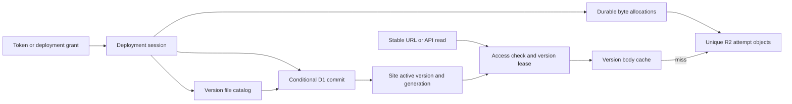
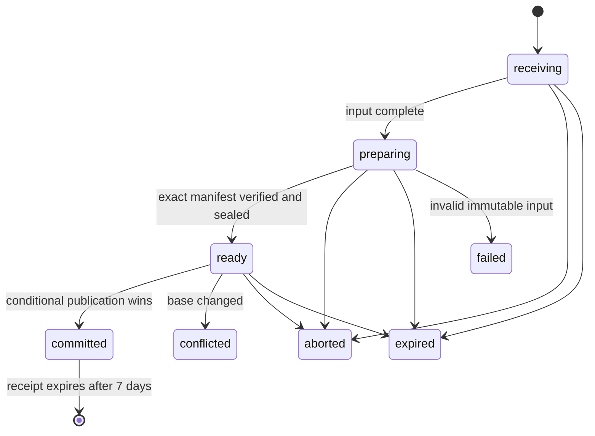
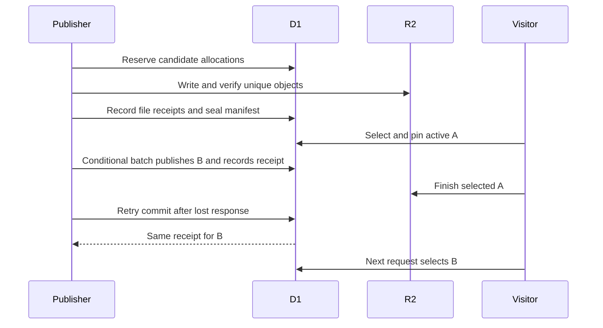
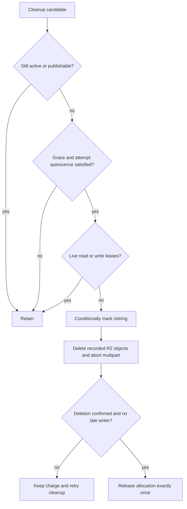

# Atomic Site Updates - Plan

## Goal Capsule

**Objective:** Publish a complete multi-file site in one switch at its existing stable URL, without exposing partially uploaded deployments.

**Authority:** Trevin has approved the product scope recorded below for atomic multi-file site updates.

**Means:** Immutable full snapshots, a conditional D1 publication pointer, and staged deployment sessions (KTD1–KTD12).

**Decision hierarchy:** The Product Contract governs behavior; the Planning Contract governs implementation within it. Preserve R1–R17. Stop before enabling a feature if its release-critical proof fails.

**Execution:** Implement U1–U8 with their verification gates. This document plans code work; the current task changes documentation only.

**Preservation note:** Product requirements R1–R17 and settled choices are unchanged; engineering research is consolidated under the Planning Contract.

---

## Product Contract

### Summary

Build atomic site updates using immutable site versions and a single D1 publication pointer behind the existing stable URL. Each request selects the active complete deployment; requests across a publication can observe different deployments. A manifest-backed upload session separates transferring files from publishing them, accepting raw files or a ZIP archive up to 100 MiB by default. Whole-site grants authorize one fixed deployment session in the initial release.

### Problem Frame

Today a multi-file update publishes separate path writes, so visitors can load a partially updated site. The same risk applies to ZIP imports and tokenless per-path grants. General site publishing needs a complete deployment boundary while retaining the existing shared URL.

### Key decisions

- Build atomic multi-file site updates now (session-settled: user-directed — chosen over waiting for the pilot to require it: Trevin considers the capability worthwhile). Governs R1–R17.
- Include 100 MiB ZIP uploads and incremental extraction in the initial implementation (session-settled: user-approved — chosen over retaining the 25 MiB ZIP import limit: Trevin considers it too small and accepted staging plus incremental extraction). Governs R8/R9.

- Provide atomic publication at the existing stable URL, without visitor/page pinning or version-URL redirects (session-settled: user-approved — chosen over keeping an open page on its original version: the reported problem is separately published files; pages spanning a switch may need a refresh). Governs R1/R2/R4.

- Default whole-site deployments to replace: omitted paths are removed from the active site (session-settled: user-approved — chosen over merge by default: the uploaded directory defines the complete site and obsolete files do not accumulate). Existing per-file mutations and the current ZIP-import endpoint retain their semantics. Governs R10.

- Apply publication consistency to API reads, exports, duplication, and hub listings (session-settled: user-approved — chosen over visitor-only consistency: staged files stay hidden everywhere, and each operation reads one complete published version). Governs R3.

- Include whole-site grants in the initial release (session-settled: user-approved — chosen over deferring delegation: the feedback explicitly requires tokenless whole-site publication). Each grant authorizes one approved manifest or ZIP, including removal of omitted paths under replace semantics, but no site-settings changes. Governs R11/R12.

- Defer user-triggered rollback from the initial release (session-settled: user-approved — chosen over retaining selectable deployment history: failed deployments preserve the live site, and a successful but unwanted deployment can be replaced by republishing prior files). Governs R6/R13.

- Use minimal retention for superseded deployment files (session-settled: user-approved — chosen over retaining unused history: files become eligible for background cleanup once in-flight operations finish and a short safety grace period passes). The grace interval and operation-lease mechanics are engineering decisions. Governs R13.

- Count staged uploads, extracted candidates, and retained old files toward platform quota until their bytes are successfully deleted (session-settled: user-approved — chosen over charging only the active site: the quota must bound actual storage, including temporary deployment headroom). Governs R7/R14.

- Retain deployment-result metadata for 7 days after completion (session-settled: user-approved — chosen over a shorter recovery window: agents can recover a lost response without retaining old site bytes). Retries after the recovery window fail explicitly and cannot create another deployment. Governs R15.

- Include version-aware body caching in the initial release (session-settled: user-approved — chosen over uncached serving: preserve cached delivery while checking the active deployment and access rules before every cache lookup). Governs R16/R17.

- Set the default total extracted ZIP size to 500 MiB, configurable by the operator and subject to available platform quota (session-settled: user-approved — chosen over constraining extracted contents to the archive limit: compressed sites need room to expand while extraction and storage remain bounded). Governs R9.

### Verified baseline

Checked against freshly fetched `origin/main`, commit `c2f9d31170ed377b22acb78f2c7b10fd6fff95f2`, on 2026-10-07.

The brief's storage and serving description is accurate: `siteKey` addresses mutable objects; `site_files` is keyed by site and path. `serveSite` reads those objects directly, with HTML, Markdown, then catalog-listing fallback. API file GET also reads R2 directly; export and duplicate read a catalog then fetch objects individually. None selects a content version (`src/config.ts`, `src/schema.sql`, `src/sites.ts`).

Two qualifications matter:

- **Sites do not have the loose-file write lease.** `writeSite` guards a metadata update; `throwSiteMutationConflict` recognizing a write marker does not acquire one. Token, guest, and distinct grant writes can overlap. The grant lease serializes redemption of its own credential, not all writers to a site (`src/sites.ts:210`, `src/sites.ts:562`, `src/guest-write.ts:325`, `src/expire.ts:84`).
- **The default per-file upload cap is 100 MiB.** ZIP import has a separate 25 MiB default cap, applied to both archive size and aggregate unpacked bytes. ZIP import also caps eligible imported files at 200, excluding directories and skipped junk. It merges and batches upserts in groups of 100; that is not one whole-import transaction (`src/sites.ts:711`, `src/zip.ts:70`, `src/config.ts`).

| Current limit | Default | Meaning for atomic deployments |
| --- | --- | --- |
| Raw file upload | 100 MiB per file | Preserve this per-file default for session uploads. |
| ZIP import | 25 MiB | Replace with R8/R9 below; this is the current implementation limit. |
| ZIP export | 25 MiB | Export expansion is outside this change; keep its limit separate from the new import limits. |
| In-memory body threshold | 25 MiB | Larger raw bodies with Content-Length are staged in R2; they are not rejected just for exceeding this threshold. |

A deployment session can contain multiple files up to the effective per-file cap. Its aggregate bytes are bounded by the session reservation and platform quota, not the ZIP cap. MiB here reflects the code's multiples of 1024; agent-facing copy commonly calls these MB.

`purgeContent` is a no-op without the execution-context cache API; when that API rejects, the rejection propagates. A publish can therefore commit and still report a purge error. Existing grant result recovery handles this distinction (`src/cache.ts:22`, `test/grants.spec.ts`).

### Requirements

**Publication and reads**

- R1. Requests selecting a version before commit use the prior complete deployment; requests selecting after commit use the new complete deployment, with no staged files exposed.
- R2. The existing shared site URL remains valid and serves the active deployment without redirecting visitors to a version-specific URL.
- R3. API file reads, exports, duplication, and hub/API site listings use only published data and select one deployment per site per operation; in-flight operations finish using their selected deployment after a newer one is published.
- R4. A path missing from the selected deployment returns an error, never bytes from another deployment.

**Mutation and lifecycle**

- R5. Every writer to a versioned site uses the same conditional publication boundary, preserving current authorization, expiry, password, and conflict rules.
- R6. An unsuccessful candidate cannot change the published version; lost responses can be resolved through an idempotent commit and status lookup.
- R7. Uploads reserve bounded storage before candidate writes, and cleanup releases each reservation exactly once after the associated bytes are removed.

**ZIP input**

- R8. ZIP imports accept archives up to 100 MiB by default, using staged storage and incremental extraction with bounded memory.
- R9. ZIP extraction enforces separate compressed-size, per-file, total extracted-size, and file-count limits against actual processed data before publishing any extracted files; total extracted size defaults to 500 MiB, is operator-configurable, and remains subject to available platform quota.

**Deployment contents**

- R10. New whole-site deployments default to replace: the committed site contains exactly the submitted paths, and previously published paths omitted from the deployment are removed from the active site.

**Delegation**

- R11. A token holder can grant a tokenless machine permission to upload and commit one approved whole-site deployment, bounded to a site, manifest or archive, size limits, and expiry, without permission to change site settings.
- R12. Successful publication consumes the deployment grant in the same commit and records a retrievable result so retrying after a lost response cannot publish a second deployment.

**Retention**

- R13. Superseded deployment files become eligible for background cleanup after in-flight operations release them and a short safety grace period passes; retain no additional history for rollback.

**Storage accounting**

- R14. Platform quota includes active files, staged archives and uploads, extracted candidates, and retained superseded files; release their charge only after successful deletion, and include outstanding reservations in quota repair.

**Retry recovery**

- R15. Deployment ID, outcome, and result URL remain retrievable for 7 days after completion; after that window an old retry fails explicitly rather than creating a new deployment.

**Serving and caching**

- R16. The initial release caches eligible public site responses behind active-deployment selection and access checks, keyed by site, deployment, normalized path, and representation; no cache may bypass those checks.
- R17. Cache misses, unavailability, or errors fall back to the selected deployment in R2; cache failures never change publication results or cause fallback to another deployment.

The guarantee is atomic publication, not consistency across all requests made by an already-open page. A browser can receive A's HTML before commit and B's JavaScript after commit; that page may need a refresh. Automatic reloads, visitor pinning, and public historical-version URLs are outside the initial scope. Existing asset URL conventions continue to work without a new version-relative build requirement.

R3 protects each multi-file server operation and site listing from mixing deployments. It does not make separate API requests or already-rendered hub screens switch simultaneously. In-flight operations may finish reading their selected deployment after a newer one becomes active; cleanup must retain their bytes until completion.

---

## Planning Contract

### Key Technical Decisions

- KTD1. **Full immutable snapshots and one publication pointer.** Add `sites.active_version_id` and a monotonic content generation. A candidate owns a complete version catalog and uniquely named R2 objects under `site-versions/{siteId}/{versionId}/{attemptId}`. Catalog entries map normalized public paths to those keys. Unchanged files are copied for an edit or merge; shared-blob reference counting is deferred. This implements R1–R6 and R10, trading temporary space and copy work for simple ownership and cleanup.
- KTD2. **A small D1 commit with an exact transaction witness.** Prepare and seal outside the final transaction. Start the final batch with a conditional transition of the ready session that records a fresh server-generated commit-attempt nonce. It checks the base generation, sealed candidate, current authority (including an unconsumed, valid grant when applicable), and live site. Every following effect requires that exact nonce: pointer and generation update, supersession timestamp, result record, and grant consumption. No statement relies solely on an earlier zero-row update. The nonce is generated anew for every attempt, never reused on retry; a committed session is read back before attempting mutation. SQL errors roll back the whole batch. A zero-row first transition produces no later effects and resolves to conflict/expiry/authorization failure from current state. This implements R5/R6/R12; unit tests must prove both zero-row and SQL-error behavior before writers adopt it.
- KTD3. **Durable byte allocations, including pending reservations.** Register each external write attempt before issuing R2 I/O. Its allocation records the unique key or multipart upload, owner, maximum reserved bytes, actual bytes, and cleanup state. Admission and counter adjustment happen in one guarded D1 transaction. A reservation becomes stored bytes in the same record; publication changes reachability, not its charge. Recompute sums allocations, unconverted legacy catalog bytes, loose-file catalog bytes, and durable outstanding legacy/loose-file reservations without overlap. Replace the shared reservation helper's volatile deltas so repair cannot erase another upload's claim. Do not redesign loose-file serving or storage layout. This implements R7/R14 and the confirmed shared-accounting change.
- KTD4. **Leases protect operations, not browser sessions.** Acquire an active-version read lease in one conditional D1 operation that excludes retiring versions, then use the version stored on that lease. Use a two-minute renewable lease, renewal at least every 30 seconds, and a five-minute supersession grace. Stream completion/cancellation owns release; returning response headers does not. Failure to renew stops reads and terminates the operation, never substitutes a newer version. GC atomically marks a nonactive version retiring only after the grace and all live leases end. Export, duplicate, base-copy preparation, migration, and cache-fill readers participate. These engineering defaults implement R3/R13; normal resource/network failure remains possible, and does not weaken version consistency.
- KTD5. **Client-driven durable preparation.** Sessions advance through explicit upload, prepare, and commit operations; GET only observes. Preparation handles a bounded batch of metadata or one file at a time and records completed work. No Queue, Workflow, or background auto-publication is required. A session has a fixed one-hour preparation deadline, also bounded by applicable grant authority. Expiry is enforced on access even before cron records it. Terminal results live for seven days under R15, independently of content cleanup and upload authority.
- KTD6. **Finite retry identities.** Creation requires an `Idempotency-Key` consisting of UTC Unix milliseconds, a dot, and a UUIDv4 nonce. Scope it to owning account and site, and store a canonical intent fingerprint. Look up an existing identity first; identical retries return the session and changed intent conflicts. Only unseen keys within one hour of server time, allowing five minutes of future skew, may create a session. Keep the mapping through session lifetime and seven days after terminal completion. After pruning, the old timestamp guarantees explicit expiry rather than recreation. Upload/prepare/commit never create a missing session. Clients must preserve the complete identity, not refresh its timestamp on retry.
- KTD7. **Incremental ZIP extraction using the existing fflate dependency.** Stage a ZIP once, index the central directory through bounded R2 range reads, and extract indexed entries with fflate 0.8.3 synchronous `Inflate`. Feed initially 1 KiB compressed chunks and fully drain output before feeding more; its callback does not provide asynchronous backpressure. Stream to fixed 5 MiB multipart parts with one part upload in flight. Count output and update CRC32/SHA-256 incrementally. Restart interrupted entries from their compressed offset; reuse completed entries. Do not serialize private decoder state or assume browser Web Workers are available. Preserve stored/DEFLATE, data descriptors, and supported single-disk ZIP64 inputs. R8/R9 require deployed resource proof before release, not merely a larger constant.
- KTD8. **Compatible synchronous import plus explicit asynchronous opt-in.** Existing `/import` remains merge and returns its current 200 completion fields only after commit. It drives the same staged engine while the request is alive. `Prefer: respond-async` returns a 202 session that callers explicitly prepare and commit. Updated agents and the hub use the resumable path for large imports. A synchronous failure leaves an unpublished recoverable session and cannot arm a later automatic commit. An optional idempotency key enables legacy-route retry recovery; callers without one retain their existing lost-response ambiguity. This is the confirmed ZIP compatibility choice and implements R8 without redefining success.
- KTD9. **One deployment grant references immutable intent.** Extend grant minting with a `site_deployment` target referring to an already-created session. Bind the grant to its site, base generation, input fingerprint, limits, and deadline. Exact content-origin endpoints allow input upload, prepare, status, and commit, but not manifest changes, site settings, or general API proxying. Revalidate minting-token authority at each write-finalization boundary and commit. Expiry ends mutation authority; a consumed/expired credential can read its terminal receipt during R15's window, unless revoked. Token revocation blocks grant access; the owning account can recover results with a valid token. Existing one-path grants retain their contract and retention policy.
- KTD10. **Version-aware internal body cache.** Eligible public complete 200 bodies use the Cache API after primary version selection and current access/expiry/deletion checks. The synthetic GET key contains site ID, version ID, normalized path, representation-affecting query values, and renderer/cache-schema revision. Outgoing site responses always use `private, no-store`, including errors, redirects, HEAD and 304; remove competing CDN cache headers. Construct current policy/security headers after lookup. Keep protected responses, dynamic controls, and currently private Markdown uncached. Range requests bypass cache fill. Internal lifetime is one hour capped by remaining site TTL; it is not a correctness boundary. R16/R17 hold even when Cache API is absent or silently declines storage.
- KTD11. **Bounded independent cache fills.** A miss streams R2 to the visitor and optionally starts a separate R2 read of the same selected object for cache fill, with its own lease and a 20-second cancellation deadline. Do not clone/tee the visitor's large response, which can queue the entire body for a slower consumer. Catch cache failures, cancel its source, and release the lease. A cold miss may cost two R2 reads; a proven hit avoids the body read. No persistent cache-fill queue or request-coalescing framework is included.
- KTD12. **Controlled additive migration.** Ship dual readers and all guarded writers before converting existing sites. A bridge release, full rollout, and drained legacy mutations precede conversion; no percentage rollout or rollback to a binary unaware of versions after conversion starts. Persist per-site conversion state, progress, errors, and ownership. Freeze writes only to a converting site while keeping its legacy content readable. Inventory both R2 and the catalog, copy and verify a complete snapshot, then publish conditionally. Preserve existing over-limit content and visible uncataloged paths where unambiguous; report discrepancies requiring repair rather than silently dropping content. Fresh sites start versioned. R2 legacy bytes remain charged until safely deleted.

### High-Level Technical Design

The storage relationship is explicit: sessions prepare versions, and the site points only to a sealed version. Ordinary reads cannot enumerate candidate rows.

Session progression separates storage success from publication success:

Transient I/O failure preserves retryable progress in the current state. All precommit states may terminate for invalid input, explicit abort, or deadline expiry. Content lifecycle is separate: candidate → active → superseded → retiring → deleted; terminal receipt retention does not retain content. A committed version is never reactivated by a receipt retry.

Retirement and deletion follow a single decision path:

The API progression is create → upload missing input → prepare until ready → commit → read receipt. Synchronous import is an adapter around this progression; asynchronous import returns control to the client after staging.

### Persistent Data Responsibilities

Use additive tables instead of rebuilding `site_files`' primary key. Final column types and indexes belong to U1; these ownership boundaries are fixed:

| Record | Responsibility and important constraints |
| --- | --- |
| `sites` additions | Active version, monotonic content generation, lifecycle/conversion state. Existing ownership, passwords, timestamps and expiry remain authoritative. |
| `site_versions` | Site, state, sealed manifest identity, aggregate count/bytes, superseded timestamp and cleanup ownership. A candidate cannot be read through a public route. |
| `site_version_files` | Primary identity `(version_id, normalized_path)`; unique winning object allocation, length, digest, content type. Sealed rows are immutable. |
| `site_deployments` | Immutable owner/site/base/mode/input intent, state, fixed deadline, idempotency identity/fingerprint, current attempt and terminal receipt. Results preserve the stable URL as returned at commit. |
| `site_operation_leases` | Version, operation, unique lease generation, expiry. Acquisition/renewal and retirement exclude one another in D1. |
| Storage allocations/reservations | Every version object, archive, temporary copy and uncertain attempt stays charged until physical cleanup. Legacy/loose-file pending reservations survive recompute. |
| Grant extension | New target/session binding and retained hash for terminal read-back; ordinary upload grants remain unchanged. |
| Conversion progress | Durable per-site phase/cursor/error and inventory ownership; never an isolate-local completion flag. |

A full replacement of A with B costs A+B plus retained snapshots and scratch. A ZIP also occupies its archive size until deleted. Reserve known totals upfront; copied unchanged files need capacity too. A path deletion can require copy headroom. Abort unused sessions, wait for cleanup, increase capacity, or delete an entire expendable site to recover room; whole-site logical deletion must not require another snapshot.

Late R2 attempts require more than unique keys. Cleanup must not release an in-flight allocation merely because its lease expired: abort recorded multipart uploads, wait for attempt quiescence, and recheck uncertain objects. Persist cleanup tombstones until all possible writers to those keys have ended. U2 must establish a provider-grounded quiescence mechanism; absent that proof, keep the conservative charge and report cleanup pending. This is a release-critical proof obligation, not permission to leak uncharged bytes.

### API Contract

Token routes live on the existing API origin. Response schemas expose `deployment_id`, `state`, `expected_version`, `expires_at`, `status_url`, progress, and the next permitted action. Terminal success adds `version_id`, stable `url`, `completed_at`, and `result_expires_at`. Reading a receipt does not mean its version is still active.

| Method and route | Contract |
| --- | --- |
| POST `/v1/sites/{id}/deployments` | Require expected version and KTD6 identity. Input is a full manifest or ZIP descriptor. Default/initial public mode is replace. Return 201 created or 200 identical replay. |
| GET `/v1/sites/{id}/deployments/{deploymentId}` | Authenticated progress, missing inputs and receipt; never staged bytes or credentials. |
| PUT `.../{deploymentId}/files/{path}` | Exact manifest path, length, SHA-256 and approved media metadata. 201 first stored receipt; 200 verified identical replay. |
| PUT `.../{deploymentId}/archive` | Exact approved archive length and SHA-256. Upload success does not publish. |
| POST `.../{deploymentId}/prepare` | Idempotently advance bounded indexing/copy/extraction work. 202 with progress, or 200 ready. |
| POST `.../{deploymentId}/commit` | 200 with one durable receipt, including retries. Not-ready, changed-base and sealed-input conflicts are explicit 409 responses. |
| DELETE `.../{deploymentId}` | Abort unpublished session, 204 idempotently; committed state is a conflict, not site deletion. |
| POST `/v1/grants` new target | `site_deployment` references an immutable existing session; returns once-only credential and exact content-origin operation URLs. |
| POST `/v1/sites/{id}/import` | KTD8 synchronous merge contract; explicit async preference returns 202 and the session contract. |

A manifest fixes normalized paths, exact byte lengths, SHA-256 and content types. A ZIP descriptor fixes length/digest and may additionally bind an approved manifest. Reject duplicate canonical paths before writing. ZIP-derived manifests verify actual output before sealing. Apply the current 200-file limit to new deployment results, not only archive entries. Permit an explicitly empty manifest to publish an empty replacement; warn about deletion of all prior paths in the response/docs.

Expose the active version in site read/list responses and an `X-Energon-Site-Version` header. The precondition identifies a publication, not an object ETag. New explicit sessions require it. Legacy immediate writers capture a base internally and may accept an optional precondition; conflict never silently rebases a replacement.

Grant endpoints use a dedicated `/_deployment-grants/{grantId}` namespace with status and exact upload/prepare/commit children. Place routing alongside existing grant routing before Access handling, enforce the content host, and do not redirect secrets across origins. Multiple grants bound to one session still yield one commit. Distinguish token expiry from revocation for retained result authorization; preserve sufficient revocation evidence throughout result retention.

Use existing error-envelope conventions. Add documented errors for base conflict, not-ready/sealed session, expired identity/session, invalid manifest/archive, size limits, and insufficient physical headroom. Use 413 for byte limits and 410 for an expired retry; unauthorized access must not reveal another account's session. Unknown mutation targets never create replacement sessions. Capture one server time per operation for deadline comparisons.

### ZIP Limits and Runtime Boundary

Separate import configuration from buffered export. Default compressed import is 100 MiB; default total extracted bytes is 500 MiB; each extracted file uses the effective raw-file cap. Preserve explicit operator overrides when splitting the old shared ZIP setting. Keep export's default 25 MiB limit and synchronous implementation.

Use `MAX_ZIP_IMPORT_BYTES`, `MAX_ZIP_EXTRACTED_BYTES`, and `MAX_ZIP_EXPORT_BYTES` as independent overrides. Each explicit new override wins; otherwise an explicitly configured legacy `MAX_ZIP_BYTES` supplies the fallback for all three, preserving its prior compressed/extracted restrictions. With no override, use the defaults above. Continue advertising the legacy `zip_bytes` field as the effective import cap, and add separate extracted/export limit fields. Keep per-file limits independently enforced.

Validate offsets and safe integer arithmetic, local/directory agreement, nonoverlapping data ranges, CRC, actual lengths, canonical paths, and the exact grant scope. Reject encrypted, multidisk and unsupported compression explicitly. Bound directory metadata and total scanned records, including skipped junk/directories, separately from accepted file count; choose those parser budgets against real fixtures in U5 and advertise any user-visible limit. Do not trust claimed uncompressed size to authorize extra output.

Allow one active decoder per isolate through bounded admission; other prepare requests receive retryable busy/progress responses rather than accumulating buffers. Multipart parts, decoder output, directory buffers and concurrent ordinary traffic all count toward the isolate budget. The 1 KiB feed and 5 MiB part sizes are starting engineering choices to validate, not a claim that memory has already been measured.

The supported large-ZIP execution profile must be established on a deployed Worker. Cloudflare documents 128 MB isolate memory, Paid CPU default 30 seconds with a configurable higher budget, and a much smaller Free CPU budget. One-file-per-request progression does not solve excessive CPU within one file. Prove the worst supported entry before enabling the feature; if it cannot fit, change the decoder/execution mechanism rather than silently lowering R8/R9. Also verify the platform's documented 100 MB request boundary against the application's 100 MiB constant and report the effective ingress limit. Uploading the archive through chunked session transport is an available implementation fallback if the ingress boundary requires it; it does not expand the compressed archive allowance. General resumable raw-file uploads remain deferred.

### Migration, Expiry, and Compatibility

1. Add a new migration and matching `TABLE_STATEMENTS`, `ensureColumns`, index phase, and `schema.sql`. Test fresh databases, the 0005-shaped database, and repeated bootstrap across different DB bindings.
2. Deploy the bridge with durable shared reservations, dual readers, lifecycle guards on every writer, and correct outgoing site cache headers. Keep conversion disabled until old writer invocations drain. The operator playbook must establish the drain condition on the deployed platform; a flag that an old binary never reads is not a fence.
3. Preserve automatic caching for loose files. Explicitly disable cross-version cache reuse and use a full Worker rollout so old automatic-cache entries cannot serve the new version. Inspect any independently configured CDN/cache rules; bypass and drain them before claiming R1/R16. A blanket 24-hour wait is unnecessary when Worker-version isolation and the absence of other caches are proven. Purge is an accelerator only.
4. Convert sites with a durable write freeze, R2/catalog inventory, charged copies, seal and conditional switch. Keep legacy readers alive and old bytes charged until their operations end. Conversion preserves existing content above new input limits; legacy path edits/deletions remain possible without increasing an already-over-limit count. Ambiguous/missing objects, insufficient headroom, and invalid legacy paths leave the site readable and visibly conversion-blocked for operator repair/retry.
5. Route token/guest/per-path-grant writes and ZIP merge through the same candidate engine. Preserve multi-field metadata PATCH as one guarded update. Current password hashes, owner/org policy, expiry and purge state must be rechecked at publication. Guest cookies continue to authorize reads only, and their path stays unchanged.
6. Delete/expiry first tombstone the site and prohibit new publication/reads in D1, then reclaim all versions, archives, attempts and legacy objects. Existing valid read leases may finish. Do not drop the tombstone or allocation inventory while late attempts can complete. The API reports logical deletion using its existing success shape; physical cleanup status remains visible to operators. Failure to establish the tombstone leaves the site untouched.
7. Conversion and cleanup run in bounded cron batches using the existing scheduler, with explicit resume/status through admin maintenance surfaces. Keep `site_files` only for unconverted legacy state; published readers, hub counts and duplicate/export use the active version after conversion. Do not delete legacy catalog rows until their accounting ownership transfers atomically.

The bridge/new reader is the rollback floor after the first conversion. Do not deploy old binaries that interpret the frozen legacy prefix as current. A failed conversion can revert to legacy serving before pointer publication; a completed conversion requires a forward fix or a separately designed reverse migration.

### Sources and Alternatives

| Decision | Evidence and rejected alternative |
| --- | --- |
| KTD1/KTD2 | R2 strong per-object consistency does not provide a directory transaction. Staging then copying over live keys still exposes partial promotion. D1 zero-row updates are successful SQL, as `src/grant-guard.ts` documents. [R2 consistency](https://developers.cloudflare.com/r2/reference/consistency/), [D1 batch](https://developers.cloudflare.com/d1/worker-api/d1-database/#batch). |
| KTD3 | `src/http.ts` recompute currently sums published catalogs and loses in-flight reservations. Supersede that accepted limitation from `docs/solutions/database-issues/platform-quota-drift-blocks-publishing.md`; preserve atomic admission. |
| KTD4 | `docs/solutions/database-issues/loose-file-expiry-purge-race.md` demonstrates why unique ownership and conditional state matter. [Worker context lifetime](https://developers.cloudflare.com/workers/runtime-apis/context/) permits renewal while a response streams; disconnect/failed renewal still requires cleanup. |
| KTD7/KTD8 | Exact fflate source reveals synchronous callback/output allocation behavior. Whole-archive `unzipSync` cannot satisfy bounded memory. Queues alone would not solve one oversized CPU task. [fflate 0.8.3](https://github.com/101arrowz/fflate/blob/v0.8.3/src/index.ts), [ZIP format](https://pkware.cachefly.net/webdocs/casestudies/APPNOTE.TXT), [R2 multipart](https://developers.cloudflare.com/r2/objects/upload-objects/), [Workers limits](https://developers.cloudflare.com/workers/platform/limits/). |
| KTD10/KTD11 | Automatic Workers Caching and Cache API are independent. Response tee queues can grow with a slow consumer; separate R2 reads keep cache work independent. [Workers cache configuration](https://developers.cloudflare.com/workers/cache/configuration/), [Cache API](https://developers.cloudflare.com/workers/runtime-apis/cache/), [Streams tee](https://streams.spec.whatwg.org/#rs-tee). |
| KTD12 | `src/site-r2-migrate.ts` is a copy precedent, not a durable migration lock. Follow `legacy-schema-upgrade-ordering.md`, `site-storage-mutation-rollback.md`, `batch-site-import-catalog-upserts.md`, and `multi-field-patch-claim-atomicity.md` under `docs/solutions/database-issues/`. |

The chosen architecture follows `STRATEGY.md`'s stable-link publishing and operator-owned infrastructure. A repository/history UI, build service, or new queue infrastructure is unnecessary. Shared blobs and a separate cache gateway are optimization alternatives; neither is needed to resolve an open architectural fork, so no bake-off is required.

### Scope Boundaries and Proof Obligations

No product decisions remain open. Implementation must establish three release-critical mechanisms early: bounded ZIP processing on the supported deployment profile, safe attempt quiescence before releasing quota, and legacy-writer/cache isolation during rollout. Failure of one is a blocker to enabling the associated feature, not permission to declare the contract satisfied.

Deferred follow-up work: selectable revision history, user rollback, browser/page pinning, automatic refresh, shared-blob deduplication, expanded ZIP export, and general resumable per-file upload. Do not add a cache-fill queue, generalized job framework, or new history UI without evidence they are necessary.

---

## Implementation Units

### U1. Add the deployment schema and prove conditional publication

**Goal:** Establish immutable version/session identities and an all-or-nothing publication primitive.

**Requirements:** R1–R6, R10, R12, R15; KTD1/KTD2/KTD5/KTD6.

**Dependencies:** None.

**Files:** New migration under `migrations/`; `src/db.ts`, `src/schema.sql`, `src/types.ts`; new `src/site-deployments.ts`; new `test/site-deployments.spec.ts`; `test/unit/schema-drift.spec.ts` and the existing bootstrap fixtures.

**Approach:** Add tables and indexes, canonical intent validation, bounded preparation metadata, and terminal receipt persistence. Implement the small publication batch before routing public writers to it. Keep transaction witnesses distinct from client idempotency identities. Add current-version projection to internal site reads.

**Patterns to follow:** Column-before-index bootstrap and `src/grant-guard.ts`'s explicit conditional predicates. Keep catalog batches at or below the repository's 100-statement ceiling.

**Execution note:** Start with native D1 failure and concurrency tests; a mock batch cannot establish transaction behavior.

**Test scenarios:**

- Two ready sessions share base A; concurrent commit leaves exactly one active pointer and one successful receipt.
- The first conditional statement affects zero rows; no pointer, grant, quota or receipt side effect follows.
- SQL fails after the tentative transition; all D1 effects roll back and A remains active.
- A committed receipt is retried after C later publishes; retry returns B's receipt without reactivating B.
- Reuse an idempotency key with changed intent, at creation-window boundaries, and after pruning; none creates an unintended session.
- Fresh and 0005-shaped databases converge without losing existing identities; a second DB binding bootstraps independently.

**Verification:** Actual D1-backed tests prove publication and retry invariants; schema representations agree and no existing route exposes candidates.

### U2. Make reservations durable and cleanup safe

**Goal:** Account for every deployment byte across crashes, repair, and reclamation.

**Requirements:** R7/R13/R14; KTD3/KTD4.

**Dependencies:** U1.

**Files:** `src/http.ts`, `src/upload.ts`, `src/expire.ts`, `src/index.ts`; new `src/site-storage.ts`; `test/site-integrity.spec.ts`, `test/api.purge-claim.spec.ts`; new `test/site-storage.spec.ts`.

**Approach:** Implement allocation admission, attempt fencing, stored-byte transition, read leases and retirement. Update the shared reservation helper and recompute atomically, including pending loose-file writes. Add bounded cron cleanup and operator-visible pending bytes/errors. Establish attempt quiescence with explicit multipart cancellation and durable uncertainty tracking before charge release.

**Patterns to follow:** Existing atomic quota guard and unique write-claim ownership, while replacing live-key compensation for versioned content.

**Test scenarios:**

- Quota admits one of two competing reservations; the other writes no R2 bytes.
- Repair overlaps a site candidate and a loose-file reservation; neither charge disappears or doubles.
- Crash after R2 completion but before receipt, and after deletion but before quota release; retry converges without undercount.
- An upload resumes after its lease expires; it cannot overwrite a winner or become an uncharged orphan.
- Retirement races acquisition/renewal; either a valid reader is protected or it fails before reading, never switches versions.
- Whole-site deletion at full quota succeeds logically without snapshot allocation; failed physical deletion retains a visible charge.

**Verification:** Failure-injection tests reconcile inventory, allocations and quota. A provider-grounded attempt-quiescence proof is recorded; unexplained uncertain allocations remain charged and observable.

### U3. Expose token deployment sessions and stable reads

**Goal:** Publish a complete replacement through the API and serve only the selected version.

**Requirements:** R1–R6, R10, R15; KTD1/KTD2/KTD4/KTD5/KTD6.

**Dependencies:** U1, U2.

**Files:** `src/site-deployments.ts`, `src/site-storage.ts`, `src/sites.ts`, `src/index.ts`, `src/catalog.ts`, `src/urls.ts`; `test/site-deployments.spec.ts`, `test/api.spec.ts`, `test/routes.spec.ts`, `test/pages.spec.ts`.

**Approach:** Add create/upload/prepare/commit/status/abort routes. Resolve public and API reads through a shared primary selector; expose version identity. Implement missing-path and index fallback against the selected catalog only. Export/duplicate use one operation lease; duplicate hides its destination until complete. Hub queries join active-version aggregates in one consistent query.

**Test scenarios:**

- Upload B out of order while repeatedly reading A; only commit changes visible files and removes omitted paths.
- An empty replacement yields an empty site; no fallback reaches old objects.
- Upload wrong length/hash or a colliding normalized path; candidate cannot seal and A stays live.
- Export and duplicate pause after selecting A, B publishes, then operations finish entirely from A.
- Disconnect a download or fail renewal before/after headers; pins release or expire, and no substitute bytes are served.
- Abort and missing-session retries never publish; status authorization reveals no other account's manifest.

**Verification:** Stable URLs, API listing/export/duplicate and hub data all demonstrate R1–R4 with deterministic pauses.

### U4. Integrate existing writers and site lifecycle

**Goal:** Make every existing site mutation use the same publication and lifecycle rules.

**Requirements:** R5–R7, R13/R14; KTD1–KTD4/KTD12.

**Dependencies:** U3.

**Files:** `src/sites.ts`, `src/guest-write.ts`, `src/grants.ts`, `src/grant-guard.ts`, `src/expire.ts`, `src/gate.ts`; `test/site-integrity.spec.ts`, `test/api.purge-claim.spec.ts`, `test/grants.spec.ts`, `test/api.spec.ts`.

**Approach:** Adapt token PUT/DELETE, guest writes and site-path grants to one-change snapshots; preserve immediate-per-call behavior. Preserve atomic metadata PATCH. Implement tombstone-first delete/expiry and the existing API success shape, with async physical reclamation. Honor current passwords and owner/org policies at finalization.

**Test scenarios:**

- Token, guest and grant edits share a base; one wins and losers report conflict without restoring live bytes.
- Password, policy, token validity or expiry changes during upload; finalization enforces current authority.
- Metadata PATCH competes with purge and does not partially apply fields.
- Site deletion races upload/commit; tombstone prevents resurrection and cleanup retains uncertain allocations.
- Existing over-limit sites permit repairs/deletions without count growth; new uploads still obey input limits.
- Guest gate-cookie path and cookie read-only authority remain unchanged.

**Verification:** Existing site/guest/grant regressions pass against versioned and legacy bridge modes; no direct mutable-key write remains for a converted site.

### U5. Add bounded ZIP preparation and compatible import

**Goal:** Deliver the confirmed large-ZIP capability without whole-archive buffering.

**Requirements:** R7–R10/R14; KTD5/KTD7/KTD8.

**Dependencies:** U2, U3, U4.

**Files:** `src/zip.ts`, `src/upload.ts`, `src/policy.ts`, `src/config.ts`, `src/site-deployments.ts`, `src/sites.ts`, `src/index.ts`; `src/ui/uploads.ts`, `src/ui/uploads.spec.ts` and affected hub upload components; new `test/site-zip-deployments.spec.ts`; `test/unit/zip.spec.ts`, `test/api.spec.ts`, ZIP fuzz corpus under `fuzz/`.

**Approach:** Add bounded ZIP directory indexing and pull-controlled entry extraction, persistent progress, multipart cleanup and independent limits. Keep synchronous merge adapter and add explicit async preference. Update the hub to show staging/progress and only report publication after commit. Preserve explicit config overrides and separate export settings. Follow `DESIGN.md` for any UI changes.

**Execution note:** Prove resource behavior on a disposable deployed environment early; do not finish integration around an unmeasured decoder assumption.

**Test scenarios:**

- Archives above 25 MiB and at 100 MiB prepare; each independent limit rejects one byte above its effective boundary before publication.
- Extracted total reaches 500 MiB, exceeds it, or contains a file above the raw cap; reservation and output counters agree.
- ZIP64, data descriptors, wrapper directories and skipped junk preserve supported behavior; corrupt CRC, overlapping ranges, false sizes, path collisions and unsafe paths fail explicitly.
- Pause after multipart initiation/part/completion and retry; only verified winning entries reach the sealed manifest.
- Slow R2 sinks, high compression ratios and concurrent requests remain within measured memory/CPU limits or receive retryable admission responses.
- Synchronous import keeps 200 completion and merge fields; async returns pending state and requires commit. A failed synchronous adapter never later auto-publishes.
- A hub import reports progress and failure truthfully, including reload/recovery, without listing staged files as published.

**Verification:** Deployed evidence proves supported ingress, peak memory, worst-entry CPU and 500 MiB total processing. Update/configure the supported Worker execution profile from measurements. Unit/API tests alone cannot close U5.

### U6. Add whole-site grant authorization and recovery

**Goal:** Let a tokenless machine publish exactly one approved deployment.

**Requirements:** R5/R6/R11/R12/R15; KTD2/KTD6/KTD9.

**Dependencies:** U3, U5.

**Files:** `src/grants.ts`, `src/grant-guard.ts`, `src/site-deployments.ts`, `src/index.ts`, `src/expire.ts`; `test/grants.spec.ts`, `test/routes.spec.ts`, `test/site-deployments.spec.ts`.

**Approach:** Mint the new target for immutable sessions, expose exact content-origin operation URLs, and consume authority in the common commit. Separate result-read lifetime from mutation lifetime. Preserve revocation evidence and old-grant behavior.

**Test scenarios:**

- A client with only the grant uploads, prepares and commits the approved manifest or ZIP, then recovers the same receipt after a lost response.
- Wrong path, changed archive, altered base, metadata operation or different session is denied.
- Grant expiry prevents mutation while eligible terminal read-back remains available; revocation blocks access, and the owner can recover with a valid token.
- Two grants or concurrent redemptions for one session yield one publication.
- Receipt access at and after the seven-day boundary behaves explicitly; old retries create no session.
- Wrong-host requests never redirect the credential; old site-path grants retain existing responses and sweep behavior.

**Verification:** Tokenless end-to-end API flow succeeds without Access/login, and authorization/race tests demonstrate no widened authority.

### U7. Convert existing sites safely and add internal caching

**Goal:** Enable atomic serving on upgraded deployments without stale external-cache bypass or data loss.

**Requirements:** R1–R5/R13/R14/R16/R17; KTD4/KTD10/KTD11/KTD12.

**Dependencies:** U4, U5, U6.

**Files:** `src/site-r2-migrate.ts`, `src/site-storage.ts`, `src/sites.ts`, `src/cache.ts`, `src/expire.ts`, `src/index.ts`, `wrangler.toml`; `src/admin.ts`, `src/admin-health.ts`; new `test/site-migration.spec.ts`, new `test/site-cache.spec.ts`, `test/api.purge-claim.spec.ts`.

**Approach:** Add resumable inventory/copy/switch migration and operator progress. Retain legacy bytes under allocations. Add internal version-cache lookup and independent bounded fill. Preserve loose-file cache behavior and enforce no-store on all site responses. Ship/verify bridge and conversion phases as distinct rollout gates even if delivered in one release.

**Test scenarios:**

- Restart conversion at every phase; legacy or complete new content remains available, never a partial snapshot.
- Inventory finds an uncataloged visible object, missing object, or over-limit legacy site; preserve valid content and expose repairable blockers.
- Warm A, publish B without purge, then read B; adding passwords, expiry or deletion prevents cache bypass.
- Cache match/put fails, silently stores nothing or is unavailable; same-version R2 fallback still works.
- Synthetic cache URLs are not publicly routable; query/renderer variants and ETags do not collide.
- Slow visitor and cache consumers cannot make response cloning buffer a large file; cache-fill timeout releases its lease.
- Full rollout excludes old automatic-cache entries; independently configured caches are bypassed/drained before conversion is declared enabled.

**Verification:** Disposable deployed tests demonstrate real cache hits and current-version/access checks, then rehearse upgrade/rollback-floor instructions. Conversion-blocked sites are visible to operators.

### U8. Publish the API contract and visitor-facing proof

**Goal:** Make agents and operators able to use and verify the feature correctly.

**Requirements:** R1–R17; all KTDs.

**Dependencies:** U1–U7.

**Files:** `openapi/v1.json`, `src/auth.ts` help body, `src/llms.ts`, `templates/skill/`, `test/golden/`, `test/unit/openapi-drift.spec.ts`, `test/unit/skill-render.spec.ts`; new `.agents/skills/verify-energon/features/atomic-site-deploy.md`; existing `publish-site.md`, `upload-grant.md`; `INSTALL.md`, `docs/DEPLOY.md`, `CONCEPTS.md`, `STRATEGY.md` where existing one-file-only or last-writer wording becomes inaccurate.

**Approach:** Update contract documentation alongside each route unit; this unit checks their complete agreement and adds the full proof recipe. Teach full-directory replace, explicit commit, conflict inspection, progress/resume, seven-day receipt recovery and independent limits. Document headroom, conversion status and rollback floor. Update read-stamp wording for internal-cache site hits without changing loose-file claims. Public docs changes belong in `tmchow/energon-docs` after product behavior is established, as a separate repository change.

**Test scenarios:**

- Rendered skill instructions lead a fresh agent through token and tokenless replacement with a lost commit response.
- OpenAPI/help/llms route, error and limit descriptions agree with actual responses and snapshots.
- Visitor proof stages B while A stays live, then confirms B and omission deletion at the unchanged URL.
- A page loading A HTML then B assets records the permitted cross-publication behavior, not a false page-pinning guarantee.
- Operator follows the upgrade and quota-recovery instructions against a copied legacy fixture without losing configuration overrides.

**Verification:** Contract drift/golden/template checks and local plus deployed user-path evidence agree. No generated deployment identity or unrelated plugin artifacts enter the change.

---

## Verification Contract

No implementation tests or deployed proofs have been run during planning. Evidence must name the environment and commit; distinguish local unit/integration success from deployed cache/resource proof.

| Gate | Required evidence |
| --- | --- |
| Schema and final regression | `npx wrangler types`, `npm run typecheck`, `npm run lint`, and `npm test` per `AGENTS.md`. Run the full suite at the schema/completion checkpoint, not after every edit. |
| Transaction/lifecycle | Focused Worker suites for deployment, storage, integrity, grants, purge, migration and cache, including deterministic paused I/O and native D1 SQL failures. Compare pointer, catalog, objects, grants and quota after each fault. |
| API and templates | `npm run test:unit -- test/unit/openapi-drift.spec.ts test/unit/golden.spec.ts test/unit/skill-render.spec.ts`; review changed goldens and rendered instructions. |
| Router/hub | `test/routes.spec.ts`, `test/api.spec.ts`, `test/pages.spec.ts`; `npm run check:ui` when UI changes. Drive actual progress/error/reload states. |
| Local user proof | Use `.agents/skills/verify-energon/SKILL.md` Launch/Doctor/Drive/Cleanup with the new `atomic-site-deploy.md` recipe plus existing publish/grant recipes. |
| Deployed proof | Disposable, explicitly authorized content-origin environment outside Access for true Cache API hits; also prove unavailable-cache fallback. Record ingress boundary, CPU/memory, slow-stream behavior, no-purge cutover and bridge conversion. |
| Change hygiene | Required simplification/review workflows from `AGENTS.md`, clean diff check, no secrets/generated host identity, remove abandoned experiments. |

Do not claim release readiness from increased constants or successful small ZIPs. Do not claim cache correctness from a successful `put` alone. Do not claim migration complete while some sites remain silently legacy or cleanup can release quota ahead of late writers.

---

## Definition of Done

All U1–U8 outcomes and R1–R17 have matching evidence. Public and API reads select complete versions; every writer uses the common conditional publication boundary; tokenless deployment and seven-day recovery work; quota repair preserves live reservations; cleanup cannot reclaim pinned content or release uncertain writes.

The ZIP and cache deployed proofs pass on the documented supported profile, and operators have a rehearsed additive migration with visible blockers and a clear rollback floor. Existing URLs, gate paths, configuration overrides and legacy API success semantics remain compatible. Documentation describes atomic publication without promising consistency across an already-open page's requests.

No production rollout, commit, push, or PR is authorized by this planning step. Implementation completion includes cleanup of abandoned code and the repository's verification/review requirements; shipping follows the user's subsequent instruction.
