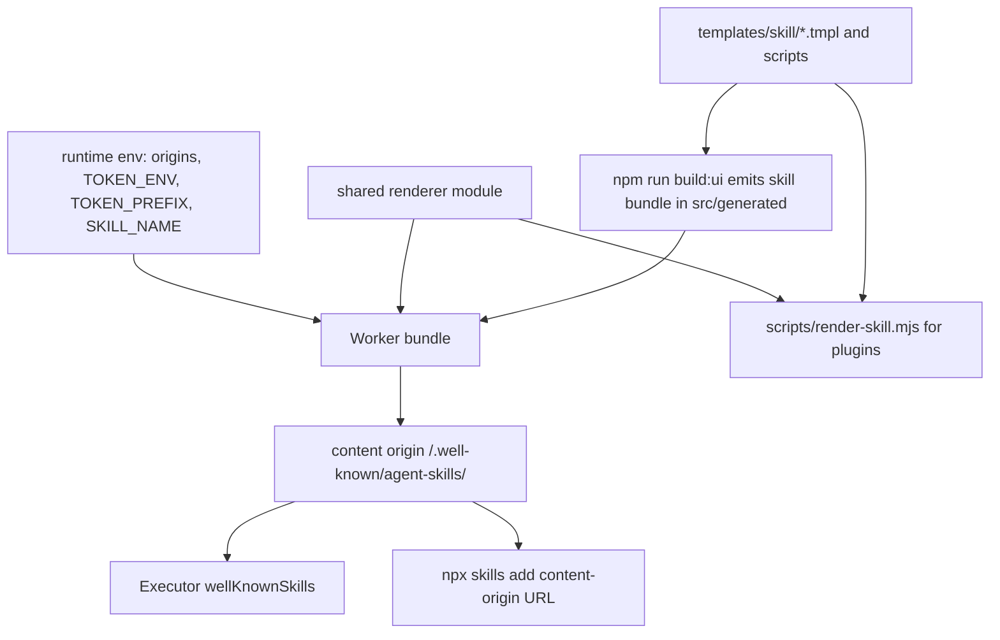
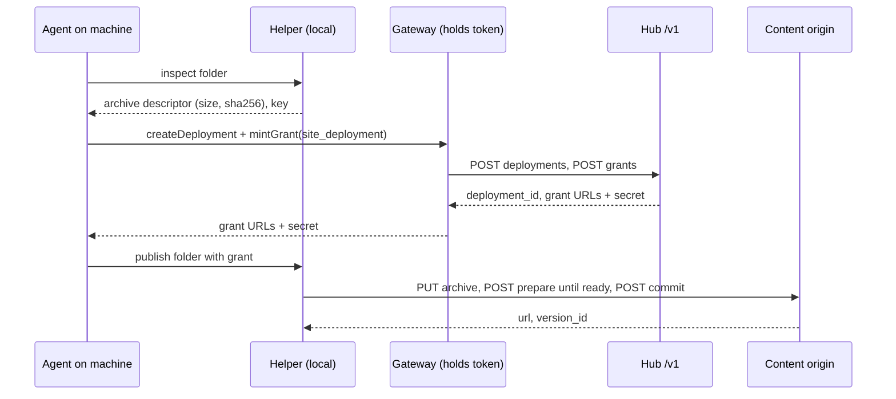

# Gateway-ready agent skills - Plan

## Goal Capsule

- **Objective:** An agent that reaches an Energon through a tool gateway (for example Executor) can publish, read, and revise work, including local files and folders, without anyone hand-writing gateway code, vendoring the skill, or writing an upload script.
- **Means:** Each Energon serves its own rendered skill, with a bundled upload helper, at a public well-known URL. The skill learns a gateway mode, and the OpenAPI document gets readable operation names and correct servers (KTD1, KTD5, KTD7, KTD9).
- **Authority:** This plan's Product Contract, then `STRATEGY.md` (including the "Resist a change when…" line), then `AGENTS.md` change rules (schema, OpenAPI drift, goldens, skill render, verify-energon map).
- **Stop conditions:**
  - Stop if a served skill file, the index, or `/v1/help` would expose a token, grant secret, share password, or any per-user data.
  - Stop if the well-known route would require changing an operator's Cloudflare Access application or `wrangler.toml`.
  - Stop if the served skill names a different origin, token prefix, or token env var than the instance actually uses.
  - Stop if the helper ever puts a grant secret or token in a URL, a log line, or the state file.
- **Execution profile:** Worker routes, a build step, skill templates, one new Python helper, OpenAPI document edits, runtime docs and goldens, verify map, and `STRATEGY.md`. No D1 schema change.
- **Who finishes:** The implementer lands two PRs against `tmchow/energon` (see Sequencing), each with the PR template filled and a verify-energon drive named in Verify.

---

## Product Contract

### Summary

Every Energon publishes its own rendered skill at `/.well-known/agent-skills/` on its content origin, so gateways and skill installers load the skill that matches the instance. The skill gains a gateway mode and ships a Python upload helper for files and folders. Deployment operations in the OpenAPI document get readable names and point at the right host. `STRATEGY.md` records gateway distribution.

### Problem Frame

A friend's Fleet project reaches Energon through Executor, an MCP tool gateway that turns OpenAPI documents into tools and loads skills from app packages or URLs. To make it work, their agent hand-wrote an Executor app, copied and adapted the skill, and wrote `upload.py`, because:

- The skill is distributed only through plugins, marketplaces, and `npx skills add` from the deployment repository, which may be private. A gateway cannot load it from the instance.
- The skill assumes `curl` with a token in an env var on the machine. In a gateway setup the token lives in the gateway, and bytes on the machine move through upload grants.
- Publishing a folder takes a manifest or archive hash, a session, uploads, prepare polling, and an explicit commit with a persisted idempotency key. Nothing ships to do that.
- Twelve operations have auto-generated names (`postVSitesIdDeploymentsDeploymentidCommit`). Gateways turn operationIds into tool names, and the five `/_deployment-grants` operations inherit the hub server, where they 404.

Anyone else putting Energon behind a gateway hits the same wall.

### Requirements

**Skill discovery**

- R1. Each Energon serves its rendered publish skill at `{CONTENT_ORIGIN}/.well-known/agent-skills/index.json` and `/.well-known/agent-skills/{skill-name}/{file}`, readable without credentials or Cloudflare Access.
- R2. The served skill is rendered from the instance's runtime identity (origin, content origin, token env, token prefix, skill name) and matches what the instance's API accepts.
- R3. The index uses the agent-skills discovery v0.1.0 shape (`skills[]` with `name`, `description`, `files`), readable by both Executor's `wellKnownSkills` and the `skills` CLI well-known provider.
- R4. An operator can turn the well-known skill off with one env var; it is on by default. When off, the paths return 404 and `/v1/help` reports it as unavailable.
- R5. `/v1/help` and `/llms.txt` advertise the well-known URL as an install path that needs no repository access.

**Gateway mode**

- R6. The skill tells an agent that has Energon operations as tools to use those tools, never to ask for or provision a token on the machine, and to move local bytes through upload grants minted with those tools.
- R7. The skill tells a tokenless machine holding only a grant to follow the grant protocol (the content origin's `/llms.txt`), without needing the rest of the skill.

**Upload helper**

- R8. The skill ships a Python 3 standard-library helper that publishes one file or a folder, in token mode or grant mode.
- R9. Folder publishing defaults to a ZIP archive deployment: build the archive, create or receive the session, upload, prepare until ready, and commit explicitly.
- R10. An interrupted folder publish can be resumed with the same intent: the helper persists the idempotency key and the exact archive, and recovers lost responses from status.
- R11. The helper prints what a gateway needs to create a deployment or mint a grant (size, SHA-256, archive descriptor) without needing a token.

**OpenAPI for gateways**

- R12. Every operation has a readable, unique, verb-noun operationId and a tag.
- R13. Operations served only on the content origin declare the content origin as their server in the served document.

**Strategy**

- R14. `STRATEGY.md` states that each Energon distributes its own skill through a well-known URL that gateways and installers load, and names operators running Energon behind a gateway for a fleet of machines.

### Key Decisions

- **The well-known skill is on by default with an operator off switch.** (session-settled: user-approved — chosen over opt-in: gateways should work without operator action; the skill holds no secrets.) Governs R1, R4.
- **Renaming operationIds ships as an ordinary feature with a release note, not a major version.** (session-settled: user-approved — chosen over a major bump or keeping auto names: few importers exist and readable tool names are the point.) Governs R12.
- **Python 3 standard library is the helper runtime; `curl` instructions remain the fallback.** (session-settled: user-approved — chosen over a POSIX shell or Node helper: Fleet already relies on Python, and stdlib needs no install.) Governs R8.
- **No session-less folder grant.** (session-settled: user-directed — chosen over a grant that lets the holder submit its own manifest: code-mode gateways create the session and mint in one step, and the ZIP descriptor is tiny.) Governs R9, R11.

### Scope Boundaries

- No Energon MCP server. Gateways already import OpenAPI.
- No change to grant or deployment semantics, D1 schema, or Access configuration.
- No `/.well-known/skills/` legacy path. Both known consumers try `/.well-known/agent-skills/` first.
- No v0.2.0 discovery format (`type`/`url`/`digest` archive entries). Executor reads only the `files` shape.
- Considered and not built: `version` digests in the index, skill-level or per-file. Executor treats `version` as optional and `max-age=300` already bounds staleness. Revisit if a consumer requires them.
- Considered and not built: byte-reproducible ZIP archives. The helper persists the archive it built and every replay uploads that file (KTD9), so rebuilding identical bytes adds nothing. Revisit if state must survive across machines.

#### Deferred to Follow-Up Work

- The `energon-docs` guide "Use Energon through a tool gateway" with a minimal Executor app (`liveOpenapiRouter` over `/v1/openapi.json` plus `wellKnownSkills` over the content origin).
- Telling the Fleet integrator the old operationIds are gone and pointing them at the well-known skill.

### Sources

- Executor `2.0.0-beta.8`: `packages/apps/src/implementation/skills.ts` (`wellKnownCatalog`, index schema), `packages/app-templates/src/implementation/skill-publishing.ts` (Executor's own well-known publisher), `packages/app-templates/executor/skills/app-authoring/integrations.md` (`liveOpenapiRouter`: `source`, `allowedOrigin`, `securitySchemes`, `methods` binding `bearerAuth`; tools named `<first tag>.<operationId>`).
- `vercel-labs/skills` well-known provider: tries `/.well-known/agent-skills/index.json` then `/.well-known/skills/index.json`; v0.1.0 entries are `{name, description, files}`.

---

## Planning Contract

### Key Technical Decisions

- KTD1. **Serve the skill on the content origin, before schema, next to `/llms.txt`.** The hub bypass list is fixed at six paths and verified exactly by `scripts/setup-access.mjs`, so the hub cannot serve it without every operator re-running Access setup. The route lives in `enforceContentHost` (`src/index.ts`) and also answers on local hosts, because verify-energon runs hub and content on one origin. Implements R1, R4.
- KTD2. **Render at request time from a build-time bundle.** The build that already emits `src/generated/` (`npm run build:ui`, invoked by every deployment's `[build]` command) also emits a skill bundle holding the raw `templates/skill/` files. The Worker renders it with runtime identity. This avoids new `[[rules]]` text-import extensions, which would require editing each deployment's `wrangler.toml`. Implements R2.
- KTD3. **One renderer, shared by the CLI and the Worker.** Move the `{{KEY}}` substitution and its unknown-key and leftover-token errors out of `scripts/render-skill.mjs` into a dependency-free module both import. The Worker supplies variables from `identityFromEnv` and constants. Implements R2.
- KTD4. **Drop `{{ORG}}` from skill templates.** It appears once (`SKILL.md.tmpl` line 8) and has no runtime source. Rewrite that sentence around the origin host. Plugin and marketplace templates keep `{{ORG}}`. Implements R2.
- KTD5. **v0.1.0 index.** Entries carry `name`, `description` (from the rendered SKILL.md frontmatter), and `files`. Markdown is served `text/markdown; charset=utf-8`, Python `text/x-python; charset=utf-8`, all with `x-content-type-options: nosniff`, `access-control-allow-origin: *`, and `cache-control: public, max-age=300` like `/llms.txt`. Turning the switch off therefore takes up to five minutes at the edge; document that. Implements R1, R3.
- KTD6. **Off switch is `AGENT_SKILLS_DISCOVERY`, default on.** Unset means on. Once set, only a truthy value (`1|true|yes`, `flag()` in `src/policy.ts`) keeps it on, following `allowUnlimitedTokens`. `/v1/help` gains `agent_skills_url` (string or `null`). Implements R4, R5.
- KTD7. **Gateway mode is an explicit branch at the top of the skill.** Hard rule 1 ("look for the token env var, then connect") gets a carve-out. Gateway mode applies when the skill was loaded through a tool gateway, or when Energon operations are reachable as tools, including through a code-mode gateway's tool search (search for `mintGrant` or `createDeployment`), not only the visible tool list. In gateway mode the agent uses those operations and skips token setup. Grant redemption and deployment-grant URLs are always called from the machine (helper or `curl`), never as gateway tools. Implements R6, R7.
- KTD8. **Helper is `templates/skill/scripts/energon_publish.py.tmpl`, always run with `python3 <path>`.** Rendered so it defaults to the instance's origin, content origin, and token env; flags override the origins. The renderer does not preserve the executable bit, so the skill never invokes it directly. An installed skill runs `scripts/energon_publish.py`. A gateway-loaded skill has no files on disk (Executor serves skill files as text and writes nothing to the machine), so the skill tells the agent to download the helper from `{content origin}/.well-known/agent-skills/{skill-name}/scripts/energon_publish.py` into a temporary directory and run that copy. Implements R8.
- KTD9. **Persisted archive plus persisted state.** `inspect` builds the archive once and persists it beside a state file; `publish` and every resume upload that file, so the descriptor, intent hash, and idempotency key always match and a replay never yields `idempotency_conflict`. State lives under a per-user directory (`--state-dir` overrides) with owner-only permissions, stores only the key, site, deployment id, archive path, and URLs (never secrets), and is deleted after a confirmed commit receipt. Implements R9, R10.
- KTD10. **Content-origin operations get a path-level `servers` entry rewritten per request.** `src/openapi.ts` rewrites only the top-level `servers` (to `PUBLIC_ORIGIN`) today. This plan adds a path-level `servers` on `/_deployment-grants/*` set to the content origin, read through `dedicatedContentOrigin(env)` and omitted when it is null, so `/v1/openapi.json` never fails with `content_origin_not_configured`. Gateways that pin one origin per import (Executor skips other-host operations as `multiple_hosts`) then drop these operations instead of exposing them as hub tools that 404. Implements R13.
- KTD11. **Rename and tag in the document; guard in the drift test.** The twelve auto names become verb-noun IDs (`createDeployment`, `getDeployment`, `cancelDeployment`, `uploadDeploymentFile`, `uploadDeploymentArchive`, `prepareDeployment`, `commitDeployment`, `getDeploymentGrant`, `uploadDeploymentGrantFile`, `uploadDeploymentGrantArchive`, `prepareDeploymentGrant`, `commitDeploymentGrant`). The twelve untagged operations get tags. `test/unit/openapi-drift.spec.ts` adds uniqueness and tag-presence checks. Implements R12.

### High-Level Technical Design

How the skill reaches a gateway, from source to served file:

Gateway-mode folder publish, the flow the skill and helper teach:

### Sequencing

- PR B (`feat(api)`): U5, landed first. The gateway-mode text in PR A names the new operationIds (`createDeployment`, `mintGrant`). Its release note names the renames.
- PR A (`feat(skill)`): U1, U2, U3, U4, U6, after PR B. The well-known route, helper, gateway mode, and strategy ship together because the served skill must describe the helper it serves.

---

## Implementation Units

### U1. Shared renderer and build-time skill bundle

- **Goal:** The Worker can render the same skill files the CLI renders, without new wrangler rules.
- **Requirements:** R2; KTD2, KTD3, KTD4.
- **Dependencies:** none.
- **Files:**
  - `scripts/render-skill.mjs` (import the shared renderer)
  - new shared renderer module under `scripts/` (dependency-free, importable by the Worker)
  - `scripts/build-ui.mjs` or a sibling invoked by the `build:ui` npm script (emit the skill bundle)
  - `package.json` (`build:ui` script only if a sibling script is added)
  - `templates/skill/SKILL.md.tmpl` (remove `{{ORG}}`)
  - `vitest.config.ts`, `vitest.unit.config.ts` (ensure the bundle exists before tests, mirroring `buildUI()`)
  - an ambient declaration for the generated skill bundle beside `src/ui-generated.d.ts`, and a `.d.ts` for the shared renderer, because CI typechecks before any build and `src/generated/` is gitignored
  - `test/unit/skill-render.spec.ts`
- **Approach:**
  1. Extract `render()` with its unknown-key and leftover-token errors into the shared module; `render-skill.mjs` imports it with no behavior change.
  2. The build emits a gitignored module in `src/generated/` mapping relative paths under `templates/skill/` to their raw contents.
  3. Keep the `build:ui` command name, since deployment `wrangler.toml` files call it.
- **Patterns to follow:** `scripts/build-ui.mjs`, `src/ui-generated.d.ts`, and `.gitignore` "Compiled Svelte UI"; `listTmplFiles` and `writeTmplTree` for which files are `.tmpl`.
- **Test scenarios:**
  - `npm run skill:render -- --check` stays clean after the extraction.
  - The shared renderer throws on an unknown key and on a leftover `{{TOKEN}}`, as before.
  - The emitted bundle lists `SKILL.md.tmpl`, `references/api.md.tmpl`, and the helper template, and no other paths.
  - Rendering `SKILL.md.tmpl` with no `ORG` variable succeeds.
- **Verification:** CLI render output is byte-identical except for the `{{ORG}}` sentence, and the bundle builds in a clean checkout.

### U2. Well-known skill route, off switch, and advertising

- **Goal:** Any client can fetch the instance's rendered skill from the content origin.
- **Requirements:** R1, R2, R3, R4, R5; KTD1, KTD5, KTD6.
- **Dependencies:** U1.
- **Files:**
  - new `src/agent-skills.ts` (render bundle with runtime identity, build index, serve files)
  - `src/index.ts` (`enforceContentHost` branch and local-host path)
  - `src/types.ts`, `src/policy.ts` (`AGENT_SKILLS_DISCOVERY`)
  - `src/auth.ts` (`helpBody`: `agent_skills_url`, install SOP line), `src/llms.ts` (Optional section)
  - `wrangler.example.toml`, `docs/DEPLOY.md` (vars table, five-minute edge note)
  - `openapi/v1.json` (only if the index is added as a documented operation; then also help routes and the unauthenticated list per the drift spec)
  - `test/routes.spec.ts`, new `test/unit/agent-skills.spec.ts`, `test/golden/help/default.json.golden`, `test/golden/llms/*.golden`
- **Approach:**
  1. Render each bundle file with variables from `identityFromEnv(env)`, `PRODUCT`, `VERSION`, and `installLine()`, memoized per isolate keyed on those values.
  2. Answer GET and HEAD for the index and listed files, 405 for other methods, 404 for unlisted paths and when disabled.
  3. Serve on the content host and on local hosts; the hub keeps 404 so nothing depends on an Access bypass.
- **Patterns to follow:** `llmsResponse` in `src/llms.ts` and the `/llms.txt` branch in `enforceContentHost`; `allowUnlimitedTokens` in `src/policy.ts`.
- **Test scenarios:**
  - Content host GET `/.well-known/agent-skills/index.json` returns 200 JSON with one skill whose `name` is the configured skill name and whose `files` include `SKILL.md`, `references/api.md`, and `scripts/energon_publish.py`.
  - Each listed file returns 200 with the KTD5 content type, nosniff, CORS, and cache headers; HEAD returns the same headers and an empty body.
  - POST to the index returns 405; GET of an unlisted path such as `/.well-known/agent-skills/{name}/secrets.txt` returns 404.
  - Served `SKILL.md` contains the configured `PUBLIC_ORIGIN` and `TOKEN_ENV` and no `{{`.
  - Hub host GET of the index returns 404.
  - Unit: with `AGENT_SKILLS_DISCOVERY=false` the handler returns 404, `helpBody` reports `agent_skills_url: null`, and `/llms.txt` omits the well-known install line; unset reports and advertises the URL.
  - Unit: with a non-default `TOKEN_PREFIX` the served skill names that prefix, so it cannot drift from what the API accepts.
  - Golden: help and llms bodies include the well-known URL.
- **Verification:** `npx skills add <content origin>` lists the skill against a local run, and the index validates against Executor's index schema (name, optional version, files).

### U3. Upload helper

- **Goal:** One command publishes a local file or folder in token or grant mode and survives interruption.
- **Requirements:** R8, R9, R10, R11; KTD8, KTD9.
- **Dependencies:** U1 (the helper ships as a bundle file).
- **Files:**
  - new `templates/skill/scripts/energon_publish.py.tmpl`
  - new `test/unit/publish-helper.spec.ts` (drives `python3` with `spawnSync`)
  - `test/unit/skill-render.spec.ts` (helper renders with no leftover placeholders)
- **Approach:**
  1. Subcommands cover inspecting a file or folder (prints size, SHA-256, the archive descriptor, and the included file list as JSON), publishing a file (token: create or replace with optional `expected_version`; grant: `PUT` to `upload_url`), and publishing a folder (token: create session, upload archive, prepare, commit; grant: same against deployment-grant URLs).
  2. Folder archives exclude hidden files and directories (any path segment starting with `.`) unless `--include-hidden` is passed, and skip symlinks, so `.env`, `.git/`, and links to files outside the folder are never published by default.
  3. Grant secrets and tokens come only from stdin JSON, a `--grant-file` path, or the token env var. No flag takes a secret value.
  4. Send a grant secret only to URLs whose origin equals the configured content origin, and do not follow redirects.
  5. Always set an explicit content type, since `urllib` otherwise adds a form type; stream uploads with `Content-Length`.
  6. Follow the protocol rules owned by `src/grant-protocol.ts` and the deployment API: retryable `409 grant_busy`, final `410` codes, idempotency key `<unix ms>.<UUIDv4>` generated once, prepare until 200, commit once and read the receipt on a lost response.
  7. Reject a folder over the 200-file cap before any request, so a large archive is not uploaded only to fail at prepare.
- **Patterns to follow:** the Python key generator in `.agents/skills/verify-energon/features/atomic-site-deployment.md`; protocol constants imported in `test/unit/skill-render.spec.ts`.
- **Test scenarios:**
  - `inspect` on a folder prints a descriptor whose size and SHA-256 match the persisted archive, and a later publish uploads that same file even after a source file changes.
  - A folder containing `.env`, `.git/config`, and a symlink to a file outside it yields an archive and file list without them; `--include-hidden` adds the dotfiles but never the symlink.
  - The state file and archive are owner-only, contain the key and deployment id but no `grant_` or token-prefixed string, and are removed after a successful commit.
  - A grant JSON whose `upload_url` origin differs from the content origin exits non-zero without sending the secret.
  - Running without a token in token mode exits non-zero with a message naming the env var.
  - A grant JSON missing `upload_url` exits non-zero without a network call.
  - A folder with more than 200 files is rejected before any request.
- **Verification:** verify-energon drives a file grant, a folder grant, and a folder token publish end to end, including a resume after killing the helper mid-upload.

### U4. Gateway mode in the skill

- **Goal:** An agent with Energon tools knows to use them, never chases a token, and moves local bytes through grants and the helper.
- **Requirements:** R6, R7; KTD7, KTD8.
- **Dependencies:** U3.
- **Files:**
  - `templates/skill/SKILL.md.tmpl` (hard rule 1 carve-out, new gateway section, helper usage in Scenarios A, E, M)
  - `templates/skill/references/api.md.tmpl`
  - `src/llms.ts`, `src/auth.ts` (one-line pointer, only if wording changes there)
  - `test/unit/skill-render.spec.ts`, goldens if runtime docs change
- **Approach:**
  1. The gateway section states the KTD7 recognition rule and that grant and deployment-grant URLs are called from the machine.
  2. It tells the agent to download the helper per KTD8 when no installed skill directory exists.
  3. Show the gateway folder flow from the High-Level Technical Design gateway-publish sequence diagram and the single-file flow (inspect, mint through the tool, helper uploads), including reviewing the `inspect` file list before minting.
  4. To resume a gateway folder publish after losing the grant secret, ask the gateway to mint a new `site_deployment` grant for the same `deployment_id` while the deployment is still uploading or ready.
  5. Keep the token path unchanged for agents with a local token.
- **Patterns to follow:** existing "Whole-site grant handoff" and Scenario M text; protocol constants asserted in `test/unit/skill-render.spec.ts`.
- **Test scenarios:**
  - Rendered SKILL.md contains the gateway section, the hard-rule carve-out, and `python3 scripts/energon_publish.py`.
  - The rendered gateway section contains the absolute helper URL on the configured content origin and mentions searching the gateway for Energon operations.
  - Rendered SKILL.md still contains `GRANT_AUTH_HEADER` and `GRANT_UPLOAD_PREFIX` from source.
- **Verification:** Read as a fresh agent with only gateway tools and no local skill files: no step asks for `{{TOKEN_ENV}}` or the connect flow, and the helper is reachable.

### U5. OpenAPI names, tags, and content-origin servers

- **Goal:** Gateway tools built from `/v1/openapi.json` have readable names and call the right host.
- **Requirements:** R12, R13; KTD10, KTD11.
- **Dependencies:** none.
- **Files:**
  - `openapi/v1.json`
  - `src/openapi.ts`
  - `test/unit/openapi-drift.spec.ts`, `test/routes.spec.ts` (served document)
  - `.agents/skills/verify-energon/features/discovery.md` if it names operationIds
- **Approach:**
  1. Apply the KTD11 names and add tags (`deployments`, `grants`, `discovery`, or the existing tag that fits).
  2. Add path-level `servers` on `/_deployment-grants/*` path items per KTD10 when serving.
- **Patterns to follow:** existing verb-noun IDs (`createSite`, `mintGrant`); `openapiResponse` in `src/openapi.ts`.
- **Test scenarios:**
  - Drift spec fails on a duplicated operationId and on an operation with no tag.
  - Served document: `/_deployment-grants/{grantId}/commit` has `servers[0].url` equal to the configured content origin; `/v1/sites` uses the top-level public origin.
  - With no dedicated content origin (local single-origin config), `/v1/openapi.json` still returns 200 and the grant paths carry no path-level `servers`.
  - No operationId matches the old auto-generated pattern (`^(get|post|put|delete)V`).
- **Verification:** Importing the served document into Executor shows `deployments.createDeployment` and the other hub operations, and the `/_deployment-grants` operations are absent (skipped as `multiple_hosts`) rather than imported against the hub.

### U6. Strategy, concepts, and verify map

- **Goal:** Product docs and the verify map describe gateway distribution.
- **Requirements:** R14; supports R1, R6, R8.
- **Dependencies:** U2, U3, U4.
- **Files:**
  - `STRATEGY.md` (Positioning third paragraph; Users)
  - `CONCEPTS.md` (only if a new domain term such as "agent skills discovery" is used in user-facing docs)
  - `.agents/skills/verify-energon/features/discovery.md` (`agent-skills` sub-feature)
  - new `.agents/skills/verify-energon/features/gateway-publish.md` and the features `README.md` index
- **Approach:**
  1. Positioning: the skill is also served by each Energon at a well-known URL, so it travels through gateways and installers that load skills by URL.
  2. Users: operators running Energon behind a tool gateway for many machines, token held centrally, machines publishing through grants. Keep the "Resist a change when…" line.
  3. Verify map: Default bullets fetch the index and one file; Extra bullets cover the disabled var and helper drives (file grant, folder grant, folder token, resume).
- **Test expectation:** none -- documentation and verify map; covered by `test/unit/contribution-policy.spec.ts` for map structure.
- **Verification:** The feature files follow the four-section contract in `features/README.md`.

---

## Verification Contract

| Gate | Command | Applies to |
| --- | --- | --- |
| Types, lint, full suite | `npx wrangler types && npm run typecheck && npm run lint && npm test` | Both PRs, before commit |
| Skill render | `npm run skill:render -- --check` | PR A |
| Focused unit | `npm run test:unit -- test/unit/skill-render.spec.ts test/unit/agent-skills.spec.ts test/unit/publish-helper.spec.ts test/unit/golden.spec.ts` | PR A |
| Routes | `npx vitest run test/routes.spec.ts` | Both PRs |
| OpenAPI drift | `npm run test:unit -- test/unit/openapi-drift.spec.ts` | Both PRs |
| Goldens | `UPDATE_GOLDENS=1` then review `git diff test/golden/` | Whenever help or llms text changes |
| User path | verify-energon: `features/discovery.md` and `features/gateway-publish.md` (PR A), `features/discovery.md` OpenAPI drive (PR B) | Both PRs |

CI runs Node only; `test/unit/publish-helper.spec.ts` needs `python3` on the runner (present on GitHub's Ubuntu images). Confirm in the first CI run.

## Definition of Done

- All Verification Contract gates pass on each PR.
- `npx skills add <local content origin>` installs the skill, and the installed `SKILL.md` names the local origin.
- A helper folder publish interrupted after archive upload completes on rerun with the same key and no `idempotency_conflict`, in token mode and in grant mode (re-minted grant for the same deployment).
- A gateway-mode agent with no local skill files downloads and runs the helper from the well-known URL.
- No served file or `/v1/help` field contains a secret, and the hub host does not serve the well-known paths.
- `STRATEGY.md` reflects gateway distribution; the release note for PR B lists the renamed operationIds.
- Abandoned experimental code from dead-end approaches is removed from the diff.

## Risks & Dependencies

| Risk | Mitigation |
| --- | --- |
| Executor or the `skills` CLI changes its index format | v0.1.0 is the format both read today; the index builder is one function to extend for v0.2.0. |
| Served skill drifts from the plugin copy rendered from `instance-skill.json` | Both render the same templates with the same renderer; `docs/DEPLOY.md` already requires env identity to match the manifest. |
| Renamed operationIds break an existing gateway app | Release note; the Fleet integrator is told directly (Deferred to Follow-Up Work). |
| `python3` missing on a machine | The skill keeps `curl` instructions for single-file grants and token flows. |
| Edge cache serves the skill after the switch is turned off | `max-age=300`, documented in `docs/DEPLOY.md`. |
