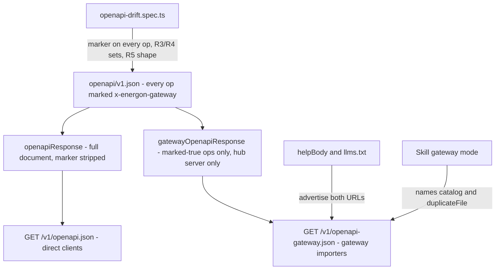

# Gateway OpenAPI catalog - Plan

## Goal Capsule

- **Objective:** An agent that reaches an Energon through a code-mode tool gateway publishes local files and sites through upload grants. It finds that workflow and the skill from tool search alone, before it reads the skill. Direct `/v1` clients keep the full API.
- **Means:** A second OpenAPI document at `/v1/openapi-gateway.json`, projected per request from `openapi/v1.json` by a per-operation marker (KTD1, KTD2), plus rewritten summaries and runtime docs.
- **Authority:** This Product Contract, then `STRATEGY.md` (including the "Resist a change when…" line), then the `AGENTS.md` change rules (OpenAPI drift, goldens, skill render, verify-energon map). Issue tmchow/energon#160 is the source request.
- **Stop conditions:**
  - Stop if the gateway document would include any operation that takes a non-JSON request body, or returns zip or binary bytes other than `getFile` and `getSiteFile`.
  - Stop if `/v1/openapi.json` would lose an operation it serves today.
  - Stop if the duplicate route could store request bytes instead of copying an existing file.
- **Execution profile:** OpenAPI document edits, one new discovery route and one new `/v1` route, runtime docs and goldens, skill template, verify map, and INSTALL.md. No D1 schema change.
- **Who finishes:** The implementer lands one PR against `tmchow/energon` with the PR template filled and the verify-energon gateway-publish drive named in Verify. The energon-docs guide is a separate follow-up PR.
- **Open blockers:** None.

---

## Product Contract

### Summary

Every Energon serves a gateway catalog alongside `/v1/openapi.json`. It lists grant, deployment, metadata, small-read, and own-work operations, and leaves out every operation that moves bytes through tool arguments, returns a zip, revokes the shared key, runs the connect flow, or needs admin rights. A new JSON-only route duplicates a loose file. Rewritten summaries, `/v1/help`, `llms.txt`, and the skill's gateway mode all point gateway importers to the new catalog and the grant workflow.

### Problem Frame

A code-mode MCP gateway imports `/v1/openapi.json` and indexes every operation for tool search. An agent asked to publish a local file searches the tools before it loads the attached skill. It finds `files.createFile`, whose summary reads "Upload one file" and whose body is the file itself. The agent reads the file into model context and writes it back out as a large base64 tool argument. In the captured run behind #160, generating those arguments took most of the time. Gateway approval or output limits can also reject the call before Energon sees it.

The correct route already exists and works. The skill's gateway mode (`templates/skill/SKILL.md.tmpl`) has the agent mint an upload grant through the gateway, then send the bytes from the machine with the helper. Once the agent picked that route, upload and verification took seconds. The failure happens at tool selection: the catalog offers the byte route, `mintGrant`'s summary ("Mint a single-use upload grant") doesn't match a publishing search, and an attached skill isn't guaranteed to be loaded before the agent picks a tool. Both `/v1/help` and `llms.txt` still describe `POST /v1/files` and byte `PUT`s as the way to publish.

Every operator who puts Energon behind a gateway hits this. The integration-side workaround is to patch out six operations in each gateway's import.

### Key Decisions

- **Serve a filtered catalog and rewrite summaries.** Removing the byte tools is what keeps an agent from picking them. Summaries alone would leave `createFile` in the search index, and an `x-` marker that each importer has to honor does nothing for importers like Executor, which bind a source URL. (session-settled: user-approved — chosen over summaries-only and over a marker that importers filter themselves: an importer can only bind a document URL.) Governs R1, R9, R10.
- **An operation is in the gateway catalog only if it is marked in.** Every new route needs an explicit in-or-out decision, so a future upload route can't slip into gateway catalogs by default. (session-settled: user-approved — chosen over a deny-list marker on byte operations, which would repeat #160 the next time an upload route is added.) Governs R5.
- **Keep file reads and drop zip exports.** Reading published text through the gateway is useful. Zip exports only bloat tool output, and the machine can fetch content URLs without a key. (session-settled: user-approved — chosen over keeping all reads and over dropping all byte reads, after the output-limit tradeoff was shown.) Governs R3, R4, R11.
- **Add a loose-file duplicate route instead of losing copy.** (session-settled: user-directed — chosen over omitting duplicate from gateways: copying a loose file is worth keeping without moving bytes.) Governs R7, R8.
- **Drop self-revoke and the connect flow.** A gateway holds one Agent Key for a fleet, so self-revoke would cut off every machine. The connect flow mints keys a gateway never uses. (session-settled: user-approved — chosen over keeping them.) Governs R4.
- **Drop admin operations.** A gateway holding an Admin key would give every machine's agent cross-account cleanup, token revoke, and sweep. Admin keys last at most 7 days, so few gateways would hold one, and admins can use a direct client. (session-settled: user-approved — chosen over keeping admin tools behind their existing 403, after a cross-model review raised the fleet exposure.) Governs R4.
- **Advertise the catalog in the product now; the energon-docs guide follows.** (session-settled: user-approved — chosen over shipping both together and over deferring the guide again.) Governs R12, R13.

### Requirements

**Gateway catalog**

- R1. Each Energon serves a gateway catalog at a stable public URL. It needs no auth and has the same caching and CORS as `/v1/openapi.json`, and it is generated per request from `openapi/v1.json`.
- R2. `/v1/openapi.json` keeps every operation it serves today. It changes only by adding the R7 route, the gateway catalog's own discovery operation, and the summary rewrites in R9 through R11.
- R3. The gateway catalog includes:
  - grant minting and status;
  - the hub-origin deployment operations: create, get, cancel, prepare, and commit;
  - site creation and duplication, plus site and file listing, metadata, settings changes, and deletion;
  - own-work cleanup;
  - `getFile` and `getSiteFile`;
  - `whoami`, help, health, `llms.txt`, and the gateway catalog itself;
  - the R7 duplicate route.
- R4. The gateway catalog excludes:
  - `createFile`, `putFile`, `putSiteFile`, `importSite`, `uploadDeploymentFile`, and `uploadDeploymentArchive`;
  - `exportOwned` and `exportSite`;
  - all five `/_deployment-grants/*` operations, whether or not the hub and content origins are the same;
  - `revokeSelf`, `startConnection`, `exchangeConnection`, and `getAuthMarkdown`;
  - every `/v1/admin/*` operation.
- R5. Every operation in `openapi/v1.json` is explicitly marked as in or out of the gateway catalog, and an unmarked operation fails the build's tests. The tests also fail if a gateway operation takes a request body other than JSON, or returns zip or binary output on success, except `getFile` and `getSiteFile`.
- R6. The gateway catalog lists only the hub origin as its server, and the inclusion marker does not appear in either served document.

**Loose-file duplicate**

- R7. A new JSON-only operation copies an existing loose file into a new loose file owned by the caller. It accepts the options the current `duplicate_from` mode accepts and never accepts or stores request bytes. It appears in both catalogs.
- R8. `createFile` keeps its `duplicate_from` mode for direct clients.

**Discoverability**

- R9. In both catalogs, the summary and first description line of `mintGrant`, `createDeployment`, `createSite`, and the R7 route match searches for "publish", "share file", and "upload local file".
- R10. The first lines of those operations state the workflow: inspect locally, mint a scoped grant, upload from the machine with the helper, verify the SHA-256, and return the URL and expiry. They name the attached skill.
- R11. In both catalogs, the `getFile` and `getSiteFile` summaries say the tool returns stored bytes and point to the content URL for large or binary files.
- R12. `/v1/help` and `llms.txt` advertise the gateway catalog URL and tell importers to:
  - use it;
  - bind the Agent Key to the hub origin only;
  - redeem grant URLs on the machine.

  They label the byte-upload routes as the direct-client path.
- R13. The skill's gateway mode names the gateway catalog and the R7 route for copying a file. It keeps its rule that grant URLs are called from the machine, never through the gateway.

**Release and verification**

- R14. Operator-facing release material says that gateways which already imported `/v1/openapi.json` keep the byte tools until their operator re-points the import to the gateway catalog.
- R15. The verify-energon gateway-publish feature fetches the gateway catalog, confirms the R4 exclusions, and drives three grant publishes, each ending in a SHA-256 match on the downloaded bytes:
  - a new file with retention set;
  - a conditional replacement using `expected_version`;
  - a whole-site publish with retention set.
- R16. A manual import of the gateway catalog into Executor, starting with no skill loaded, is an acceptance gate. A tool search for publishing a local file must surface the grant workflow and the skill before any call, and no byte-upload tool appears.

### Acceptance Examples

- AE1. **Covers R5.** Given a new `/v1` route added to `openapi/v1.json` with no gateway marking, when the unit tests run, they fail and name the operation.
- AE2. **Covers R5.** Given an operation marked in whose request body is `application/octet-stream`, when the unit tests run, they fail.
- AE3. **Covers R4, R6.** Given an Energon whose hub and content origins are the same, when the gateway catalog is fetched, it contains no `/_deployment-grants/*` operation.
- AE4. **Covers R7.** Given a request to the duplicate route that carries an `X-Filename` header and a file body, when it is handled, no uploaded bytes are stored. The response is either a copy of the named source file or a 4xx.
- AE5. **Covers R16.** Given Executor importing only the gateway catalog with the skill attached but not loaded, when an agent searches for how to publish `report.md`, the results include `grants.mintGrant` with workflow text that names the skill, and no tool that takes the file body.

### Scope Boundaries

- The energon-docs guide "Use Energon through a tool gateway" (including an Executor app recipe) is a follow-up PR in that repository.
- Existing gateway imports are not changed or redirected. Operators re-point them (R14).
- No size or type limit is added to `getFile` or `getSiteFile` responses; R11 warns instead.
- The grant secret still passes through the gateway once at mint. Changing that is a separate design.
- No Energon MCP server. Gateways keep importing OpenAPI.
- No narrowed variant of `createFile` in either catalog; R7 is the only gateway copy path.

### Dependencies / Assumptions

- Executor's code-mode search shows the first line of an operation's description (https://v2.executor.sh/docs/mcp#codemode). Whether it prefers `summary` over `description` is unverified, which is why R9 and R10 cover both.
- Executor names tools `<first tag>.<operationId>` and skips operations on other hosts as `multiple_hosts` (`docs/plans/2026-10-07-1731-feat-gateway-agent-skills-plan.md`, KTD10 and Sources). R4 does not rely on that skip.
- Admin scope requires an Admin key, which lasts at most 7 days (`src/auth.ts:521`; `CONCEPTS.md` "Admin token").

### Sources / Research

- Issue: tmchow/energon#160.
- Served document: `src/openapi.ts:7-19`, route at `src/index.ts:138`; drift test `test/unit/openapi-drift.spec.ts:97-151`.
- Byte routes and summaries: `openapi/v1.json` (`createFile` near line 571; `GrantTarget` and `GrantMintRequest` near lines 7171-7302).
- Copy implementation and the JSON-with-`X-Filename` byte path: `src/files.ts:235`, `src/files.ts:363-392`.
- Help and overview that still teach byte uploads: `src/auth.ts:526-547`, `src/llms.ts:30-41`.
- Gateway mode: `templates/skill/SKILL.md.tmpl:18`, `:37-45`.
- Verify map: `.agents/skills/verify-energon/features/gateway-publish.md`.
- Prior gateway work: `docs/plans/2026-10-07-1731-feat-gateway-agent-skills-plan.md` (PRs #152, #153).
- Strategy: `STRATEGY.md:20`, `:28`, `:39`.
- Repo patterns: `src/v1-routes.ts` (`V1_PRE_SCHEMA_LITERALS`, `V1_TOKEN`, `V1_LOOSE_ONE`), `src/route-table.ts` (token tables continue on a method miss), `src/index.ts` `DISCOVERY_ROUTES`, `src/http.ts` `readJson`.
- Learnings: `docs/solutions/security-issues/published-content-origin-validation.md`, `docs/solutions/database-issues/loose-file-expiry-purge-race.md`, `docs/solutions/database-issues/platform-quota-drift-blocks-publishing.md`. All three are already handled inside `duplicateLooseFile`, which is why KTD3 reuses it.

**Product Contract preservation:** restructured, no scope change. Outstanding Questions resolved into KTD1 to KTD5. R14 clarified from "the release note" to operator-facing release material, because release-please builds `CHANGELOG.md` from squash titles only and cut-release forbids Operator notes absent from the Release PR diff (KTD5).

---

## Planning Contract

### Key Technical Decisions

- KTD1. **The marker is `x-energon-gateway: true|false` on every operation in `openapi/v1.json`.** The classification lives next to the operation it governs, so a reviewer of a new route sees the choice in the same diff. Missing is a test failure, not a default. Implements R5 under the opt-in Key Decision (Governs R5).
- KTD2. **The gateway document is served at `GET /v1/openapi-gateway.json` by a pure projection in `src/openapi.ts`.** A separate literal path is something every importer can bind, whereas a query parameter can be dropped by importers that normalize URLs. The projection:
  1. clones the spec;
  2. keeps only operations marked `true`;
  3. keeps path-level `parameters` and drops path items left with no method;
  4. drops tags no kept operation uses;
  5. strips the marker;
  6. sets only the top-level hub `servers`.

  `openapiResponse` also strips the marker from the full document. Both share the existing cache and CORS headers. Implements R1, R2, R6.
- KTD3. **The duplicate route is `POST /v1/files/{id}/duplicate` (`duplicateFile`, tag `files`).** It reads the body with `readJson` (size cap, 415 on form bodies) and calls `duplicateLooseFile` directly. It never routes through `postLooseJson`, whose `X-Filename` branch stores bytes. The body takes `filename`, `password`, `write_password`, `ttl`, and `write_policy`, as `FileDuplicateRequest` does minus `duplicate_from`. The response reuses `LooseFileDuplicated` with 201. Source permission stays what it is today: any caller who can read via `/v1` can copy. `duplicateLooseFile` already does the content-origin preflight, quota reservation, and expiry handling that `docs/solutions/` requires. Implements R7 (Governs R7, R8).
- KTD4. **The structural guard is a unit test over the projected document, not runtime filtering.** The test asserts the R5 shape rules and the exact R3 and R4 operation sets by operationId. A wrong marker fails CI before it ships, and the Worker's projection stays a simple filter. Implements R5.
- KTD5. **The squash title carries the R14 re-point warning; INSTALL.md carries the detail.** The Release PR diff holds only `version.txt`, `CHANGELOG.md`, and `.release-please-manifest.json`, and cut-release forbids Operator notes absent from that diff. The squash title is the only text this PR puts into that diff, as its changelog line. So the title names both the new catalog and the re-point step, for example `feat(api): add /v1/openapi-gateway.json; re-point gateway imports to drop byte tools`. INSTALL.md's agent-connection section gets a gateway paragraph with the longer operator reference. Implements R14.

### High-Level Technical Design

One source document feeds two served documents and three runtime surfaces.

### Assumptions

- Executor's code-mode search surfaces the first description line. Summary precedence is unverified, so R9 and R10 write both.
- The Executor import named in R16 cannot run inside CI or this repo's verify harness. It is a manual check recorded in the PR's How to test.
- Spec-flow edge cases were traced in a single pass: HEAD on the new route, content-host rejection, same-origin configs, and the cache window. Each is covered by a test scenario below.

### Sequencing

U1 lands the marker and projection, which every later unit depends on. U2 can proceed in parallel with U1. U3 depends on U1 and U2. U4 and U5 follow U3 because they cite the final URL and operation names.

---

## Implementation Units

### U1. Mark every operation and serve the gateway document

- **Goal:** `/v1/openapi-gateway.json` serves the projected document, and both served documents are marker-free.
- **Requirements:** R1, R2, R3, R4, R5, R6; KTD1, KTD2, KTD4.
- **Dependencies:** None.
- **Files:**
  - `openapi/v1.json`
  - `src/openapi.ts`
  - `src/index.ts`
  - `src/v1-routes.ts`
  - `test/unit/openapi-drift.spec.ts`
  - `test/routes.spec.ts`
- **Approach:**
  1. Add `x-energon-gateway` to all 49 existing operations per the R3 and R4 lists.
  2. Add the `getGatewayOpenapi` operation with tag `discovery`, `security: []`, and marker `true`. Mark `getOpenapi` false.
  3. Add the projection and `gatewayOpenapiResponse` in `src/openapi.ts`, and strip the marker in `openapiResponse` too.
  4. Register the route in `DISCOVERY_ROUTES` with `getOrHead` and `strict`, and add the literal to `V1_PRE_SCHEMA_LITERALS`.
  5. Add `"GET /v1/openapi-gateway.json"` to `helpBody().routes` with "no auth" in its text. U3 owns the rest of the help copy.
  6. Extend the drift spec's unauthenticated list.
- **Patterns to follow:** `openapiResponse` clone-and-headers; `DISCOVERY_ROUTES` entry for `/v1/openapi.json`; the drift spec's `Operation` walk.
- **Test scenarios:**
  - Every operation in `openapi/v1.json` has a boolean `x-energon-gateway`. Removing it from one operation fails with that operationId. Covers AE1.
  - The projected document's operationIds equal the R3 set exactly, and none of the R4 set appears.
  - Every projected operation's request body content keys are only `application/json`. A synthetic spec marking an `application/octet-stream` operation `true` fails. Covers AE2.
  - Every projected success response (any `2xx`, `2XX`, or `default` code) declares only `application/json` or `text/markdown` content keys. Any other key fails unless the operationId is in a pinned exception set, and a separate assertion pins that set to exactly `getFile` and `getSiteFile`.
  - The shape checks resolve local `$ref` request bodies and responses before reading `content`, and an unresolvable `$ref` fails.
  - The shape rules run as one function over any projected document, and synthetic specs prove each rule can fail: a marked-in `PUT` with `application/zip`, a `200` returning `image/png`, a binary response reached only through a `$ref`, and a non-exempt operation returning `application/octet-stream`.
  - Neither served document contains the string `x-energon-gateway`.
  - With split origins, the projection has no `/_deployment-grants` path and no path-level `servers`. With the same origin, it also has none. Covers AE3.
  - The projection keeps the `/v1/files/{id}` path-level `parameters` and has no path item without a method.
  - The projection's top-level `tags` list only tags its operations use. Every operation's `tags[0]` is in that list.
  - `GET /v1/openapi-gateway.json` returns 200 JSON with `access-control-allow-origin: *` and `cache-control: public, max-age=300`. HEAD returns 200, POST returns 405, and the content host rejects it as it does `/v1/openapi.json` (`test/routes.spec.ts`).
  - The full document still lists every existing operation (49 existing plus `getGatewayOpenapi`, 50 in total; U2 brings it to 51).
- **Verification:** The drift spec and route spec pass. A local fetch of both URLs shows the expected operation counts.

### U2. Loose-file duplicate route

- **Goal:** `POST /v1/files/{id}/duplicate` copies a loose file without ever accepting request bytes.
- **Requirements:** R7, R8; KTD3.
- **Dependencies:** None (its `openapi/v1.json` entry carries marker `true` once U1's marker exists; land after U1 if parallel work conflicts).
- **Files:**
  - `src/files.ts`
  - `src/v1-routes.ts`
  - `openapi/v1.json`
  - `src/auth.ts` (`helpBody().routes` entry only)
  - `test/api.spec.ts`
- **Approach:**
  1. Add a handler that validates the path id, reads the body with `readJson`, and calls `duplicateLooseFile` with the body's options.
  2. Register the route with a regex in `V1_TOKEN`, placed before `V1_LOOSE_ONE`.
  3. Document it with a request schema derived from `FileDuplicateRequest` without `duplicate_from`, plus 201 `LooseFileDuplicated` and the error codes `duplicateLooseFile` raises.
  4. Add the help route string.
- **Patterns to follow:** `postLooseJson`'s duplicate branch for argument mapping (`passwordField`, `writePasswordField`); existing `duplicate_from` test at `test/api.spec.ts` "duplicate_from copies a loose file to a new id".
- **Test scenarios:**
  - A caller duplicates another account's file with `{"filename":"copy.txt","ttl":"7d"}`. The response is 201 with `duplicated: true`, a new id, the new filename, and an expiry, and the new file's bytes match the source.
  - An empty body `{}` copies with the source filename.
  - An unknown id returns 404 `file_not_found`. An expired source returns 410.
  - A request with `X-Filename: x.txt` and a non-JSON body returns a 4xx and creates no file. Covers AE4.
  - A `multipart/form-data` body returns 415 `bad_content_type`.
  - `GET /v1/files/{id}/duplicate` still serves the source file's bytes as before.
  - `POST /v1/files` with `duplicate_from` still works (R8).
  - With no token, the route returns 401.
- **Verification:** `test/api.spec.ts` passes. A worker-level request proves the route exists, because the drift check alone would pass without it.

### U3. Summaries, help, and llms.txt

- **Goal:** Search-facing summaries and runtime docs steer gateway agents to grants and the gateway catalog.
- **Requirements:** R9, R10, R11, R12.
- **Dependencies:** U1, U2.
- **Files:**
  - `openapi/v1.json`
  - `src/auth.ts`
  - `src/llms.ts`
  - `test/golden/help/default.json`
  - `test/golden/llms/default.txt`
  - `test/unit/golden.spec.ts` (only if a new assertion is needed)
  - `test/routes.spec.ts` (if its exact `GET /v1/openapi.json` string changes)
- **Approach:**
  1. Rewrite `summary` and the first description line of `mintGrant`, `createDeployment`, `createSite`, and `duplicateFile` per R9 and R10, naming the skill by its runtime-neutral description ("the attached Energon skill").
  2. Rewrite the `getFile` and `getSiteFile` summaries per R11.
  3. Add a `gateway_openapi` field beside `openapi` in `helpBody`.
  4. Add one SOP line for gateway importers per R12.
  5. Label the `POST /v1/files` and byte-`PUT` SOP lines and route strings as the direct-client path, and mention the new duplicate route in the copy line.
  6. Mirror the same in `llms.txt` "Start here" and "How to publish".
  7. Regenerate goldens and review the diff.
- **Patterns to follow:** existing SOP sentence style in `helpBody`; `llms.txt` bullet style; token prefix and env text always derived from `identityFromEnv` (`docs/solutions/runtime-errors/custom-token-prefix-authentication.md`).
- **Test scenarios:**
  - `helpBody().gateway_openapi` equals `${origin}/v1/openapi-gateway.json`.
  - The help golden and the llms golden contain the gateway catalog URL and "hub origin" binding guidance.
  - `llms/content.txt` still contains no `/v1` path.
  - In the projected document, `mintGrant`'s summary contains "publish", and its description's first line names the helper and the skill.
  - `getFile`'s summary says it returns stored bytes.
- **Verification:** The golden, drift, and route specs pass. The reviewed golden diff shows only the intended copy changes.

### U4. Skill gateway mode

- **Goal:** The skill names the gateway catalog and the duplicate tool while keeping its machine-side grant rule.
- **Requirements:** R13.
- **Dependencies:** U1, U2, U3.
- **Files:**
  - `templates/skill/SKILL.md.tmpl`
  - `test/unit/skill-render.spec.ts`
- **Approach:** Inside the `## Gateway mode` section, add:
  - one line telling operators to import `{{ORIGIN}}/v1/openapi-gateway.json`;
  - `files.duplicateFile` to the tool-name list and the copy guidance.

  Keep all existing asserted strings.
- **Patterns to follow:** current gateway-mode bullet style; the renderer rejects unknown placeholders, so use `{{ORIGIN}}`.
- **Test scenarios:**
  - The rendered gateway section contains `https://energon.acme.test/v1/openapi-gateway.json` and `files.duplicateFile`.
  - The existing assertions still pass: "never through the gateway", `publish-file`, no `Bearer $ACME_ENERGON_TOKEN`.
- **Verification:** `skill-render.spec.ts` passes and `npm run skill:render -- --check` is green.

### U5. Verify map, operator docs, and Executor check

- **Goal:** The user-path drive proves the gateway catalog and grant publishes end to end, and operators know to re-point imports.
- **Requirements:** R14, R15, R16; KTD5.
- **Dependencies:** U1 to U4.
- **Files:**
  - `.agents/skills/verify-energon/features/gateway-publish.md`
  - `.agents/skills/verify-energon/features/README.md`
  - `INSTALL.md`
- **Approach:**
  1. Add a `catalog` sub-feature that fetches the gateway document and checks it has none of the R4 operationIds.
  2. Extend `file-grant` to set `ttl` on the `new_file` target and compare the downloaded bytes' SHA-256 with the local file's.
  3. Add a `file-replace-grant` that mints `{type:"file", id, expected_version}` and checks the new content generation and SHA-256.
  4. Extend `folder-grant` to create the site with a `ttl` and compare one served file's SHA-256.
  5. Update the README index line.
  6. Add an INSTALL.md gateway paragraph covering:
     - the catalog URL;
     - binding the key to the hub origin only;
     - attaching the well-known skill;
     - re-pointing existing imports.
  7. Write the manual Executor check (R16) into the PR's How to test.
- **Patterns to follow:** existing `bin/save --expect` steps and `$G` evidence layout in `gateway-publish.md`.
- **Test expectation:** none for unit tests; the drive itself is the proof. Run `test/unit/contribution-policy.spec.ts` because `.agents/skills/` changed.
- **Verification:** A verify-energon gateway-publish run passes every sub-feature with saved evidence. The AE5 Executor check either passes or is recorded in the PR as an open acceptance gate that blocks merge (see Definition of Done).

---

## Verification Contract

| Gate | Command or action | Applies to |
| --- | --- | --- |
| OpenAPI drift and projection | `npm run test:unit -- test/unit/openapi-drift.spec.ts` | U1, U2, U3 |
| Goldens | `npm run test:unit -- test/unit/golden.spec.ts` (`UPDATE_GOLDENS=1` then review `git diff test/golden/`) | U3 |
| Skill render | `npm run test:unit -- test/unit/skill-render.spec.ts` and `npm run skill:render -- --check` | U4 |
| Route table | `npm run test:unit -- test/unit/route-table.spec.ts` | U1, U2 |
| Worker routes and API | `npx vitest run test/routes.spec.ts test/api.spec.ts` | U1, U2, U3 |
| Contribution policy | `npm run test:unit -- test/unit/contribution-policy.spec.ts test/unit/pr-title.spec.ts` | U5 |
| Full pre-commit | `npx wrangler types && npm run typecheck && npm run lint && npm test` | all |
| User path | verify-energon `features/gateway-publish.md`, all sub-features | U5 |
| Manual | Executor import of `/v1/openapi-gateway.json` with skill attached, not loaded (AE5) | R16 |

---

## Definition of Done

- Every R1 to R15 is met and covered by a named test or verify step.
- R16 has passed before the PR is merge-ready. When Executor is unavailable to the implementer, the PR may open, but it records R16 as an open acceptance gate in How to test and is not merge-ready until someone runs it.
- Both served documents are marker-free, and the gateway document contains exactly the R3 operation set.
- Goldens are regenerated and their diff reviewed.
- The PR uses the template, names `features/gateway-publish.md` in Verify, and has a Conventional Commit title that names the gateway catalog and the re-point step (KTD5).
- No abandoned or experimental code remains in the diff.
